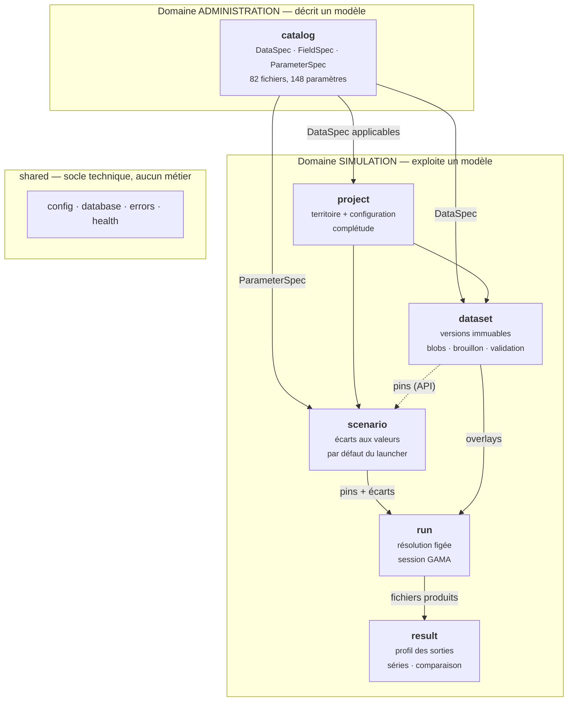
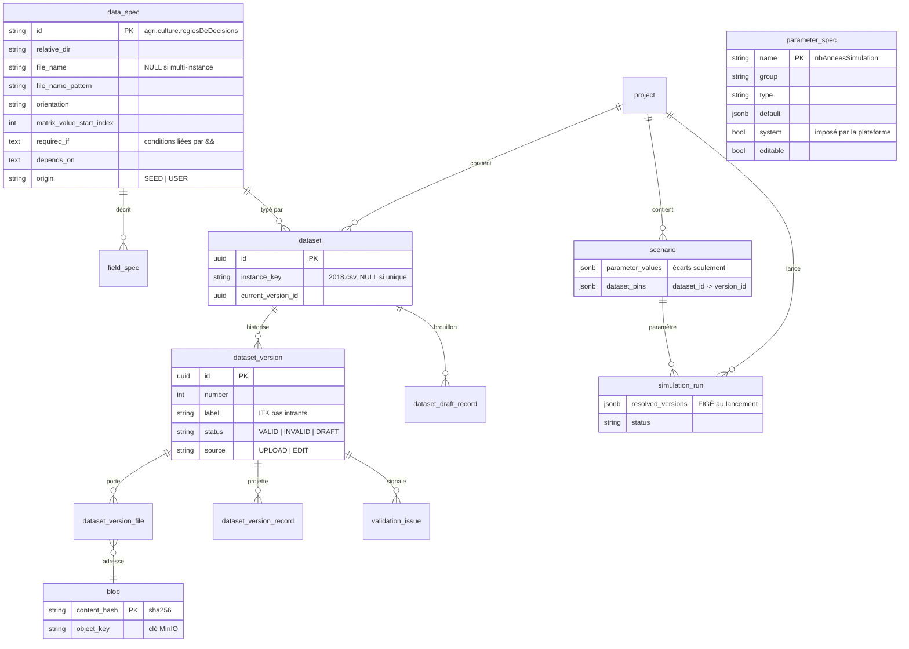
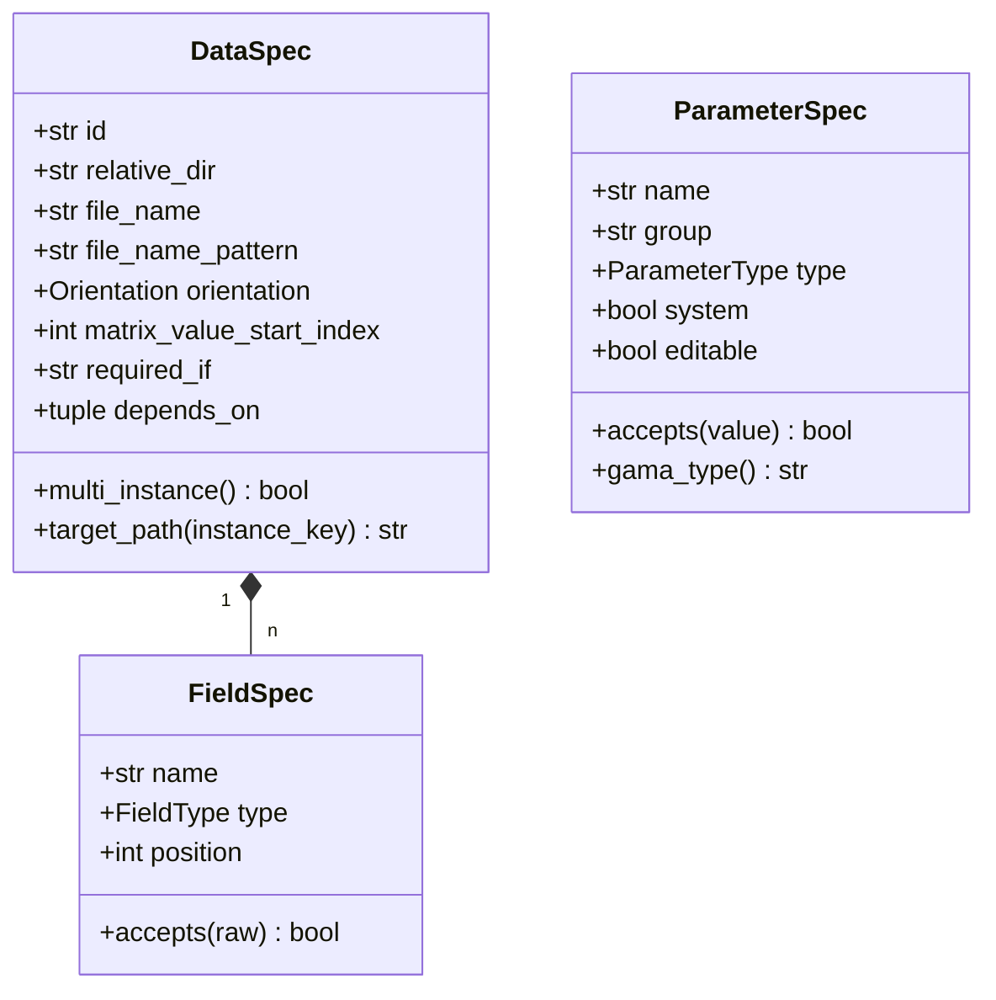
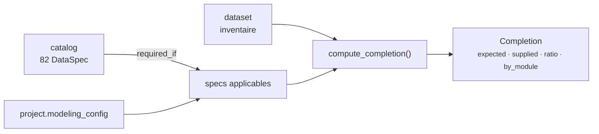
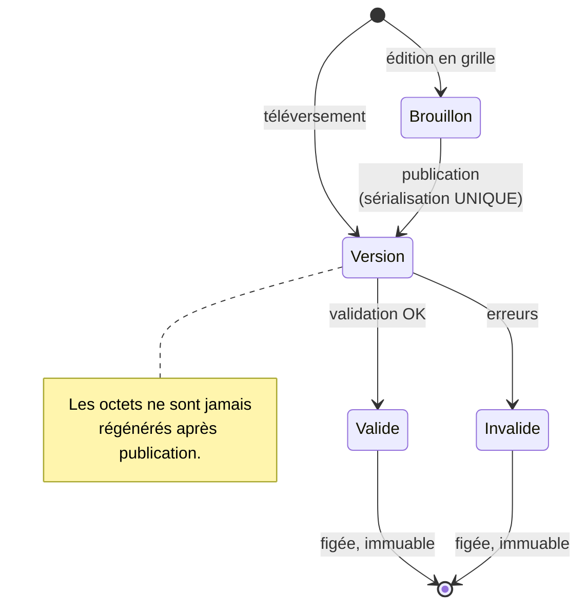
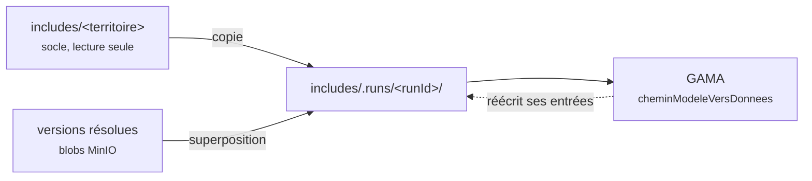
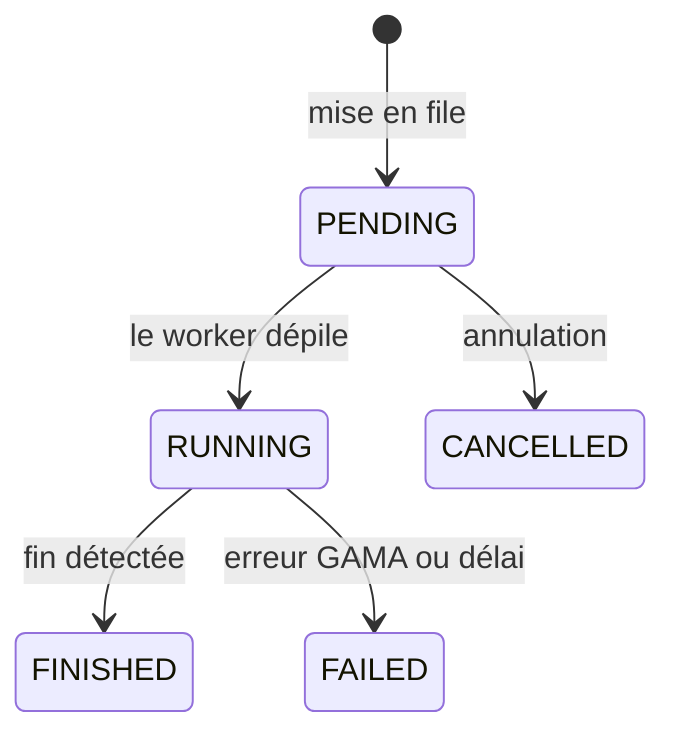
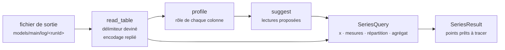

# Backend — les domaines en détail

!!! abstract "Objet de ce document"
    Décrire **ce qui est implémenté**, contexte par contexte : responsabilité,
    modèle de domaine, frontières, règles non évidentes, surface d'API.

    [Architecture backend](backend.md) dit *pourquoi* le découpage est ainsi ;
    [Bonnes pratiques](backend-bonnes-pratiques.md) dit *comment* écrire le code.
    Ce document dit *ce qu'il y a*.

---

## 1. Vue d'ensemble

Deux domaines. **Administration produit les schémas que Simulation consomme** —
la flèche ne s'inverse jamais.



| Contexte | Fichiers | Lignes | Ports |
|---|---:|---:|---|
| `catalog` | 8 | 1 016 | `CatalogRepository` |
| `project` | 7 | 565 | `ProjectRepository`, `DatasetInventoryPort` |
| `dataset` | 10 | 1 932 | `DatasetRepository`, `BlobStore`, `DraftStore`, `RecordProjection` |
| `scenario` | 7 | 566 | `ScenarioRepository` |
| `run` | 6 | 754 | — *(pilote GAMA directement)* |
| `result` | 6 | 630 | `OutputStore` |
| `shared` + `worker` | 7 | 580 | — |

---

## 2. Le schéma de données



!!! info "Les deux étages de stockage"
    `blob` (MinIO) porte les **octets**, et fait foi : c'est ce que GAMA lit.
    `dataset_version_record` (Postgres) est une **projection** dérivée, jetable,
    qui sert l'affichage en grille et la comparaison entre versions.

---

## 3. `catalog` — décrire ce que le modèle attend

**Domaine Administration.** Le catalogue est la seule source de vérité sur les
entrées et les paramètres. Rien de MAELIA n'est codé en dur ailleurs.

### Modèle



### Trois règles non évidentes

**L'identité d'un champ est sa position, pas son nom.** `reglesDeDecisions.csv`
répète légitimement des libellés de ligne — plusieurs opérations du même type par
itinéraire, c'est le paramètre `plusieursTravauxDuSolParITK`. La contrainte
d'unicité porte donc sur `(data_spec_id, position)`.

**Les conditions d'applicabilité se cumulent.** Une condition propre à un fichier
*précise* celle de son module, elle ne la remplace pas :

```
executerModeleHydrographique == true && nomChoixModeleHydrographique == 'SWAT'
```

Le langage se limite à `==`, `!=` et `&&` : pas de `||`, pas de parenthèses. Aucun
cas réel n'en a besoin, et une règle doit rester lisible par un administrateur.

**Une condition illisible ne masque pas le fichier.** Mieux vaut un fichier
réclamé à tort qu'un fichier silencieusement oublié.

### Seed

Le catalogue se **régénère depuis le code GAML** et les fichiers réellement
livrés — jamais depuis le tableur `MAELIA_Schema_Donnees.xlsx`, qui contient des
erreurs de collecte (cf. [l'inventaire](../reference/donnees-et-parametres.md)).

```bash
python headless-maelia-server/scripts/generate_catalog_seed.py     # 82 entrées
python headless-maelia-server/scripts/generate_parameter_seed.py   # 148 paramètres
```

Le seed est **idempotent et non destructif** : les specs modifiées à la main
(`origin = USER`) sont préservées ; celles d'origine `SEED` disparues du seed sont
retirées, sans quoi la plateforme réclamerait un fichier que GAMA ne lit plus.

### API

`GET /dataspecs` · `GET /dataspecs/{id}` · `GET /dataspecs/graph` ·
`POST /dataspecs/applicable` · `GET /parameters` · `GET /parameters/groups` ·
`PUT|DELETE /admin/dataspecs/{id}`

---

## 4. `project` — territoire et configuration

**Domaine Simulation.** Un projet, c'est un **territoire** (où lire) et une
**configuration de modélisation** (quoi lire).

La configuration est le levier central : elle change la liste des fichiers
attendus.

| Configuration | Fichiers attendus |
|---|---:|
| Agricole seul (défaut) | **40** |
| + hydrographique | **65** |

La complétude est une **fonction pure** : elle reçoit les specs applicables et un
inventaire, elle rend un état. Elle ne connaît ni la base ni le stockage objet —
c'est ce qui la rend testable sans infrastructure.



`DatasetInventoryPort` évite au projet toute connaissance de la persistance des
datasets : il demande un **état**, pas des lignes.

### API

`GET|POST /projects` · `GET|PUT|DELETE /projects/{id}` ·
`PUT /projects/{id}/modeling-configuration` · `GET /projects/{id}/completion` ·
`GET /territories` · `GET /default-configuration`

---

## 5. `dataset` — les données versionnées

Le contexte le plus dense (1 932 lignes). Il porte le versionnage, le stockage
adressé par empreinte, le brouillon, la validation et la matérialisation.

### Cycle de vie d'une version



### La règle qui tient tout

**Les octets ne sont jamais régénérés après publication.**

- Version par **téléversement** → les octets reçus deviennent le blob tel quel.
- Version par **édition** → les lignes sont sérialisées **une seule fois**, à la
  publication, puis gelées.

La matérialisation est une **copie d'octets**, jamais une regénération. C'est ce
qui écarte le risque qu'un fichier `;`-délimité, transposé, à colonnes méta ou en
ISO-8859-1 dérive entre ce qui a été validé et ce que GAMA lit.

Cette garantie est vérifiée sur **tous les fichiers livrés** :
`tests/integration/test_codec_roundtrip.py` — 20 tests, `encode(decode(x)) == x`
octet pour octet.

!!! warning "Ce que le codec doit préserver"
    Le codec ne transporte pas que le contenu logique. Un `Dialect` porte
    l'encodage, le BOM, le terminateur de ligne — `\n`, `\r\n` **et `\r` seul**,
    `joursParMois.csv` étant encore au format Mac historique —, la présence d'un
    saut final et les colonnes méta des fichiers transposés.

    À la publication, la forme physique est héritée de la **version source** :
    reconstruire l'ordre des colonnes depuis les clés du brouillon réordonnerait
    le fichier, celui-ci étant stocké en JSONB dont la base normalise les clés.

### Isolation par exécution

MAELIA ne se contente pas de *lire* ses includes : il en **réécrit** certains
pendant le run (`blocsDonnees.csv`). Deux exécutions partageant un répertoire se
corrompraient mutuellement — sans erreur, avec des résultats silencieusement faux.



### API

`GET /projects/{id}/datasets` · `POST /projects/{id}/datasets/{specId}/versions` ·
`GET /datasets/{id}` · `GET /datasets/{id}/versions/{n}/records|issues|files/{nom}` ·
`GET|PUT /datasets/{id}/draft` · `POST /datasets/{id}/draft/publish` ·
`POST /projects/{id}/datasets/resolve`

---

## 6. `scenario` — ce qui rend une exécution différente

Un scénario est une **configuration de paramètres** : les écarts aux valeurs par
défaut du launcher, et rien d'autre.

**Seuls les écarts voyagent.** Stocker les 148 valeurs figerait les défauts du
launcher au moment de la création ; une montée de version du modèle conserverait
alors silencieusement des valeurs périmées. Reposer la valeur par défaut retire
l'écart au lieu de l'enregistrer.

!!! info "Les entrées ne sont pas des scénarios"
    L'API accepte toujours des `dataset_pins`, et la résolution au lancement s'en
    sert quand ils existent — c'est le mécanisme de gel, il n'a pas bougé. Mais
    **l'interface ne les expose plus** : un fichier suit la dernière version
    valide de son dataset, et varier les données se fait en versionnant le
    fichier, pas en créant un scénario. Un scénario parle de paramètres.

### Quatre refus, chacun avec une raison actionnable

| Cas | Message |
|---|---|
| Paramètre inconnu du launcher | *il serait ignoré par GAMA* |
| Paramètre système | *le fixer n'aurait aucun effet* |
| Mauvais type | *« trois » n'est pas un int valide* |
| Paramètre non modifiable | *sa valeur par défaut est une expression* |
| Version épinglée absente | *introuvable pour `agri.culture.reglesDeDecisions`* (API seulement) |

!!! note "`bool` est un `int` en Python"
    Sans garde explicite, `True` passerait pour `1` sur `nbAnneesSimulation`. La
    validation refuse un booléen là où un entier est attendu, et un test le
    verrouille.

### API

`GET|POST /projects/{id}/scenarios` · `GET|PUT|DELETE /scenarios/{id}` ·
`GET /scenarios/{id}/gama-parameters`

---

## 7. `run` — l'exécution

### Le parcours complet

```mermaid
sequenceDiagram
    autonumber
    actor U as Utilisateur
    participant API
    participant DB as Postgres
    participant Q as Redis (file + pub/sub)
    participant W as Worker
    participant M as MinIO
    participant G as gama-headless

    U->>API: POST /projects/{id}/runs {scenario_id}
    API->>DB: paramètres du scénario + versions épinglées
    API->>API: résolution FIGÉE de TOUS les datasets
    API->>Q: enqueue run_simulation(run_id)
    API-->>U: 201 {run_id, resolved_versions}

    W->>Q: dépile
    W->>M: octets des versions résolues
    W->>W: copie du socle + superposition
    Note over W: includes/.runs/&lt;runId&gt;/

    W->>Q: verrou de compilation
    W->>G: load (modèle, paramètres, until)
    Note over W,G: GAMA ne supporte pas<br/>deux load simultanés
    W->>Q: libère le verrou

    W->>G: play
    loop pendant le run
        G-->>W: console + statut
        W->>Q: publie l'avancement
        Q-->>API: relais
        API-->>U: WebSocket /ws/runs/{id}
    end
    G-->>W: FIN DE SIMULATION
    W->>W: inventaire de models/main/log/&lt;runId&gt;
    W->>Q: état final
```

### États d'une exécution



### Quatre contraintes tirées du terrain

**La session appartient au worker.** Si le socket se ferme, GAMA détruit la
simulation. Une requête HTTP valide, met en file et répond ; elle ne pilote jamais
le moteur.

**La compilation est sérialisée, pas les simulations.** Deux `load` simultanés du
même modèle se disputent le registre de ressources Xtext :

```
java.lang.IllegalStateException: A different resource with the URI
'file:/opt/gama-platform/headless/__synthetic__N.gaml' was already registered.
```

Un verrou Redis couvre le seul `load` (~35 s) ; les simulations restent
parallèles. Le verrou porte un TTL, se libère par comparaison de jeton, et sa
boucle d'attente rend la main toutes les demi-secondes.

**La fin ne se détecte pas seulement par `SimulationEnded`.** `main.gaml` exécute
`do pause` **avant** de poser `simulationTerminee` : l'expérience est déjà en pause
quand la condition `until:` devient vraie. Le worker surveille donc aussi le
marqueur console `*********** FIN DE SIMULATION ***********`.

**Le dossier de sortie est déterministe.** Le worker impose
`idSimulationAPI = <runId>` ; l'action `majChemins` écrit alors dans
`models/main/log/<runId>` au lieu d'un dossier horodaté qu'il faudrait deviner.

### Paramètres imposés par la plateforme

Ils priment sur ceux du scénario :

| Paramètre | Pourquoi |
|---|---|
| `idSimulationAPI` | dossier de sortie déterministe, sans collision |
| `cheminModeleVersDonnees` | pointe la copie de travail du run |
| `cheminRacineMaelia` | racine partagée par les trois conteneurs |
| `executerSurCluster` | toujours `false` en headless |

### API

`POST|GET /projects/{id}/runs` · `GET|POST /admin/runs` ·
`GET /admin/runs/{id}` · `POST /admin/runs/{id}/cancel` · `WS /ws/runs/{id}`

---

## 8. `result` — lire ce que l'exécution a produit

Un run laisse derrière lui un dossier de fichiers, pas des indicateurs. MAELIA y
écrit des tables larges — une ligne par parcelle et par période, une trentaine de
colonnes dont la plupart sont numériques. Ce contexte les rend lisibles **sans
qu'aucun nom de colonne MAELIA n'apparaisse dans le code**.

### Pourquoi rien n'est déclaré à l'avance

Neuf fichiers de sortie, jusqu'à trente colonnes chacun, et la liste grandit avec
le modèle : un catalogue de sorties saisi à la main serait faux à la première
montée de version. La forme est donc **lue dans le fichier**, et les graphiques
s'en déduisent.



### Le rôle d'une colonne, et pourquoi il ne suffit pas de tester les nombres

| Rôle | Reconnu à | Sert à |
|---|---|---|
| `TEMPORAL` | son **nom** (`annee`, `jourDebut`, `date`…) | ordonner l'axe |
| `MEASURE` | ≥ 80 % de valeurs numériques | être agrégée |
| `DIMENSION` | le reste | filtrer, répartir en séries |

Le test du nom passe **avant** le test numérique : `annee` ne contient que des
entiers et serait autrement moyennée comme une mesure. Le seuil de 80 % — et non
100 % — vient du modèle lui-même, qui laisse des cellules vides quand une
opération ne s'applique pas à la ligne.

L'unité est extraite de l'en-tête (`N_lixivie[kgN/ha]`) : c'est le seul endroit où
elle est jamais écrite. Elle sert ensuite à un refus utile — **deux mesures ne
sont proposées sur un même axe que si elles partagent leur unité**, faute de quoi
l'échelle de l'une écrase l'autre et la lecture est fausse.

### Une requête, tous les graphiques

`SeriesQuery` — axe, mesures, répartition, agrégat, filtres — couvre courbe,
barres, barres empilées, aire et nuage de points. Le type de tracé est une
donnée rendue par le front, pas une branche de code au backend : ajouter un type
de graphique ne touche pas le domaine.

### Comparer des runs

Le même `SeriesQuery` rejoué sur plusieurs runs du projet, superposé. C'est la
lecture qui donne son sens au gel des versions : sans elle, la reproductibilité
d'un scénario resterait une propriété invérifiable.

Un run qui n'a pas produit le fichier est **ignoré, pas fatal** — un run en échec
a toute sa place dans une comparaison.

### API

`GET /runs/{id}/outputs` · `GET /runs/{id}/outputs/{nom}/profile` ·
`GET /runs/{id}/outputs/{nom}/preview` · `GET /runs/{id}/outputs/{nom}/text` ·
`GET /runs/{id}/outputs/{nom}/download` · `POST /runs/{id}/outputs/{nom}/series` ·
`POST /projects/{id}/output-comparison`

!!! warning "Un nom de fichier vient du client"
    `FileOutputStore` résout le chemin puis vérifie qu'il est bien **sous** le
    dossier du run. Sans ce contrôle, `../../` sortirait du dossier de sortie.

---

## 9. `shared` — le socle

Aucun métier. `config` (un seul `Settings`), `database` (moteur async + session),
`errors` (`DomainError` → RFC 7807), `health` (cinq sondes), `models` (point de
rassemblement pour Alembic).

!!! tip "Ce que vérifient les sondes"
    Pas des présences, des **invariants**. `shared-volume` ne dit pas « le disque
    est monté » mais « le modèle est lisible au chemin partagé, le projet GAMA est
    valide, l'écriture fonctionne » — c'est cet invariant-là qui casse.

---

## 10. État

**Fait.** Les six contextes, 12 tables, 3 migrations, 50 routes, 116 tests (dont
20 d'aller-retour du codec sur les fichiers réels). Chaîne complète vérifiée :
deux scénarios épinglant des versions différentes produisent deux exécutions
concurrentes menées à terme, avec des entrées matérialisées distinctes et le socle
inchangé ; leurs sorties se relisent et se comparent sur un même graphique.

**À faire.** Bascule du stockage des runs de Redis vers Postgres — la table
`simulation_run` existe déjà et c'est le test annoncé de l'architecture : si les
ports sont corrects, ni le worker ni les routes ne bougeront. Puis l'ingestion
des sorties en stockage objet (le port `OutputStore` est déjà là, seul son
adaptateur changera), et `iam`.
