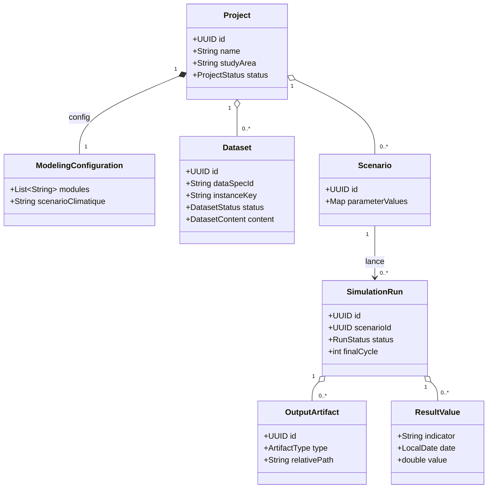
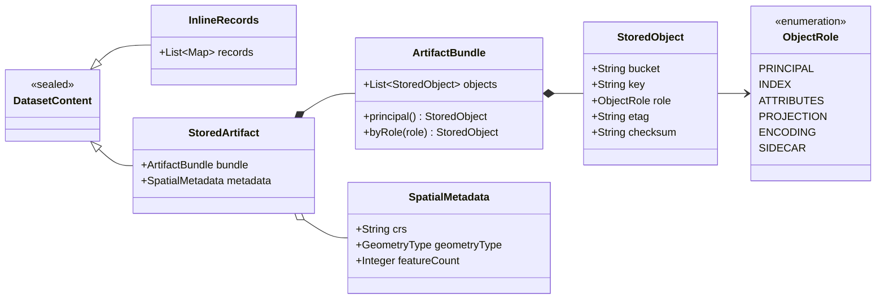

# Modèle de domaine des données d'entrée

Cette page présente le modèle de domaine **en partant du projet**, jusqu'à situer les données
d'entrée, puis zoome sur la façon dont le **contenu** d'un dataset est représenté — qu'il
s'agisse de tabulaire stocké en base ou d'artefacts binaires (shapefiles, rasters…) référencés
dans un object store.

## Du projet aux données

Un `Project` agrège sa configuration de modélisation, ses données d'entrée (`Dataset`) et ses
scénarios (`Scenario`). Un scénario lance des `SimulationRun`, qui produisent des artefacts et
des valeurs de résultat. C'est la colonne vertébrale du workflow ; les données d'entrée en sont
une branche.

Chaque `Dataset` est l'instance concrète d'un type de fichier décrit au catalogue (`dataSpecId`),
pour un projet donné ; `instanceKey` distingue les fichiers d'un type multi-instance, et le cycle
de vie `VIDE → EN_COURS → VALIDE` / `INVALIDE` traduit son état de saisie et de validation.

Le reste de cette page zoome sur un seul champ : **`Dataset.content`**.

## Le contenu d'un dataset

Historiquement, le contenu d'un dataset était supposé *tabulaire et stocké en base* (`records`
en JSONB). Cette hypothèse casse dès qu'une entrée n'est ni l'un ni l'autre — le cas déclencheur
étant le **shapefile stocké dans S3** : un bundle géométrique avec un CRS, un type de géométrie
et un schéma d'attributs, dont les octets ne vivent pas dans PostgreSQL.

Le principe retenu : le domaine porte une **référence et des métadonnées, jamais les octets**.
`Dataset.content` devient un `DatasetContent` **scellé** à deux variantes.

- **`InlineRecords`** — le tabulaire, conservé en JSONB. C'est son meilleur foyer : requêtable,
  diffable, validable ligne à ligne.
- **`StoredArtifact`** — une *référence* vers un bundle d'objets dans l'object store, accompagnée
  de ses métadonnées spatiales.

!!! tip "Tirer parti du scellé"
    Le caractère scellé de `DatasetContent` est un filet de sécurité : les rares points de
    dispatch utilisent un `switch` à patterns **exhaustif**. L'ajout futur d'une variante
    provoque alors une erreur de compilation partout où elle doit être traitée, plutôt qu'un
    oubli silencieux.

### Le bundle d'artefacts

`StoredArtifact` référence un **`ArtifactBundle`**, jamais un objet isolé. Un shapefile est
*toujours* un ensemble de fichiers solidaires — `.shp` (géométrie), `.shx` (index), `.dbf`
(attributs), `.prj` (le CRS), `.cpg` (encodage). Chaque `StoredObject` porte un `ObjectRole`
pour que la matérialisation retrouve et réécrive les bons fichiers frères.

!!! warning "Ne jamais séparer un shapefile de ses frères"
    Un `.shp` sans son `.prj` conduit GAMA à charger des géométries silencieusement fausses
    (mauvais CRS), sans erreur au chargement. L'intégrité du bundle est une invariante contrôlée
    à la validation.

Les formats mono-fichier (GeoTIFF, image, OSM) sont modélisés comme un bundle à un seul objet de
rôle `PRINCIPAL` : un seul type couvre tout l'éventail non-tabulaire supporté par GAMA.

### Le discriminateur : `contentKind`

C'est le catalogue qui décide de la nature du contenu. `DataSpec` porte un champ `contentKind`
qui précise l'intention déjà exprimée par `fileType` / `saisieMode`, et détermine la variante de
`DatasetContent` attendue.

| `contentKind` | Contenu attendu | Variante |
|---|---|---|
| `TABULAR` | Enregistrements structurés | `InlineRecords` |
| `VECTOR_ARTIFACT` | Vecteur spatial (`.shp`, `.geojson`, `.kml`, OSM) | `StoredArtifact` |
| `RASTER_ARTIFACT` | Raster (`.asc`, GeoTIFF, image) | `StoredArtifact` |
| `BINARY_ARTIFACT` | Autre binaire opaque | `StoredArtifact` |

!!! info "Généricité par modèle"
    `contentKind` vivant dans le schéma, brancher un nouveau modèle GAMA se résume à livrer ses
    `DataSpec` avec le bon `contentKind`. Le catalogue MAELIA devient une *instance* du
    méta-modèle, non un cas codé en dur.

!!! note "Suite"
    Les mécanismes de validation, de matérialisation vers `includes/` et les ports sortants
    (`ObjectStore`, `SpatialArtifactInspector`) sont décrits dans une page dédiée.
