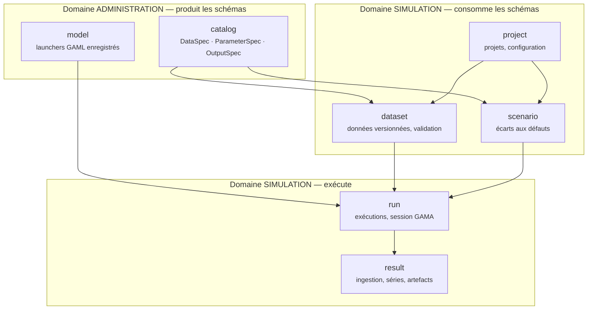

---
search:
  exclude: true
---

# Archive — Architecture backend

!!! danger "Page archivée — ne pas s'y fier"
    Rédigée avant la refonte de la documentation. Conservée pour mémoire :
    elle peut décrire des types, des chemins ou des chiffres qui n'existent
    plus. Remplacée par la section Architecture — voir [le sommaire](../index.md).


!!! abstract "Objet de ce document"
    Décrire l'architecture cible du backend Python, les règles qui la tiennent, et
    le chemin pour y aller depuis l'état actuel. Il s'adresse à toute personne qui
    va écrire du code dans `headless-maelia-server/` — c'est le document qu'on
    ouvre avant de créer un fichier, et celui qu'on cite en revue.

    Il ne décrit pas une architecture idéale abstraite : chaque règle est motivée
    par une contrainte réelle de ce projet, la plupart découvertes en exécutant
    MAELIA pour de vrai.

---

## 1. Ce que le backend doit soutenir

La plateforme couvre **deux domaines fonctionnels** aux cycles de vie différents.

| | Administration | Simulation |
|---|---|---|
| **Qui** | administrateur de la plateforme | modélisateur, observateur |
| **Quoi** | *décrire* un modèle : entrées, paramètres, sorties | *exploiter* un modèle sur un territoire |
| **Rythme** | rare, structurant | quotidien, volumineux |
| **Produit** | des **schémas** | des **données** et des **résultats** |

Cette asymétrie est la clé de l'architecture : **le domaine administration produit
les schémas que le domaine simulation consomme.** Un jeu de données n'est valide
que par rapport à un `DataSpec` ; un scénario n'est valide que par rapport à un
`ParameterSpec`. La dépendance va dans un seul sens, et l'architecture doit
l'imposer plutôt que l'espérer.

---

## 2. Les forces qui contraignent l'architecture

Une architecture ne se choisit pas dans l'abstrait : elle répond à des forces.
Voici celles de ce projet, toutes vérifiées sur le terrain.

**F1 — Rien ne doit être codé en dur par fichier ou par paramètre.**
MAELIA compte ~71 types de fichiers d'entrée et 142 paramètres de scénario. Écrire
du code par fichier, c'est signer pour un an de maintenance et rendre impossible
l'accueil d'un second modèle. Tout passe par des catalogues en base.

**F2 — Une simulation est une session longue, pas une requête.**
Le protocole `gama-server` détruit la simulation si le socket se ferme. Un run
d'un an dure ~76 s, un run de 3 ans plusieurs minutes. La connexion doit vivre du
`load` jusqu'à la fin, donc **hors du cycle de vie d'une requête HTTP**.

**F3 — Le moteur de simulation mute ses propres entrées.**
MAELIA réécrit `blocsDonnees.csv` pendant le run. Deux exécutions partageant un
répertoire d'entrées se corrompent mutuellement, **sans erreur**, avec des
résultats silencieusement faux. Tout run doit travailler sur une copie isolée.

**F4 — Le moteur est un processus unique et partagé.**
Toutes les simulations vivent dans la même JVM (~+0,7 Gio par run simultané). La
concurrence n'est pas gratuite et doit être bornée explicitement.

**F5 — Les données d'entrée doivent être versionnées.**
Un résultat n'a de valeur que si l'on sait exactement de quelles données il découle.

**F6 — Les chemins de fichiers sont partagés entre trois conteneurs.**
`api`, `worker` et `gama-headless` voient le même volume au même chemin. Un chemin
calculé côté Python est un chemin utilisable côté GAML. C'est un invariant, pas
une commodité.

!!! warning "La leçon de la version Java"
    La version précédente appliquait déjà l'hexagonal par contexte et le pilotage
    par catalogue — de bonnes idées, qu'on reprend. Mais elle comptait ~180
    fichiers Java pour 9 contextes et **n'a jamais réussi un run MAELIA de bout en
    bout**. La cérémonie avait absorbé le budget qui aurait dû aller à la
    validation. On garde les principes ; on calibre la cérémonie (§9).

---

## 3. Principes directeurs

### P1 — Découper par contexte métier, pas par couche technique

Pas de `services/`, `models/`, `repositories/` à la racine. Ces dossiers
grossissent sans borne et forcent à sauter entre trois répertoires pour suivre un
changement. On découpe par **contexte métier** : tout ce qui concerne les datasets
est dans `dataset/`.

Test simple : *ajouter une fonctionnalité doit toucher un seul répertoire.*

### P2 — Les dépendances pointent vers l'intérieur

```
api / worker  ──▶  application  ──▶  domain  ◀──  infrastructure
```

Le **domaine** ne connaît ni FastAPI, ni SQLAlchemy, ni Redis, ni `websockets`.
Il ne fait aucune E/S. C'est ce qui le rend testable sans conteneurs et
compréhensible sans connaître la plomberie.

L'infrastructure dépend du domaine (elle implémente ses interfaces), jamais
l'inverse.

### P3 — Les frontières sont des `Protocol`, pas des classes de base

Un port est une interface structurelle, sans héritage :

```python
# dataset/domain/ports.py
from typing import Protocol

class DatasetRepository(Protocol):
    async def get(self, dataset_id: UUID) -> Dataset | None: ...
    async def save(self, dataset: Dataset) -> None: ...
```

L'adaptateur SQLAlchemy n'a rien à hériter ni à déclarer : il satisfait le
protocole en ayant les bonnes méthodes. En test, un objet trivial suffit.

### P4 — Le domaine en `dataclass`, les bords en Pydantic

| Couche | Type | Pourquoi |
|---|---|---|
| Domaine | `@dataclass(frozen=True)` | pur, immuable, sans dépendance |
| API (entrée/sortie) | `BaseModel` Pydantic | validation + sérialisation + OpenAPI |
| Persistance | modèle SQLAlchemy | mapping relationnel |

Trois représentations, c'est un coût assumé mais **borné** : le mapping se fait
en deux fonctions par contexte (`to_domain`, `from_domain`), pas via une couche de
mappers générés. Si un contexte n'a aucune règle métier, un seul type Pydantic
peut suffire — on ne crée pas de domaine vide par symétrie.

### P5 — Les schémas sont des données, pas du code

Corollaire direct de **F1**. Ajouter un type de fichier d'entrée ou un paramètre
de scénario, c'est **insérer une ligne**. Si une évolution fonctionnelle exige de
modifier du code Python, c'est le signe que la logique a fui du catalogue vers le
code.

### P6 — Un effet de bord externe s'isole par exécution

Généralisation de **F3**. Dès qu'un système externe écrit là où il lit, la
plateforme lui fournit un espace de travail dédié et jetable. Ne jamais laisser
deux exécutions partager un répertoire mutable.

---

## 4. Découpage en contextes



| Contexte | Responsabilité | Domaine |
|---|---|---|
| `catalog` | Décrire entrées, paramètres et sorties d'un modèle | Administration |
| `model` | Recenser les launchers GAML : chemin, expérience, contraintes headless | Administration |
| `project` | Projets, configuration de modélisation, complétude | Simulation |
| `dataset` | Saisie, import, validation, **versionnage**, matérialisation | Simulation |
| `scenario` | Écarts aux valeurs par défaut, validés contre le catalogue | Simulation |
| `run` | Cycle de vie d'une exécution, pilotage du moteur | Simulation |
| `result` | Ingestion des sorties, séries, agrégats, artefacts | Simulation |
| `iam` | Authentification, rôles, cloisonnement | Transverse — **en dernier** |

!!! note "Domaine `Simulation` et contexte `run`"
    Le domaine métier s'appelle **Simulation** ; le contexte qui porte le cycle
    de vie d'une exécution s'appelle **`run`**. Deux niveaux distincts, deux noms
    distincts : un contexte `simulation` dans un domaine « Simulation » aurait
    rendu toute conversation ambiguë.

### Règles de dépendance entre contextes

1. **Un contexte n'importe jamais l'`infrastructure` d'un autre.** La communication
   passe par les cas d'usage ou par des ports.
2. **Le sens administration → simulation ne s'inverse pas.** `catalog` ignore l'existence
   de `project`.
3. **Pas de cycle.** Un besoin bidirectionnel signale un contexte mal découpé, ou
   un événement qui s'ignore.
4. `shared/` n'accueille que le socle technique — configuration, journalisation,
   erreurs, utilitaires sans métier. **Jamais** de règle métier.

---

## 5. Anatomie d'un contexte

```
app/contexts/dataset/
├── domain/
│   ├── models.py        # dataclasses pures : Dataset, DatasetVersion, ValidationIssue
│   ├── services.py      # règles pures : validation, diff de versions
│   └── ports.py         # Protocol : DatasetRepository, FileStorage
├── application/
│   └── use_cases.py     # orchestration : import_csv, validate, materialize
├── infrastructure/
│   ├── persistence.py   # SQLAlchemy : entités + adaptateur du port
│   ├── storage.py       # MinIO : adaptateur de FileStorage
│   └── csv_codec.py     # lecture/écriture bi-orientation
└── api/
    ├── routes.py        # APIRouter
    └── schemas.py       # Pydantic (entrée/sortie HTTP)
```

**Ce qui va où — la question à se poser :**

| Question | Réponse |
|---|---|
| Est-ce vrai indépendamment de FastAPI, de Postgres et de GAMA ? | `domain/` |
| Est-ce un enchaînement d'étapes coordonnant plusieurs objets ? | `application/` |
| Est-ce que ça parle à un système extérieur ? | `infrastructure/` |
| Est-ce lié à HTTP (statuts, multipart, pagination) ? | `api/` |

Exemple concret : *« un CSV transposé se lit en inversant lignes et colonnes »* est
une règle du domaine. *« le fichier arrive en `multipart/form-data` »* est une
affaire d'API. *« il est stocké dans MinIO »* est de l'infrastructure.

### Assemblage

Un contexte expose deux points d'entrée et rien d'autre :

- `api/routes.py` → un `APIRouter` monté par `app/main.py` ;
- `application/use_cases.py` → des fonctions appelables par le worker.

L'injection se fait par `Depends` côté API et par construction explicite côté
worker. **Pas de conteneur d'injection** : il masque les dépendances qu'on cherche
justement à rendre visibles.

---

## 6. Règles transverses issues du terrain

Ces règles ne se déduisent d'aucun principe général : elles viennent de pannes
réelles. Les enfreindre coûtera le temps qu'il a fallu pour les découvrir.

### R1 — Une session longue appartient au worker

**Force F2.** Une requête HTTP ne pilote jamais le moteur. Elle valide, crée un
run, le met en file, et répond. Le worker tient la session ouverte.

Conséquence sur le port :

```python
class SimulationEnginePort(Protocol):
    async def run(
        self, request: RunRequest, on_event: EventHandler
    ) -> RunOutcome: ...
```

Le port expose **un run complet**, pas `load()`/`play()`/`stop()`. Exposer les
primitives ferait fuir le protocole GAMA dans le domaine et rendrait le port
inimplémentable pour un autre moteur.

### R2 — Un run travaille sur une copie de ses entrées

**Force F3, principe P6.** Le socle est en lecture seule ; chaque run reçoit une
copie jetable. C'est aujourd'hui une copie brute du territoire ; ce sera demain
« socle + données versionnées du projet ». **La même brique** doit servir aux deux —
la matérialisation est un point d'extension, pas un utilitaire de test.

### R3 — Les chemins de sortie sont déterministes

Dérivés de l'identifiant du run, jamais horodatés. On ne devine pas où un moteur a
écrit : on le lui impose et on lit à l'endroit prévu. La lecture du chemin annoncé
par le moteur reste un **repli**, pas la source de vérité.

### R4 — La concurrence est bornée explicitement

**Force F4.** Un plafond configuré (`WORKER_MAX_JOBS`), dimensionné sur la mémoire
du moteur et non sur le nombre de cœurs. On monte en charge en ajoutant des
workers, pas en relevant le plafond d'un worker.

### R5 — Aucune boucle non bornée dans un chemin de requête

Toute boucle d'attente rend la main périodiquement et reste annulable. Un
`listen()` bloquant sur un abonnement a déjà empêché l'arrêt propre de l'API : un
onglet resté ouvert suffisait à bloquer un redéploiement.

### R6 — L'observabilité porte l'identité métier

Chaque ligne de journal d'un run porte `run_id` (et `project_id` quand il existe).
Sans cela, les journaux de N runs concurrents sont illisibles.

### R7 — Les sondes vérifient les invariants, pas la présence

Un `health` utile ne dit pas « le disque est monté » mais « le modèle est lisible
au chemin partagé, le projet GAMA est valide, l'écriture fonctionne ». C'est
l'invariant **F6** qui est testé, parce que c'est lui qui casse.

---

## 7. Erreurs, configuration, transactions

### Erreurs

Trois familles, trois traitements :

| Famille | Exemple | Traitement |
|---|---|---|
| **Métier** | dataset invalide, paramètre inconnu | exception du domaine → statut HTTP dédié |
| **Infrastructure** | moteur injoignable, timeout | remontée telle quelle, run en `ECHEC` avec le motif |
| **Programmation** | `KeyError`, `AttributeError` | jamais rattrapée localement, 500 + trace |

Le format de réponse est **RFC 7807** (`application/problem+json`), via un
gestionnaire unique. Un `except Exception` n'est acceptable que sur un traitement
best-effort explicitement documenté (nettoyage, sonde, ingestion optionnelle) — et
il journalise toujours.

### Configuration

Un seul `Settings` Pydantic, lu depuis l'environnement, injecté ; jamais
`os.environ` dispersé dans le code. Les chemins partagés y sont typés `Path`, et
c'est le seul endroit qui connaît la disposition du volume.

### Transactions

Une transaction par cas d'usage, ouverte dans `application/`, jamais dans le
domaine ni dans un dépôt. Un cas d'usage qui écrit dans plusieurs contextes est un
signal de mauvais découpage.

---

## 8. Tests

La pyramide découle du découpage : **si le domaine est pur, il se teste sans rien.**

| Niveau | Cible | Infrastructure | Attente |
|---|---|---|---|
| Unitaire | `domain/` | aucune | rapide, majoritaire |
| Cas d'usage | `application/` | ports simulés | logique d'orchestration |
| Adaptateur | `infrastructure/` | Testcontainers | mapping et requêtes réelles |
| Bout en bout | chaîne complète | `docker compose` | un run MAELIA court |

Deux exigences non négociables :

1. **Le domaine se teste sans Docker.** Si un test de règle métier a besoin d'une
   base, la règle est au mauvais endroit.
2. **Un test de bout en bout exécute une vraie simulation.** C'est le seul qui
   prouve que la plateforme fonctionne — la version Java avait tout le reste au
   vert sans jamais l'avoir passé.

---

## 9. Calibrer la cérémonie

L'hexagonal se paie. Voici où l'on refuse de payer.

!!! danger "À ne pas faire"
    - **Un port par entité.** Un port existe pour isoler une dépendance *externe*
      ou pour permettre une *substitution réelle*. Pas par symétrie.
    - **Trois classes pour transporter cinq champs.** Si un contexte n'a aucune
      règle métier, un type Pydantic et un dépôt suffisent. On introduira un
      domaine quand une règle apparaîtra.
    - **Une couche de mappers générés.** Deux fonctions explicites par contexte,
      lisibles et déboguables.
    - **Des abstractions « au cas où ».** On n'abstrait pas un second moteur de
      simulation avant d'en avoir un second.
    - **Un `shared/` fourre-tout.** Il n'accueille que du socle technique.

La règle d'arbitrage : **une abstraction doit rendre un service aujourd'hui.**
Isoler une dépendance instable, permettre un test sans infrastructure, empêcher un
cycle — ce sont des services. « C'est plus propre » n'en est pas un.

---

## 10. Chemin de migration

L'état actuel est un socle d'amorçage volontairement plat : `app/core/`,
`app/api/`, `app/worker/`, ~1 100 lignes. Il fonctionne de bout en bout. On ne
réécrit pas : **on fait migrer contexte par contexte, en gardant la chaîne verte.**

=== "Phase 1 — Structure"

    Créer `app/contexts/` et `app/shared/`. Déplacer l'existant sans le réécrire :

    - `core/config.py`, `core/health.py` → `shared/`
    - `core/runs.py`, `core/gama_session.py`, `worker/tasks.py`, `api/admin.py`
      → `contexts/run/`
    - `core/includes.py` → `contexts/dataset/` (c'est la matérialisation)

    Extraire au passage `SimulationEnginePort` (R1) et `RunRepository`.
    **Aucun changement de comportement.** Critère de sortie : un run de bout en
    bout passe toujours.

=== "Phase 2 — Persistance"

    SQLAlchemy async + Alembic. Rebasculer `RunRepository` de Redis vers Postgres.

    C'est le **test de l'architecture** : si la phase 1 est correcte, ni le worker
    ni les routes ne changent d'une ligne. Redis reste pour ce à quoi il sert
    vraiment — file de tâches et diffusion temps réel.

=== "Phase 3 — Administration"

    Contextes `catalog` et `model`. Reprise des deux jeux de référence de la
    version Java : 71 types de fichiers, 142 paramètres. Le catalogue des
    launchers, aujourd'hui codé en dur, passe en base.

    Critère de sortie : ajouter un type de fichier sans toucher au code.

=== "Phase 4 — Simulation"

    Contextes `project`, `dataset`, `scenario`, avec le **versionnage** (F5) :
    chaque modification crée une version, chaque run référence celle qu'il a
    consommée. La matérialisation devient « socle + données versionnées », en
    réutilisant la brique de R2.

=== "Phase 5 — Résultats"

    Contexte `result` : ingestion des CSV de sortie, séries, agrégats, restitution.

=== "Phase 6 — IAM"

    En dernier, comme prévu : contexte `iam`, rôles, cloisonnement des projets.

---

## 11. Checklist de revue

À dérouler avant de proposer une modification du backend.

- [ ] La modification tient-elle dans **un seul contexte** ?
- [ ] Le `domain/` reste-t-il **sans import** de FastAPI, SQLAlchemy, Redis, websockets ?
- [ ] Une **règle métier** a-t-elle été ajoutée dans `api/` ou `infrastructure/` ?
- [ ] Une **valeur MAELIA** (nom de fichier, de paramètre) a-t-elle été codée en dur ? *(P5)*
- [ ] Toute **boucle d'attente** est-elle bornée et annulable ? *(R5)*
- [ ] Tout **effet de bord externe** est-il isolé par exécution ? *(R2)*
- [ ] Les journaux portent-ils `run_id` / `project_id` ? *(R6)*
- [ ] Une **abstraction nouvelle** rend-elle un service aujourd'hui ? *(§9)*
- [ ] La règle métier ajoutée est-elle **testée sans Docker** ?

---

## 12. Journal des contraintes

Contraintes établies par l'observation, à ne pas redécouvrir.

| # | Contrainte | Vérifiée par |
|---|---|---|
| C1 | La fermeture du socket détruit la simulation côté GAMA | protocole `gama-server` |
| C2 | MAELIA réécrit ses fichiers d'entrée pendant le run | empreintes MD5 avant/après |
| C3 | `do pause` précède `simulationTerminee` : `SimulationEnded` peut ne pas être émis | run bloqué malgré « FIN DE SIMULATION » |
| C4 | Le modèle ne trace pas de numéro de cycle, mais une ligne par jour simulé | lecture de la console |
| C5 | `idSimulationAPI` rend le dossier de sortie déterministe | `majChemins` dans `main.gaml` |
| C6 | ~+0,7 Gio de mémoire GAMA par run simultané | 3 runs parallèles mesurés |
| C7 | Le modèle doit être un projet Eclipse valide (`.project`) | refus de chargement sinon |
| C8 | Les trois conteneurs doivent voir le volume au même chemin | sonde `shared-volume` |
