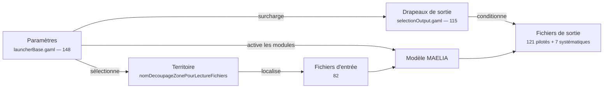

---
search:
  exclude: true
---

# Archive — Données d'entrée, de sortie et paramètres

!!! danger "Page archivée — ne pas s'y fier"
    Rédigée avant la refonte de la documentation. Conservée pour mémoire :
    elle peut décrire des types, des chemins ou des chiffres qui n'existent
    plus. Remplacée par la section Référence — voir [le sommaire](../index.md).


!!! abstract "Objet de ce document"
    Inventaire de référence du modèle MAELIA 1.4.29 : ce qu'il **lit**, ce qu'il
    **écrit**, et ce qui **pilote** l'un et l'autre. Établi par extraction
    automatique du code GAML, puis confronté aux organigrammes et au schéma de
    données fournis.

!!! warning "Le code fait autorité"
    En cas de divergence entre le code et la documentation source, **c'est le code
    qui est retenu** — c'est lui qui s'exécute. Les écarts relevés sont listés au
    §5 : ils signalent des corrections à porter dans la documentation source, pas
    dans le modèle.

## 1. Méthode

| Source | Ce qu'on en tire | Fiabilité |
|---|---|---|
| **Code GAML** (`models/**/*.gaml`) | chemins lus, fichiers écrits, paramètres exposés | **autorité** |
| **Organigrammes** (`docs/Organigramme*.jpg`) | arborescence attendue des entrées | bonne, 4 écarts relevés |
| **Schéma de données** (`MAELIA_Schema_Donnees.xlsx`) | champs de chaque type de donnée | **faible** (cf. §5.3) |
| **Jeux livrés** (`includes/terrainTest`, `includes_sasseme`) | ce qui existe réellement | factuelle |

Trois motifs de lecture coexistent dans le code, tous reconstruits ici :

```gaml
// 1. chemin littéral
'' + cheminModeleVersDonnees + nomDecoupageZonePourLectureFichiers + '/modeleAgricole/culture/especesCultivees.csv'
// 2. répertoire + nom en variable
cheminBarrages + nomFichierBarrages          // -> modeleNormatif/barrages/barrages.csv
// 3. nom composé à l'exécution
'/modeleAgricole/blocs' + nomChoixAssolement + '.csv'   // -> blocsDonnees.csv
```

Tout chemin est relatif à `<cheminModeleVersDonnees><territoire>/`, où le
territoire est donné par le paramètre `nomDecoupageZonePourLectureFichiers`.


## 2. Fichiers d'entrée (82)

`terrainTest` / `sasseme` indiquent la présence du fichier dans le jeu livré. Une absence n'est pas une anomalie : de nombreuses lectures sont gardées par `file_exists` et le modèle poursuit sans le fichier.


### 2.1 Modèle agricole (35)

| Fichier | Lu par | terrainTest | sasseme |
|---|---|:--:|:--:|
| `Engrais/Engrais.csv` | `modeleAgricole/Engrais/Engrais.gaml` | ✓ | ✓ |
| `agriculteurs/batiments.shp` | `modeleAgricole/Elevage/gestionElevage/batiment.gaml` | ✓ | — |
| `agriculteurs/contratsLivraison.csv` | `modeleAgricole/exploitation.gaml` | — | — |
| `agriculteurs/explSurf.csv` | `modeleAgricole/exploitation.gaml` | — | — |
| `agriculteurs/exploitations.csv` | `modeleAgricole/exploitation.gaml` | ✓ | ✓ |
| `agriculteurs/lotsAnimaux.csv` | `modeleAgricole/Elevage/gestionElevage/atelierElevage.gaml` | ✓ | — |
| `agriculteurs/materiel.csv` | `modeleAgricole/materielIrrigation.gaml` | ✓ | ✓ |
| `agriculteurs/perceptionAgriculteurs.csv` | `modeleAgricole/Agriculteurs/agriculteur.gaml` | — | — |
| `agriculteurs/profilesAgriculteurs.csv` | `modeleAgricole/Agriculteurs/agriculteurFonctionsDeCroyances.gaml` | — | — |
| `blocs<assolement>.csv` | `modeleAgricole/bloc.gaml` | — | — |
| `blocs<assolement>_cor.csv` | `modeleAgricole/bloc.gaml` | — | — |
| `culture/correspondance_especesMAELIA_especesIBIO.csv` | `output/resultats_iBIO.gaml` | — | — |
| `culture/especesCultivees.csv` | `modeleAgricole/especeCultivee.gaml` | ✓ | ✓ |
| `culture/especesHerbSim.csv` | `modeleAgricole/Cultures/especeHerbSim.gaml` | ✓ | ✓ |
| `culture/matriceDistanceCulturale.csv` | `modeleAgricole/SystemesDeCultures/systemeDeCultureDeReference.gaml` | — | — |
| `culture/reglesDeDecisions.csv` | `modeleAgricole/SystemesDeCultures/systemeDeCultureDeReference.gaml` | ✓ | ✓ |
| `culture/reglesDeDecisions_fertilisation.csv` | `modeleAgricole/SystemesDeCultures/systemeDeCultureDeReference.gaml` | ✓ | ✓ |
| `culture/systemesDeCultureDeReference.csv` | `modeleAgricole/SystemesDeCultures/systemeDeCultureDeReference.gaml` | — | — |
| `engrais/stocskEngraisParExploitation.csv` | `modeleAgricole/exploitation.gaml` | — | — |
| `ilots/dansZone/ilots.shp` | `modeleAgricole/Ilots/ilot.gaml` | ✓ | ✓ |
| `ilots/dansZone/parcelles.shp` | `modeleAgricole/Parcelles/parcelle.gaml` | ✓ | ✓ |
| `ilots/horsZone/ilots_HZ.shp` | `modeleAgricole/Ilots/ilotHorsZone.gaml` | — | — |
| `ilots/horsZone/parcelles_HZ.shp` | `modeleAgricole/Parcelles/parcelleHorsZone.gaml` | — | — |
| `marcheAgricole/ASAForfaitDebit.csv` | `modeleAgricole/marcheAgricole.gaml` | — | — |
| `marcheAgricole/ASAForfaitSurface.csv` | `modeleAgricole/marcheAgricole.gaml` | — | — |
| `marcheAgricole/ASAPrixEau.csv` | `modeleAgricole/marcheAgricole.gaml` | — | — |
| `marcheAgricole/chargesDePassage.csv` | `modeleAgricole/marcheAgricole.gaml` | — | — |
| `marcheAgricole/chargesFixesAccesRessourceIrrigation.csv` | `modeleAgricole/marcheAgricole.gaml` | — | — |
| `marcheAgricole/chargesFixesMaterielIrrigation.csv` | `modeleAgricole/marcheAgricole.gaml` | — | — |
| `marcheAgricole/chargesOp.csv` | `modeleAgricole/marcheAgricole.gaml` | — | — |
| `marcheAgricole/primes.csv` | `modeleAgricole/marcheAgricole.gaml` | — | — |
| `marcheAgricole/prixEau.csv` | `modeleAgricole/marcheAgricole.gaml` | — | — |
| `marcheAgricole/prixVentes<scenario>.csv` | `modeleAgricole/marcheAgricole.gaml` | — | — |
| `marcheAgricole/redevanceEau.csv` | `modeleAgricole/marcheAgricole.gaml` | — | — |
| `marcheAgricole/rendementsObservesAnterieur.csv` | `modeleAgricole/Agriculteurs/memoire.gaml` | — | — |

### 2.2 Modèle commun (12)

| Fichier | Lu par | terrainTest | sasseme |
|---|---|:--:|:--:|
| `altitude/altitudeAgregeesParZH.shp` | `modeleCommun/bandeAltitude.gaml` | — | — |
| `communes/communes-trimUG.shp` | `modeleCommun/commune.gaml` | — | — |
| `communes/departement.shp` | `modeleAgricole/exploitation.gaml` | — | — |
| `communes/prix_eau_maelia_complet.csv` | `modeleCommun/commune.gaml` | — | — |
| `communes/residence_principale_maelia-complet.csv` | `modeleCommun/commune.gaml` | — | — |
| `communes/resultatsEDEM.csv` | `modeleCommun/commune.gaml` | — | — |
| `communes/salaires_maelia-complet.csv` | `modeleCommun/commune.gaml` | — | — |
| `date/joursParMois.csv` | `modeleCommun/dateCourante.gaml` | ✓ | ✓ |
| `meteo/observee/<annee>.csv` | `modeleCommun/zoneMeteo.gaml` | — | — |
| `meteo/polygonesMeteoFrance.shp` | `modeleCommun/zoneMeteo.gaml` | ✓ | ✓ |
| `meteo/simulee/<scenario>/<annee>.csv` | `modeleCommun/zoneMeteo.gaml` | — | — |
| `typesDeSol/typeDeSolParZH.shp` | `modeleCommun/typeDeSol.gaml` | ✓ | ✓ |

### 2.3 Modèle hydrographique (25)

| Fichier | Lu par | terrainTest | sasseme |
|---|---|:--:|:--:|
| `canaux/<nomCanal>.csv` | `modeleHydrographique/equipementDeCaptageCanaux.gaml` | — | — |
| `canaux/canaux.csv` | `modeleHydrographique/equipementDeCaptageCanaux.gaml` | — | — |
| `canaux/canaux.shp` | `modeleHydrographique/canaux.gaml` | — | — |
| `clc/clcParZH.shp` | `modeleCommun/clc.gaml` | — | — |
| `clc/clcRPGParZH.shp` | `modeleAgricole/clcRPG.gaml` | — | — |
| `clc/disparitionIlots.csv` | `processus/disparitionIlots.gaml` | — | — |
| `equipements/pointsDePrelevement/aep/ppAep.shp` | `modeleHydrographique/equipementDeCaptageAEP.gaml` | — | — |
| `equipements/pointsDePrelevement/ind/ppInd.shp` | `modeleHydrographique/equipementDeCaptageIND.gaml` | — | — |
| `equipements/pointsDePrelevement/ind/volumeRefAnnuelIND.csv` | `modeleHydrographique/equipementDeCaptageIND.gaml` | — | — |
| `equipements/pointsDePrelevement/irr/ppIrr.shp` | `modeleHydrographique/equipementDeCaptageIRR.gaml` | — | — |
| `equipements/pointsDeRejet/aep/rjAEP.shp` | `modeleHydrographique/equipementDeRejetAEP.gaml` | — | — |
| `equipements/pointsDeRejet/ind/rjI.shp` | `modeleHydrographique/equipementDeRejetIND.gaml` | — | — |
| `hru/hruSansIlots_0.25.shp` | `modeleHydrographique/hru.gaml` | — | — |
| `hru/hru_0.25.shp` | `modeleHydrographique/hru.gaml` | — | — |
| `mnt/BGA_PNG.png` | `modeleHydrographique/mnt.gaml` | — | — |
| `mnt/majortribdskratie.shp` | `modeleHydrographique/mnt.gaml` | — | — |
| `nappes/nappeParZH.shp` | `modeleHydrographique/nappePhreatique.gaml` | — | — |
| `retenuesCollinaires/retenuesParZH.shp` | `modeleHydrographique/retenueCollinaire.gaml` | — | — |
| `troncons/noeudsExutoireZH.shp` | `modeleHydrographique/noeudHydrographique.gaml` | — | — |
| `troncons/tronconsPrincipauxParZH.shp` | `modeleHydrographique/coursDeau.gaml` | — | — |
| `zonesHydrographiques/ZH.shp` | `modeleHydrographique/zoneHydrographique.gaml` | ✓ | ✓ |
| `zonesHydrographiques/contourZH.shp` | `modeleCommun/contourZoneMaelia.gaml` | ✓ | ✓ |
| `zonesHydrographiques/debitEntre.csv` | `modeleHydrographique/zoneHydrographique.gaml` | — | — |
| `zonesHydrographiques/debitEntreObs.csv` | `modeleHydrographique/zoneHydrographique.gaml` | — | — |
| `zonesHydrographiques/donneesMNT_ZH.csv` | `modeleHydrographique/zoneHydrographiqueSWAT.gaml` | ✓ | ✓ |

### 2.4 Modèle normatif (10)

| Fichier | Lu par | terrainTest | sasseme |
|---|---|:--:|:--:|
| `barrages/barrages.csv` | `modeleNormatif/barrage.gaml` | — | — |
| `canaux/RestrictionsDebitCanaux.csv` | `modeleNormatif/secteurAdministratif.gaml` | — | — |
| `pointsDeReference/matriceDebitReelPointDOE.csv` | `modeleNormatif/pointDeReferenceCalibration.gaml` | — | — |
| `pointsDeReference/pointsDeReference.shp` | `modeleNormatif/pointDeReference.gaml` | — | — |
| `uniteDeGestion/UG_region_L93_BGA.shp` | `modeleNormatif/uniteDeGestion.gaml` | — | — |
| `uniteDeGestion/VP_historique.csv` | `modeleNormatif/uniteDeDefinitionDuVP.gaml` | — | — |
| `zonesAdministratives/joursRestrictionSecteurs.csv` | `modeleNormatif/secteurAdministratif.gaml` | — | — |
| `zonesAdministratives/secteursAdministratifs.shp` | `modeleNormatif/secteurAdministratif.gaml` | — | — |
| `zonesAdministratives/seuilsDeRestriction.csv` | `modeleNormatif/zoneAdministrativeSimple.gaml` | — | — |
| `zonesAdministratives/zonesAdministratives.shp` | `modeleNormatif/zoneAdministrative.gaml` | — | — |

## 3. Fichiers de sortie (121 sorties, 143 fichiers)

Le modèle n'écrit pas tout : chaque famille de sortie est **conditionnée par un
drapeau booléen**. `output/selectionOutput.gaml` déclare les 115 drapeaux et leurs
valeurs par défaut ; `output/ecritureResultats.gaml` fait l'aiguillage :

```gaml
if (Assolement_SDC) { do initialisationEcritureFichiersAssolement_SDC(); }
```

!!! tip "Ce lien est désormais dans le catalogue"
    `scripts/generate_output_seed.py` suit cet aiguillage jusqu'aux noms de
    fichiers littéraux et produit `seed/outputs.json`. Le drapeau seul ne suffit
    pas : il est **imbriqué dans les gardes des modules** dont la sortie dépend,
    et c'est la pile complète qui est extraite. Voir §3.2.

Chaque module de sortie compose ensuite son nom de fichier ainsi :

```gaml
nomFichierJournalier <- cheminRelatifDuDossierDeSortieDeSimulation + '/modeleAqYield_Journalier' + nomDeLaSimulation + '.csv';
```

Le suffixe `nomDeLaSimulation` est vide par défaut ; les noms ci-dessous sont donc
les noms de fichiers réels, à l'extension `.csv` près.

Les sorties sont écrites dans `<cheminSorties>/<idSimulationAPI>/` quand la
plateforme pilote le run — ce qui rend le dossier déterministe.

| Drapeau | Défaut | Fichier(s) produit(s) | Module |
|---|:--:|---|---|
| `Assolement_SDC` | faux | `assolement_SDC` | `resultatsAssolement_SDC.gaml` |
| `Assolement_espece` | faux | `assolement_espece` | `resultatsAssolement_espece.gaml` |
| `Assolement_itk` | faux | `assolement_itk` | `resultatsAssolement_itk.gaml` |
| `Assolement_parcelle` | faux | `assolementParcelles` | `resultatsAssolementParcelles.gaml` |
| `BilanExploitation` | faux | `bilanExploitation` | `resultatsBilanExploitation.gaml` |
| `Canaux` | faux | `Canaux_Annuel`<br>`Canaux_Journalier` | `resultatsCanaux.gaml` |
| `DebistSTH` | faux | `DebistSTH` | `resultatsDebistSTH.gaml` |
| `Debit` | faux | `debit` | `resultatsAS_debit.gaml` |
| `DetailsGroupeIrrigation` | faux | `groupesIrrigation` | `resultatsDetailsGroupeIrrigation.gaml` |
| `DrainIlot` | faux | `DrainIlot` | `resultatsDrainIlot.gaml` |
| `DrainIlotDetail` | faux | `DrainIlotDetail` | `resultatsDrainIlotDetail.gaml` |
| `DrainIlotDetail_mois` | faux | `DrainIlotDetailMensuel` | `resultatsDrainIlotDetailMensuel.gaml` |
| `DrainIlotDetail_quinzaine` | faux | `DrainIlotDetailBimensuel` | `resultatsDrainIlotDetailBimensuel.gaml` |
| `DrainIlot_ITK_ZH` | faux | `DrainIlot_ITK_ZH` | `resultatsDrainIlot_ITK_ZH.gaml` |
| `DrainIlot_mois` | faux | `DrainIlotMensuel` | `resultatsDrainIlotMensuel.gaml` |
| `DrainIlot_quinzaine` | faux | `DrainIlotBimensuel` | `resultatsDrainIlotBimensuel.gaml` |
| `ECO_SDCRef` | faux | `eco_SDC` | `resultatsECO_SDCRef_Donnee.gaml` |
| `ECO_SDCRef` | faux | `eco_SDC` | `resultatsECO_SDCRef_FonctionCroyances.gaml` |
| `ECO_espece` | faux | `eco_espece` | `resultatsECO_espece.gaml` |
| `ECO_exploitationDetail` | faux | `eco_exploitationDetail` | `resultatsECO_exploitationDetail.gaml` |
| `ECO_exploitationType` | faux | `eco_exploitationType` | `resultatsECO_exploitationTypes.gaml` |
| `ECO_itk` | faux | `eco_itk` | `resultatsECO_itk.gaml` |
| `FluxSWAT_BVe` | faux | `resAS` | `resultatsAS.gaml` |
| `FractionSolNu` | faux | `fractionSolNuAnnuel`<br>`fractionSolNuJournalier`<br>`solNuIlots` | `resultatsFractionSolNu.gaml` |
| `GestionnaireDeBarrage` | faux | `Barrage_Annuel`<br>`Barrage_Journalier` | `resultatsGestionnaireDeBarrage.gaml` |
| `GetClimatParZH` | faux | `climatParZH` | `getClimatParZH.gaml` |
| `IrrigationParAgri` | faux | `IrrParAgri` | `resultats_IrrParAgri.gaml` |
| `IrrigationParcelle` | faux | `irrigation_parcelle` | `resultatsIrrigation_parcelle.gaml` |
| `N_Cstock_Parcelles` | faux | `resultats_N_Cstock_Parcelles` | `resultats_N_Cstock_Parcelles.gaml` |
| `N_GES_Parcelles` | faux | `resultats_N_GES_Parcelles` | `resultats_N_GES_Parcelles.gaml` |
| `N_N2O_Parcelles` | faux | `resultats_N_N2O_Parcelles` | `resultats_N_N2O_Parcelles.gaml` |
| `N_NH3_Parcelles` | faux | `resultats_N_NH3_Parcelles` | `resultats_N_NH3_Parcelles.gaml` |
| `N_Nmin_som_res_Parcelles` | faux | `resultats_N_Nmin_som_res_Parcelles` | `resultats_N_Nmin_som_res_Parcelles.gaml` |
| `N_Nmin_total_Parcelles` | faux | `resultats_N_Nmin_total_Parcelles` | `resultats_N_Nmin_total_Parcelles.gaml` |
| `N_QNfix_Parcelles` | faux | `resultats_N_QNfix_Parcelles` | `resultats_N_QNfix_Parcelles.gaml` |
| `N_SOC_Parcelles` | faux | `resultats_N_SOC_Parcelles` | `resultats_N_SOC_Parcelles.gaml` |
| `N_exportation_pailles_Parcelles` | faux | `resultats_N_exportation_pailles_Parcelles` | `resultats_N_exportation_pailles.gaml` |
| `N_lixi_Parcelles` | faux | `resultats_N_lixi_Parcelles` | `resultats_N_lixi_Parcelles.gaml` |
| `N_lixi_typeExploitation` | faux | `N_lixi_typeExploitation` | `resultats_N_lixi_typeExploitation.gaml` |
| `N_total_eqC02_typeExploitation` | faux | `N_total_eqC02_typeExploitation` | `resultats_N_total_eqC02_typeExploitation.gaml` |
| `N_varArbreRegression_nApportProduits_Parcelles` | faux | `resultats_N_nApportProduits_Parcelles` | `resultats_N_nApportProduits_Parcelles.gaml` |
| `N_varArbreRegression_nSemisCultures_Parcelles` | faux | `resultats_N_nSemisCultures_Parcelles` | `resultats_N_nSemisCultures_Parcelles.gaml` |
| `N_varArbreRegression_quantitesProduits_Parcelles` | faux | `resultats_N_quantitesProduits_Parcelles` | `resultats_N_quantitesProduits_Parcelles.gaml` |
| `Prelevements` | faux | `prelevements_Annuel_IRR`<br>`prelevements_Journalier_IRR` | `resultatsPrelevements.gaml` |
| `PrelevementsZA` | faux | `ZA_resultatsPrelevements`<br>`ZA_resultatsPrelevementsJournalier` | `ZA_resultatsPrelevements.gaml` |
| `PrelevementsZH` | faux | `ZH_resultatsPrelevementsJournalier_`<br>`ZH_resultatsPrelevements_` | `ZH_resultatsPrelevements.gaml` |
| `Prelevements_decoupage_itk` | faux | `resultatsPrelevementsJournalier_decoupage_itk`<br>`resultatsPrelevements_decoupage_itk` | `resultatsPrelevements_decoupage_itk.gaml` |
| `Prelevements_decoupage_typePPA` | faux | `resultatsPrelevementsJournalier_decoupage_PPA`<br>`resultatsPrelevements_decoupage_PPA` | `resultatsPrelevements_decoupage_typePPA.gaml` |
| `Prelevements_espece` | faux | `resultatsPrelevementsJournalier_espece`<br>`resultatsPrelevements_espece` | `resultatsPrelevements_espece.gaml` |
| `Prelevements_sol_espece` | faux | `resultatsPrelevementsJournalier_sol_espece`<br>`resultatsPrelevements_sol_espece` | `resultatsPrelevements_sol_espece.gaml` |
| `Prelevements_sol_itk` | faux | `resultatsPrelevementsJournalier_sol_itk`<br>`resultatsPrelevements_sol_itk` | `resultatsPrelevements_sol_itk.gaml` |
| `Prelevements_za_espece` | faux | `resultatsPrelevementsJournalier_za_espece`<br>`resultatsPrelevements_za_espece` | `resultatsPrelevements_ZA_espece.gaml` |
| `Prelevements_za_sol_espece` | faux | `resultatsPrelevementsJournalier_za_sol_espece`<br>`resultatsPrelevements_za_sol_espece` | `resultatsPrelevements_ZA_sol_espece.gaml` |
| `RDT_espece` | faux | `rendements_espece` | `resultatsRDT_espece.gaml` |
| `RDT_exploitation_espece` | faux | `rendements_exploitation_espece` | `resultatsRDT_exploitation_espece.gaml` |
| `RDT_itk` | faux | `rendements_itk` | `resultatsRDT_itk.gaml` |
| `RDT_parcelle_espece` | faux | `rendements_parcelle_espece` | `resultatsRDT_parcelle_espece.gaml` |
| `RDT_sol_itk` | faux | `rendements_sol_itk` | `resultatsRDT_sol_itk.gaml` |
| `RUEdesSOLs` | faux | `RUEdesSOLS` | `resultatsRUEdesSOLS.gaml` |
| `RechargeRetenues` | faux | `recharge_retenues` | `resultatsRechargeRetenues.gaml` |
| `Restrictions` | faux | `Restrictions_Annuel`<br>`Restrictions_Journalier` | `resultatsRestrictions.gaml` |
| `RetenuesVolumeActuelJour` | faux | `volumeActuelRetenues` | `resultatsRetenuesVolumeActuelJour.gaml` |
| `SWAT_PhaseRoutage` | faux | `validationSWAT_PhaseRoutage_ZH` | `resultatsSwatPhaseRoutageZH.gaml` |
| `TempsSimulation` | faux | `tempsSimulation` | `resultatsTempsSimulation.gaml` |
| `aqYield_eva_trmax_trr_ITK_ZH` | faux | `aqYield_eva_trmax_trr_ITK_ZH` | `resultatsModeleAqYield_ITK_ZH.gaml` |
| `debitBVe` | faux | `debitBVe` | `resultatsDebitBVe.gaml` |
| `debugSortie1parcelleAqYield` | faux | `modeleAqYield_Journalier` | `resultatsAveyronUneParcelle_AqYield.gaml` |
| `debugSortie1parcelleAqYield_N` | faux | `modeleAqYield_Journalier` | `resultatsAveyronUneParcelle_AqYield_N.gaml` |
| `demoChambreAlsace` | faux | `demoChambreAlsace` | `resultatsDemoChambreAlsace.gaml` |
| `hauteurNappes` | faux | `hauteurDeNappe` | `resultatsHauteurNappes.gaml` |
| `inputs_sols` | faux | `inputs_sol_Parcelles` | `inputs_sol_Parcelles.gaml` |
| `irrigationDebug` | faux | `irrigationIsActivitePossible.csv`<br>`irrigation_groupes` | `resultatsIrrigation_debug.gaml` |
| `lien_ilots_zoneMeteo` | **vrai** | `id_ilot_zoneMeteo.csv` | `inputs_ilot_zoneMeteo.gaml` |
| `prelevementParPPA` | faux | `prelevements_Journalier_IRR_AS` | `resultatsPrelevements_AS.gaml` |
| `prixFerti_Parcelles` | faux | `resultats_prixFerti_Parcelles` | `resultats_prixFerti_Parcelles.gaml` |
| `recolteParcelles` | faux | `resultatsRecolteParcelles` | `resultatsRecolteParcelles.gaml` |
| `sortieCalibration` | faux | `debit_` | `resultatsDebitPourCalibration.gaml` |
| `sorties_azote` | faux | `sorties_CN` | `sortiesAzote.gaml` |
| `sorties_carboneGES` | faux | `sorties_GES` | `sortiesCarboneGES.gaml` |
| `sorties_iBio` | faux | `resultats_iBIO` | `resultats_iBIO.gaml` |
| `suiviMemoireAgri` | faux | `suiviMemoireAgri` | `resultatsSuiviMemoireAgri.gaml` |
| `suiviOT` | **vrai** | `suiviITK_` | `resultatsSuiviITK.gaml` |
| `suiviOTParParcelle` | **vrai** | `suiviOTParParcelle` | `resultatsSuiviITKParParcelle.gaml` |
| `suiviOTParParcelleTemps` | faux | `suiviOTParParcelleTemps` | `resultatsSuiviITKParParcelleTemps.gaml` |
| `suiviOTParParcelle_humidite` | faux | `suiviOTParParcelle_humidite` | `resultatsSuiviITKParParcelle_humidite.gaml` |
| `suiviSemisRecolteParParcelle` | faux | `suiviSemisRecolteParParcelle` | `resultatsSuiviSemisRecolteParParcelle.gaml` |
| `suivi_journalier_1parc_HerbSimNC` | faux | `validationHerbSimNC` | `resultatsValidationHerbSimNC.gaml` |
| `tpsWFerti_Parcelles` | faux | `resultats_tpsWFerti_Parcelles` | `resultats_tpsWFerti_Parcelles.gaml` |
| `travailParAgri` | faux | `Agri_heuresEffectueesActivite`<br>`Travail_Annuel` | `resultatsTravail.gaml` |
| `travailParAgri_Binage` | faux | `Agri_heuresBinage` | `resultatsTravail_Binage.gaml` |
| `travailParAgri_Ferti` | faux | `Agri_heuresFerti` | `resultatsTravail_Ferti.gaml` |
| `travailParAgri_Irrigation` | faux | `Agri_heuresIrrigation` | `resultatsTravail_Irrigation.gaml` |
| `travailParAgri_Labour` | faux | `Agri_heuresLabour` | `resultatsTravail_Labour.gaml` |
| `travailParAgri_Phyto` | faux | `Agri_heuresPhyto` | `resultatsTravail_Phyto.gaml` |
| `travailParAgri_Recolte` | faux | `Agri_heuresRecolte` | `resultatsTravail_Recolte.gaml` |
| `travailParAgri_RepriseLabour` | faux | `Agri_heuresRepriseLabour` | `resultatsTravail_RepriseLabour.gaml` |
| `travailParAgri_Semis` | faux | `Agri_heuresSemis` | `resultatsTravail_Semis.gaml` |
| `travailParEspece` | faux | `travail_espece` | `resultatsTravail_espece.gaml` |
| `travailParITK` | faux | `travail_itk` | `resultatsTravail_itk.gaml` |
| `travailParTypeExploitation` | faux | `Agri_heuresEffectueesParTypeExploit`<br>`Travail_TypeExploit_Annuel` | `resultatsTravailParTypeExploitation.gaml` |
| `variablesAqYieldSurParcellesSpecifiees` | faux | `modeleAqYield_Annuel`<br>`modeleAqYield_Journalier` | `resultatsModeleAqYield.gaml` |
| `variablesAqYieldSurParcellesSpecifiees_light` | faux | `modeleAqYield_light_journalier` | `resultatsModeleAqYield_light.gaml` |

**Actives par défaut** (3) : `lien_ilots_zoneMeteo`, `suiviOT`, `suiviOTParParcelle`.

### 3.1 Sorties écrites hors aiguillage (10)

Ces fichiers sont écrits directement, au fil du code, sans passer par
`ecritureResultats.gaml`. L'analyse locale ne voit pas les conditions de
l'appelant : on leur attribue donc la garde **sûre** de leur arborescence — un
fichier écrit depuis `modeleHydrographique/` n'existe que si ce module tourne.

| Fichier | Écrit par | Condition retenue |
|---|---|---|
| `simulationParameters.txt` | `main/main.gaml` | aucune |
| `simulationDuration.txt` | `main/main.gaml` | aucune |
| `corresponsanceIlotZoneMeteo.csv` | `modeleCommun/zoneMeteoMoyenne.gaml` | aucune |
| `surfaceParcelles.csv` | `modeleAgricole/Parcelles/parcelle.gaml` | `executerModeleAgricole` |
| `missingITK.csv` | `modeleAgricole/SystemesDeCultures/systemeDeCultureDeReference.gaml` | `executerModeleAgricole && remplacerItkManquants` |
| `debugBilanSol.csv`, `debugBilanRoutage.csv`, `debugCouchesSolParHRU.csv`, `debugParHRU.csv`, `debugParHRU_ZH192.csv` | `modeleHydrographique/zoneHydrographiqueSWAT.gaml` | `executerModeleHydrographique` — garde interne non traduisible |

!!! warning "Deux corrections par rapport à la version précédente de ce tableau"
    `id_ilot_zoneMeteo.csv` **dépend bien d'un drapeau** (`lien_ilots_zoneMeteo`,
    vrai par défaut) : il passe par l'aiguillage et figure au §3.

    `nbAgentsPerDay.csv` **n'est jamais écrit** : sa variable de chemin existe,
    mais le `save` est commenté dans `main.gaml`. Il ne figure plus au catalogue.


### 3.2 La condition de production, et ce qu'elle coûte

Une sortie n'est pas commandée par son seul drapeau. `ecritureResultats.gaml`
imbrique les appels dans les gardes des modules, et la condition réelle est la
**conjonction de la pile** :

```gaml
if(executerModeleHydrographique){
    if(isPrelevementEtRejetSimules and executerModeleAgricole){
        if(executerModeleNormatif){
            if (UtilisationQuota and !isEauDisponibleAgriInfinie) { ... }
```

soit, dans le langage de conditions du catalogue :

```
executerModeleHydrographique == true && isPrelevementEtRejetSimules == true
&& executerModeleAgricole == true && executerModeleNormatif == true
&& UtilisationQuota == true && isEauDisponibleAgriInfinie != true
```

**Le `||` a dû être ajouté au langage.** Les gardes des entrées n'en avaient
jamais eu besoin ; celles des sorties, si :

```gaml
if sorties_eau and (nomChoixModeleCroissancePlante=AqYield or ...=AqYieldNC)
```

Le langage reste **sans parenthèses** : `&&` lie plus fort que `||`, et
l'extraction distribue en forme normale disjonctive. La condition tient donc sur
une ligne, lisible par un administrateur dans une cellule de tableau.

**Cinq gardes sur 121 ne sont pas entièrement traduisibles** —
`length(listeCanaux) > 0`, un booléen d'état interne. Le terme est écarté, la
sortie est marquée `exact = false`, et la plateforme l'annonce comme *possible*
plutôt que certaine. Le texte GAML d'origine est conservé (`guard_source`) :
une traduction qui abandonne un terme doit rester vérifiable.

### 3.3 Quarante sorties hors de portée d'un scénario

Sur les 115 drapeaux, **41 ne sont pas déclarés par `launcherBase.gaml`**. Ils ne
peuvent donc pas être surchargés dans un `load` : la sortie qu'ils commandent est
inatteignable, quoi que fasse l'utilisateur. Les rendre accessibles demande
d'ajouter une ligne `parameter … var: …` au launcher — c'est une modification du
**modèle**, pas du catalogue.

L'écran `/admin/catalogue/sorties` les signale « hors de portée ».

### 3.4 Invariant de vérification

Le critère d'arrêt de l'extraction est objectif, et tenu par un test
(`tests/unit/test_output_catalog.py`) :

> Pour les réglages par défaut du launcher, les fichiers **prédits** par le
> catalogue sont exactement ceux qu'un run `terrainTest` a **écrits** —
> ni manquant, ni hors catalogue.

Vérifié deux fois : 9 fichiers avec les défauts, et 11 après activation de
`Assolement_espece` et `RDT_espece` dans un scénario.


## 4. Paramètres de scénario (148)

Extraits de `models/main/launcherBase.gaml`, qui est **le** référentiel : c'est
la liste exacte des variables surchargeables au `load` de gama-server. Le nom
technique est celui à passer dans le message JSON ; le libellé est celui affiché
par l'interface GAMA.

!!! danger "Paramètres pilotés par la plateforme"
    `executerSurCluster`, `cheminRacineMaelia`, `cheminModeleVersDonnees` et
    `idSimulationAPI` sont **imposés** par le worker et écrasent toute valeur
    fournie par un scénario. Les exposer à l'utilisateur n'aurait aucun effet.

| Nom technique (GAML) | Libellé | Défaut |
|---|---|---|
| `executerSurCluster` **⚙** | executerSurCluster | `false` |
| `cheminRacineMaelia` **⚙** | cheminRacineMaelia | `mapCheminRacineMaeliaSelonClusterOuPas[executerSurCluster]` |
| `cheminModeleVersDonnees` **⚙** | cheminModeleVersDonnees | `cheminRacineMaelia + "includes/"` |
| `cheminRelatifDuDossierDeSortieDeSimulation` | cheminSorties | `cheminRacineMaelia + "models/main/log"` |
| `anneeDebutSimulation` | anneeDebutSimulation | `2019` |
| `nbAnneesSimulation` | nbAnneesSimulation | `3` |
| `nomSimulation` | nomSimulation | `""` |
| `nomDecoupageZonePourLectureFichiers` | nomDecoupageZonePourLectureFichiers | `'terrainTest'` |
| `executerModeleSurUneZH` | simulationSurZH | `false` |
| `listNomsZHsDecoupageZone` | idZHASimuler | `[""]` |
| `executerUnSeulAgriculteur` | simulationSurExploitation | `false` |
| `idExploitationAexecuter` | idExploitationASimuler | `"mineral_beauce_29"` |
| `executerSurEnsembleExploit` | simulationSurEnsembleExploitations | `false` |
| `listIdExploitationAexecuter` | idExploitationsASimuler | `["expl_13","expl_15"]` |
| `executerUneSeuleParcelle` | simulationSurParcelle | `false` |
| `nomParcelleAffichee` | idParcelleASimuler | `'beauce_48_1'` |
| `nomScenarioClimatique` | nomScenarioClimatique | `"rcp8.5"` |
| `utiliserMemeDonnesMeteoPartout` | utiliserMemeMeteoPartout | `false` |
| `idPointMeteoUnique` | idPointMeteoUnique | `"3994"` |
| `idSimulationAPI` **⚙** | idSimulationAPI | `""` |
| `verboseMode` | modeVerbeux | `false` |
| `executerModeleHydrographique` | executerModeleHydrographique | `false` |
| `nomChoixModeleHydrographique` | nomChoixModeleHydrographique | `'SWAT'` |
| `coefficientSurfaceRuissellementLag` | surLag: coefficientSurfaceRuissellementLag | `4.0` |
| `retardEntreSortiSolEtEntreeAquifereGlobal` | deltaGw: retardEntreSortiSolEtEntreeAquifereGlobal | `31.0` |
| `coefPercolationVersAquifereProfondGlobal` | betaDeep: coefPercolationVersAquifereProfondGlobal | `1.0` |
| `coefficientManningTerrain` | nTerrain: coefficientManningTerrain | `0.12` |
| `isPrelevementEtRejetSimules` | isPrelevementEtRejetSimules | `true` |
| `affecterEqIrrSiInexistant` | affecterEqIrrSiInexistant | `true` |
| `nomPtRefAffichee` | nomPtRefAffichee | `"O5882510"` |
| `listNomsZHsDebitComplement` | listNomsZHsDebitComplement | `["549"]` |
| `listeExutoiresZoneMaelia` | listeExutoiresZoneMaelia | `["110","208"]` |
| `ID_RESSOURCES_INFINIES` | ID_RESSOURCES_INFINIES | `["SURF_EAU0000000025689668"]` |
| `executerModeleAgricole` | executerModeleAgricole | `true` |
| `nomChoixAssolement` | nomChoixAssolement | `'Donnees'` |
| `anneeDeReferenceRPG` | anneeDeReferenceRPG | `2014` |
| `activerITKalternatif` | activerITKAlternatif | `false` |
| `forcerSemisCI` | forcerSemisCI | `false` |
| `avecContrainteDeMainOeuvre` | avecContrainteDeMainOeuvre | `true` |
| `plusieursTravauxDuSolParITK` | plusieursTravauxDuSolParITK | `true` |
| `plusieursFertilisationsParITK` | plusieursFertilisationsParITK | `true` |
| `plusieursTraitementsPhytoParITK` | plusieursTraitementsPhytoParITK | `true` |
| `adaptationFertilisation` | Adaptation de la fertilisation | `""` |
| `corpenProfondeurTemporelle` | Profondeur temporelle du bilan CORPEN | `3` |
| `gestionStocksEngrais` | Niveau scalaire de gestion des stocks d engrais | `"territoire"` |
| `avecIlotsHorsZone` | avecIlotsHorsZone | `false` |
| `nomChoixModeleCroissancePlante` | nomChoixModeleCroissancePlante | `'AqYieldNC'` |
| `nomChoixModeleCroissancePrairie` | nomChoixModeleCroissancePrairie | `'HerbSimNC'` |
| `denit_fTemp_option` | Choix fonction temp dénit | `"Stics"` |
| `isIrrigationSimulee` | isIrrigationSimulee | `true` |
| `nomChoixModeleIrrigation` | nomChoixModeleIrrigation | `'Simple'` |
| `listScenarioPrix` | liste des scénarios de prix de vente des cultures | `['']` |
| `scenarioDePrixPrincipal` | nom du scenario de prix principal | `''` |
| `PREFIXE_CI` | préfixe culture couvert intermédiaire | `'ci'` |
| `remplacerItkManquants` | remplacement ITK manquants | `false` |
| `associerIlotMeteoZH` | associerIlotMeteoZH | `false` |
| `option_Finert_calc` | fraction SOM inerte fonction du %MO | `false` |
| `avecStressClimatique` | Gel et échaudage | `false` |
| `executerParcelleVirtuelle` | executerParcelleVirtuelle | `false` |
| `rotationForceeParcelle` | rotationForceeParcelle | `'colza-precPauvre_CP-precRiche_feverole_CP-precRiche'` |
| `gestionPaillesForceeParcelle` | gestionPaillesForceeParcelle | `''` |
| `idSdcForce` | [PARAM] idSdcForce | `'all'` |
| `typeDeSolForceParcelle` | [PARAM] typeDeSolForceParcelle | `'luvisols plateaux inferieurs'` |
| `surfaceHectareForceParcelle` | [PARAM] surfaceHectareForceParcelle | `10.0` |
| `executerModeleElevage` | executerModeleElevage | `false` |
| `executerModeleNormatif` | executerModeleNormatif | `false` |
| `executerBarrage` | executerBarrage | `false` |
| `accelerationTourEauSiRestriction` | accelerationTourEauSiRestriction | `false` |
| `executerEcritureFichiers` | executerEcritureFichiers | `true` |
| `nb_decimales_sorties` | nb décimales sorties | `2` |
| `sorties_eau` | sorties eau | `true` |
| `sorties_azote` | sorties azote | `true` |
| `sorties_carboneGES` | sorties carbone et GES | `true` |
| `sorties_retenues` | sorties retenues | `false` |
| `sorties_barrages` | sorties barrages | `false` |
| `listAgriASuivre` | listAgriASuivre | `['344877','345341','346156','346838','345630','345225',…` |
| `listParcellesASuivre` | listParcellesASuivre | `['082-5653275_00','082-5661385_00', '082-5658658_03']` |
| `Assolement_SDC` | Sortie Assolement_SDC | `false` |
| `Assolement_itk` | Sortie Assolement_itk | `false` |
| `Assolement_espece` | Sortie Assolement_espece | `false` |
| `ECO_espece` | Sortie ECO_espece | `false` |
| `ECO_itk` | Sortie ECO_itk | `false` |
| `ECO_exploitationType` | Sortie ECO_exploitationType | `false` |
| `ECO_exploitationDetail` | Sortie ECO_exploitationDetail | `false` |
| `ECO_SDCRef` | Sortie ECO_SDCRef | `false` |
| `ECO_coutIrrigationIlot` | Sortie ECO_coutIrrigationIlot | `false` |
| `variablesAqYieldSurParcellesSpecifiees` | Sortie AqYield parcelles | `false` |
| `variablesAqYieldSurParcellesSpecifiees_light` | Sortie AqYield parcelles light | `false` |
| `listParcellesPourSortiesAqYield` | Liste parcelles sorties AqYield | `['082-5650603_00']` |
| `aqYield_eva_trmax_trr_ITK_ZH` | Sortie eva, trmax, trreelle ITK ZH | `false` |
| `debug_fusion_AqYieldNC` | debug_fusion_AqYieldNC | `false` |
| `sortiesAqYieldNC` | Sorties AqYield NC | `false` |
| `N_lixi_typeExploitation` | Sortie N_lixi_typeExploitation | `false` |
| `N_total_eqC02_typeExploitation` | Sortie N_total_eqC02_typeExploitation | `false` |
| `N_Cstock_Parcelles` | Sortie N_Cstock_Parcelles | `false` |
| `engrais_utilises_territoire` | Sortie engrais_utilises_territoire | `false` |
| `engrais_utilises_exploitation` | Sortie engrais_utilises_exploitation | `true` |
| `eqCO2_emissions_NC_Parcelles` | Sortie eqCO2_emissions_NC_Parcelles | `false` |
| `N_N2O_Parcelles` | Sortie N_N2O_Parcelles | `false` |
| `N_NH3_Parcelles` | Sortie N_NH3_Parcelles | `false` |
| `N_Nmin_som_res_Parcelles` | Sortie N_Nmin_som_res_Parcelles | `false` |
| `N_Nmin_total_Parcelles` | Sortie N_Nmin_total | `false` |
| `N_QNfix_Parcelles` | Sortie N_QNfix_Parcelles | `false` |
| `tpsWFerti_Parcelles` | Sortie tpsWFerti_Parcelles | `false` |
| `prixFerti_Parcelles` | Sortie prixFerti_Parcelles | `false` |
| `recolteParcelles` | Sortie recolteParcelles | `false` |
| `eqCO2_synthesis_Parcelles` | Sortie eqCO2_synthesis_Parcelles | `false` |
| `N_GES_Parcelles` | Sortie N_GES_Parcelles | `false` |
| `N_lixi_Parcelles` | Sortie N_lixi_Parcelles | `false` |
| `suivi_journalier_1parc_HerbSimNC` | Sortie journalière HerbSimNC | `false` |
| `suivi_ajout_pools_residus` | Sortie Ajout_Pools_Residus | `true` |
| `DrainIlot` | Sortie DrainIlot | `false` |
| `DrainIlot_mois` | Sortie DrainIlot mensuel | `false` |
| `DrainIlot_quinzaine` | Sortie DrainIlot bimensuel | `false` |
| `DrainIlotDetail` | Sortie DrainIlotDetail | `false` |
| `DrainIlotDetail_mois` | Sortie DrainIlotDetail mensuel | `false` |
| `DrainIlotDetail_quinzaine` | Sortie DrainIlotDetail bimensuel | `false` |
| `IrrigationParAgri` | Irrigation par Agri | `false` |
| `travailParAgri_Irrigation` | Travail Irrigation par agri | `false` |
| `DetailsGroupeIrrigation` | Travail Irrigation | `false` |
| `irrigationDebug` | Irrigation debug | `false` |
| `IrrigationParcelle` | Irrigation par parcelle | `false` |
| `RDT_itk` | Sortie RDT_itk | `false` |
| `RDT_sol_itk` | Sortie RDT_sol_itk | `false` |
| `RDT_espece` | Sortie RDT_espece | `false` |
| `RDT_parcelle_espece` | Sortie RDT_parcelle_espece | `false` |
| `sorties_iBio` | Sortie i-Bio | `false` |
| `DebistSTH` | Sortie debit aux points STH selectione | `false` |
| `Debit` | Sortie debit pour tous les points STH | `false` |
| `Prelevements` | Sortie Prelevements Territoire | `false` |
| `PrelevementsZH` | Sortie Prelevements par ZH | `false` |
| `PrelevementsZA` | Sortie Prelevements par ZA | `false` |
| `Prelevements_sol_itk` | Sortie Prelevements par Sol x ITK | `false` |
| `Prelevements_sol_espece` | Sortie Prelevements par Sol x Espece | `false` |
| `Prelevements_espece` | Sortie Prelevements par Espece | `false` |
| `Prelevements_za_espece` | Sortie Prelevements par ZA x Espece | `false` |
| `Prelevements_za_sol_espece` | Sortie Prelevements par ZA x Sol x Espece | `false` |
| `Prelevements_decoupage_itk` | Sortie Prelevements par ITK x Decoupage ilot | `false` |
| `Prelevements_decoupage_typePPA` | Sortie Prelevements par ITK x Decoupage PPA | `false` |
| `Restrictions` | Sortie Niveau de restriction par ZA | `false` |
| `GestionnaireDeBarrage` | Sortie GestionnaireDeBarrage | `false` |
| `debugSortie1parcelleAqYield` | Sortie debugSortie1parcelleAqYield | `false` |
| `suiviOT` | Suivi de la realisation des operations techniques | `false` |
| `suiviOTParParcelle` | Suivi détaillé des OT par parcelle | `true` |
| `suiviOTParParcelleTemps` | Suivi detaille des OT par parcelle avec duree | `false` |
| `suiviOTParParcelle_humidite` | Suivi des OT semis, irrigation, récolte + humidité | `false` |
| `listOTASuivreEnSortie` | liste des OT a suivre en sortie | `listOT` |
| `plan_epandage_actif` | Plan épandage | `false` |

**⚙** = piloté par la plateforme.


## 5. Écarts relevés entre le code et la documentation

### 5.1 Organigrammes — 4 corrections à porter

Les organigrammes sont globalement fidèles : sur 67 fichiers représentés, 63
correspondent exactement au code. Quatre écarts, tous du côté de la documentation.

| Organigramme | Code (fait foi) | Nature |
|---|---|---|
| `coutourZH.shp` | `contourZH.shp` | coquille (`n` manquant) |
| `ilotsHZ.shp` | `ilots_HZ.shp` | tiret bas manquant |
| `parcellesHZ.shp` | `parcelles_HZ.shp` | tiret bas manquant |
| `tronconsParZH.shp` | *(inexistant)* | fichier représenté mais jamais lu ; seul `tronconsPrincipauxParZH.shp` l'est |

!!! note "Faux positifs écartés"
    `debitEntre.csv` et `debitEntreObs.csv` semblent absents du code : leurs
    lectures littérales sont **commentées** dans `zoneHydrographique.gaml`, mais le
    modèle les lit bien via `pathToFichiersDebitEntre + nomFichierDebitEntre`.
    De même, `N x NomCanal.csv` correspond à une lecture par canal
    (`'/modeleHydrographique/canaux/' + listDonneesDetaillee at j`).

### 5.2 Fichiers lus par le code mais absents des organigrammes (19)

Les organigrammes datent d'avant plusieurs modules. Ces entrées existent dans le
code et **doivent figurer au catalogue** :

| Domaine | Fichiers |
|---|---|
| Élevage | `agriculteurs/batiments.shp`, `agriculteurs/lotsAnimaux.csv`, `agriculteurs/contratsLivraison.csv`, descriptions de cheptels (bovin lait / viande) |
| Exploitations | `agriculteurs/exploitations.csv`, `agriculteurs/explSurf.csv` |
| Fertilisation | `Engrais/Engrais.csv`, `Engrais/digestat_liquide.csv`, `engrais/stocskEngraisParExploitation.csv` |
| Cultures | `culture/especesHerbSim.csv`, `culture/reglesDeDecisions_fertilisation.csv`, `culture/correspondance_especesMAELIA_especesIBIO.csv` |
| Assolement | `blocs<assolement>.csv`, `blocs<assolement>_cor.csv` |
| Hydrographie | `troncons/noeudsExutoireZH.shp`, `lacs/hydrographieSurfacique.shp`, `mnt/majortribdskratie.shp`, `mnt/BGA_PNG.png`, `hru/hru_0.25.shp` |
| Processus | `clc/disparitionIlots.csv` |

!!! tip "Coquilles à conserver"
    `stocskEngraisParExploitation.csv` (au lieu de *stocks*) et
    `profilesAgriculteurs.csv` (anglicisme) sont les noms **réels** attendus par le
    code. Le catalogue doit les reprendre tels quels : les « corriger » ferait
    échouer la lecture.

### 5.3 Schéma de données Excel — inutilisable en l'état

`MAELIA_Schema_Donnees.xlsx` compte 42 feuilles. Il ne peut **pas** servir de
référence de nommage :

| Constat | Nombre | Détail |
|---|:--:|---|
| Erreurs de collecte | 3 | les cellules contiennent `HTTPConnectionPool(host='maelia-platform.inra.fr'…): Read timed out` — le fichier a été produit par extraction du site, et ces requêtes ont échoué |
| Champs décrits positionnellement | 15 | `Colonne 0`, `Colonne 1`, `Colonne 2 à N` : aucun nom à comparer |
| Feuille vide | 1 | `Feuil1` |
| Appariables aux données réelles | 10 | dont **2 seulement** à 100 % de recouvrement |
| Sans correspondance | 13 | |

Sur les feuilles exploitables, les divergences relevées :

| Feuille | Écart |
|---|---|
| `donnees-ilot` | doc `PAE_ID_EXP` → données `ID_EXPL` ; 9 champs réels non documentés (`AREA_HA`, `PENTE_MOY`, `PRAIRIE`, `EQU_0..3`…) |
| `donnees-sol` | doc décrit 10 horizons (`ARG1 à 10`) → les données en comptent 4 (`ARG1..ARG4`) |
| `donnees-parcelle` | recouvrement complet, mais 7 champs réels non documentés (`ID_ILOT`, `ID_EXPL`, `EXPREST`…) |

**Conclusion.** Le catalogue d'entrées doit être construit à partir du **code et
des en-têtes réels** des fichiers livrés, le tableur ne servant que de source
d'aide à la description (libellés, unités).

## 6. Relations

### 6.1 Chaîne complète



### 6.2 Les trois familles de paramètres

| Famille | Rôle | Effet |
|---|---|---|
| **Localisation** | `nomDecoupageZonePourLectureFichiers`, `cheminModeleVersDonnees` | déterminent **quels fichiers** sont lus |
| **Activation** | `executerModeleAgricole`, `executerModeleHydrographique`, `executerModeleNormatif`, `nomChoixModeleCroissancePlante`… | déterminent **quels modules** tournent, donc quelles entrées deviennent obligatoires |
| **Sortie** | les 115 drapeaux de `selectionOutput.gaml` | déterminent **quels fichiers** sont écrits |

### 6.3 Dépendances conditionnelles

Un paramètre d'activation rend un groupe d'entrées obligatoire. C'est la relation
que le catalogue devra encoder (`requiredIf`) :

| Condition | Entrées devenant nécessaires |
|---|---|
| `executerModeleHydrographique = true` | tout `modeleHydrographique/` (HRU, tronçons, nappes, retenues, équipements) |
| `nomChoixModeleHydrographique = 'SWAT'` | `zonesHydrographiques/donneesMNT_ZH.csv`, `hru/hru_0.25.shp` |
| `executerModeleNormatif = true` | tout `modeleNormatif/` (zones administratives, seuils, unités de gestion) |
| `executerBarrage = true` | `modeleNormatif/barrages/barrages.csv` |
| `avecIlotsHorsZone = true` | `ilots/horsZone/ilots_HZ.shp`, `ilots/horsZone/parcelles_HZ.shp` |
| `nomChoixModeleCroissancePrairie = 'HerbSim'` | `culture/especesHerbSim.csv` |
| `nomChoixAssolement = 'Donnees'` | `blocsDonnees.csv`, `blocsDonnees_cor.csv` |
| `nomChoixAssolement = 'FonctionsDeCroyances'` | `blocsFonctionsDeCroyances.csv`, `agriculteurs/profilesAgriculteurs.csv` |
| `nomScenarioClimatique ≠ ""` | `meteo/simulee/<scenario>/<annee>.csv` au lieu de `meteo/observee/<annee>.csv` |
| `isPrelevementEtRejetSimules = true` | `equipements/pointsDePrelevement/**`, `equipements/pointsDeRejet/**` |
| `executerModeleElevage = true` | `agriculteurs/lotsAnimaux.csv`, `agriculteurs/batiments.shp`, cheptels |

### 6.4 Dépendances par identifiant

Les fichiers se référencent entre eux par clé — ce sont les arêtes du graphe de
dépendances que le module de prétraitement devra respecter.

| Identifiant | Défini par | Référencé par |
|---|---|---|
| `ID_ILOT` | `ilots/dansZone/ilots.shp` | `parcelles.shp`, sorties par îlot |
| `ID_EXPL` | `agriculteurs/exploitations.csv` | `ilots.shp`, `materiel.csv`, `explSurf.csv` |
| `ID_ZH` | `zonesHydrographiques/ZH.shp` | `ilots.shp`, `typeDeSolParZH.shp`, `nappeParZH.shp`, `clcParZH.shp`, `retenuesParZH.shp` |
| `ID_SOL` | `typesDeSol/typeDeSolParZH.shp` | `ilots.shp` |
| `ID_SDC` | `culture/systemesDeCultureDeReference.csv` | `blocs<assolement>.csv` |
| espèce | `culture/especesCultivees.csv` | `reglesDeDecisions.csv`, `prixVentes<scenario>.csv`, `chargesOp.csv` |
| zone météo | `meteo/polygonesMeteoFrance.shp` | `meteo/observee/<annee>.csv` |

### 6.5 Paramètres qui désignent une entité d'un fichier

Huit paramètres n'attendent pas une valeur libre mais un **identifiant qui doit
exister** dans les données du projet. Le launcher ne le dit pas : la
correspondance est déclarée au catalogue (`ParameterSpec.options_from`) et la
plateforme propose alors les valeurs réellement présentes, au lieu de laisser
saisir un identifiant que seule l'exécution démentira.

| Paramètre | Source | Champ |
|---|---|---|
| `idExploitationAexecuter` | `agriculteurs/exploitations.csv` | `ID_EXPL` |
| `listIdExploitationAexecuter` | `agriculteurs/exploitations.csv` | `ID_EXPL` |
| `nomParcelleAffichee` | `ilots/dansZone/parcelles.shp` | `ID_PARCELL` |
| `listParcellesASuivre` | `ilots/dansZone/parcelles.shp` | `ID_PARCELL` |
| `listParcellesPourSortiesAqYield` | `ilots/dansZone/parcelles.shp` | `ID_PARCELL` |
| `idSdcForce` | `ilots/dansZone/parcelles.shp` | `ID_SDC` |
| `listScenarioPrix` | `marcheAgricole/prixVentes<scenario>.csv` | *les fichiers eux-mêmes* |
| `scenarioDePrixPrincipal` | `marcheAgricole/prixVentes<scenario>.csv` | *les fichiers eux-mêmes* |

Chaque ligne a été vérifiée contre les données livrées : la valeur par défaut du
paramètre figure bien parmi celles de la source. Les identifiants d'un shapefile
sont lus dans son `.dbf` seul — la géométrie n'est pas nécessaire pour lister des
identifiants.

Deux familles restent à rattacher, faute de source vérifiable dans le code :
`listAgriASuivre` (identifiants numériques d'agriculteurs) et
`typeDeSolForceParcelle`. Les laisser libres vaut mieux qu'un rattachement
approximatif qui proposerait les mauvaises valeurs.

### 6.6 Obligatoire ou facultatif : le modèle le dit lui-même

Tous les fichiers attendus ne bloquent pas un lancement. Le code distingue quatre
situations, et c'est lui qui fait foi :

| Dans le GAML | Conséquence |
|---|---|
| lecture directe, sans garde | **obligatoire** |
| `if !file_exists(X) { raiseError }` | **obligatoire** — le modèle s'arrête |
| `if !file_exists(X) { raiseWarning }` | facultatif — il prévient et continue |
| `if (file_exists(X)) { … }` | facultatif |

Quatre relais rendent l'analyse moins directe qu'il n'y paraît, et chacun a coûté
un faux positif :

- la lecture passe par une **action partagée** qui garde son argument
  (`lectureDonneEcoParNatureDeRessource`) — toute la famille économique ;
- la lecture est dans un bloc gardé par **un autre fichier**
  (`if(file_exists(communesShape))`) ;
- l'action qui lit n'est **appelée** que depuis un bloc gardé
  (`initialisationCommunes`) ;
- le modèle essaie **plusieurs emplacements** et ne lève l'erreur qu'au dernier
  (`polygonesMeteoFrance.shp`).

Une variable déclarée et jamais reprise ne lit rien : `contratsLivraison.csv` est
du code mort. Un fichier lu seulement sous `output/` sert une sortie, pas le
démarrage.

**Le caractère obligatoire dépend des modules.** `required` dit « ce fichier
étant attendu, peut-on démarrer sans lui » ; `required_if` dit s'il est attendu.
L'applicabilité est calculée d'abord :

| Configuration | Attendus | Obligatoires | Facultatifs |
|---|---:|---:|---:|
| Agricole seul (défaut) | 41 | 10 | 31 |
| + hydrographique | 65 | 22 | 43 |
| + normatif | 74 | 26 | 48 |

!!! success "Contrôle"
    Un run sur `terrainTest` va au bout. Donc **aucun fichier obligatoire de la
    configuration agricole ne doit manquer de ce jeu** — c'est vérifié, et c'est
    ce qui a permis d'éliminer les faux positifs un à un.

Les dix obligatoires de la configuration par défaut : `Engrais.csv`,
`especesCultivees.csv`, `ilots.shp`, `parcelles.shp`, `reglesDeDecisions.csv`,
`reglesDeDecisions_fertilisation.csv`, `joursParMois.csv`,
`polygonesMeteoFrance.shp`, `typeDeSolParZH.shp`, et la série climatique observée.

## 7. Chiffres

| | Quantité |
|---|---:|
| Fichiers d'entrée distincts lus par le code | **82** |
| Paramètres exposés par `launcherBase.gaml` | **148** |
| Drapeaux de sortie déclarés | **115** |
| Drapeaux effectivement aiguillés | **102** |
| Sorties au catalogue (`seed/outputs.json`) | **121** |
| Fichiers de sortie déclarés | **143** |
| Sorties écrites hors aiguillage | **10** |
| Drapeaux absents du launcher (sorties hors de portée) | **41** |
| Gardes non entièrement traduisibles | **5** |
| Modules de sortie (`output/*.gaml`) | **145** |
| Drapeaux actifs par défaut | **3** |

!!! info "Écart avec la version Java"
    La plateforme Java annonçait « 71 types de fichiers d'entrée » et
    « 142 paramètres ». L'extraction donne **82** et **148**. L'écart tient au
    périmètre : le catalogue Java ignorait les modules élevage et fertilisation,
    et regroupait certaines familles de fichiers. Les chiffres de ce document
    priment, étant tirés du code de la version 1.4.29 livrée.
