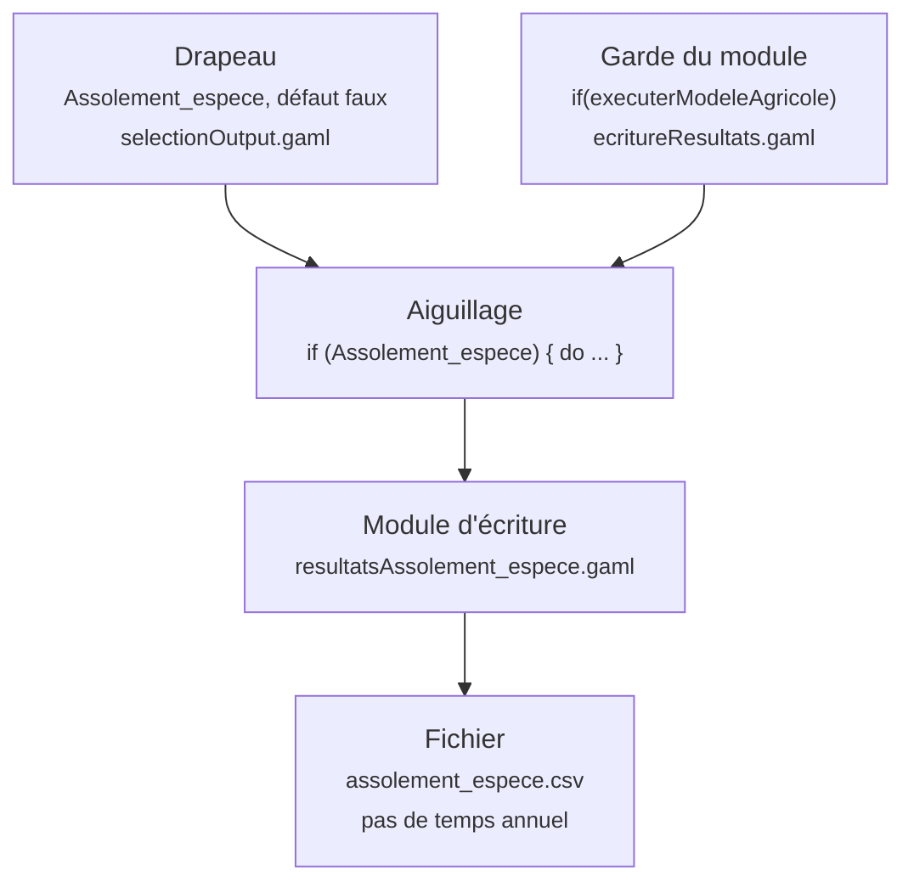

# Pourquoi MAELIA n'écrit presque rien par défaut

!!! abstract "En bref"
    Chaque famille de résultats de MAELIA est derrière un drapeau booléen, et
    ce drapeau est lui-même imbriqué dans les gardes des modules dont la sortie
    dépend. Cette page explique ce qui décide qu'un fichier existe, et pourquoi
    la plateforme sait le dire avant l'exécution.

!!! question "Le problème"
    Sans ce lien, un dossier de sortie est une énigme. Un fichier absent ne se
    distingue pas d'un fichier jamais demandé : on ne sait pas si l'exécution a
    échoué, si un module était éteint, ou si l'on n'a simplement pas coché la
    bonne case. Et un scénario ne sait pas ce qu'il produira avant de l'avoir
    produit.

## Un interrupteur par famille de résultats

`models/output/selectionOutput.gaml` déclare les drapeaux de sortie et leurs
valeurs par défaut. Presque tous sont faux.

--8<-- "_partials/chiffres-modele.md:sorties"

Une exécution aux réglages par défaut du launcher écrit donc très peu de chose.
Ce n'est pas un défaut du modèle : produire toutes les tables à chaque
exécution coûterait un temps et un volume que personne ne demande.

## Le drapeau ne suffit pas : la garde est imbriquée

`models/output/ecritureResultats.gaml` fait l'aiguillage, et il imbrique les
tests de drapeaux dans les gardes des modules. La condition réelle d'une sortie
est donc la conjonction de toute la pile qui la surplombe.



Dans le langage de conditions du catalogue, cette pile s'écrit comme une
conjonction unique :

```
executerModeleAgricole == true && Assolement_espece == true
```

Certaines piles sont bien plus profondes : quotas, restrictions et prélèvements
réclament que l'hydrographique, l'agricole et le normatif tournent ensemble, et
que les prélèvements soient simulés. C'est ce qui rend la question « pourquoi ce
fichier manque-t-il » impossible à trancher de tête.

!!! info "Le nom du fichier vient du module, pas du drapeau"
    Le module d'écriture compose son nom en concaténant le dossier de sortie, un
    littéral et un suffixe de simulation vide par défaut. Un drapeau peut ouvrir
    plusieurs fichiers, et deux drapeaux peuvent viser le même. Le générateur
    suit donc l'aiguillage jusqu'au littéral, au lieu de déduire le nom du
    drapeau.

## Trois cas particuliers, tous assumés

**Des sorties écrites hors aiguillage.** Quelques fichiers sont écrits au fil du
code, sans passer par `ecritureResultats.gaml`. L'analyse locale ne voit pas les
conditions de l'appelant : on leur attribue la garde sûre de leur arborescence —
un fichier écrit depuis le module hydrographique n'existe pas si ce module ne
tourne pas.

**Des gardes non entièrement traduisibles.** Quand une garde porte un terme que
le langage de conditions ne sait pas dire, le terme est écarté et la sortie est
annoncée *possible*. Le GAML d'origine est conservé pour vérification — voir
[langage-de-conditions.md](langage-de-conditions.md).

**Des drapeaux hors de portée d'un scénario.** Une partie des drapeaux déclarés
par `selectionOutput.gaml` n'est pas reprise par `launcherBase.gaml` : ils ne
peuvent donc pas être surchargés au `load`, et la sortie qu'ils commandent est
inatteignable quoi que fasse l'utilisateur.

!!! warning "Rendre une sortie atteignable est une modification du modèle"
    Il faut ajouter au launcher une ligne `parameter … var: …` pour le drapeau
    concerné. Ce n'est pas un réglage de catalogue, et la plateforme ne peut pas
    le contourner : elle se contente de signaler ces sorties comme hors de
    portée.

## Ce que la plateforme peut alors répondre

Le lien étant au catalogue, trois questions deviennent des lectures, et non des
enquêtes.

| Question | Ce qui y répond |
|---|---|
| Que produira ce scénario ? | l'évaluation des conditions sur les écarts posés |
| Pourquoi ce fichier manque-t-il ? | la confrontation entre ce qui était attendu et ce que l'exécution a écrit |
| Que dois-je activer pour l'obtenir ? | la route la plus courte parmi les alternatives de la condition |

La troisième est celle qui compte pour l'utilisateur : `Expectation.blocking`
nomme les paramètres à changer, et l'alternative la plus courte est choisie
parce que c'est le conseil sur lequel on peut agir
(`app/contexts/catalog/domain/outputs.py`).

!!! info "Un fichier attendu et non écrit désigne le modèle"
    Dans la confrontation d'après exécution, la moitié intéressante est la liste
    des manquants : un fichier que le scénario demandait et que l'exécution n'a
    pas produit ne pointe pas vers un réglage de l'utilisateur, mais vers une
    condition interne au modèle.

## Comment on sait que le catalogue dit vrai

Le critère d'arrêt de l'extraction est objectif : pour les réglages par défaut
du launcher, les fichiers **prédits** par le catalogue sont exactement ceux
qu'une exécution sur `terrainTest` a **écrits** — ni manquant, ni hors
catalogue. La vérification a été refaite après activation de drapeaux
supplémentaires dans un scénario, et elle est tenue par un test unitaire.

C'est le seul contrôle qui ferme la boucle : il compare une prédiction à un
dossier réel, pas une lecture du GAML à une autre lecture du GAML.

!!! quote "Sources GAML"
    `models/output/selectionOutput.gaml` — déclaration des drapeaux et de leurs
    défauts. `models/output/ecritureResultats.gaml` — l'aiguillage et ses gardes
    imbriquées. `models/output/resultatsAssolement_espece.gaml` — exemple de
    module d'écriture composant son nom de fichier.
    `models/modeleCommun/donneesGlobales.gaml` — `majChemins`, le dossier de sortie.

!!! note "Voir aussi"
    - [Le langage de conditions des catalogues](langage-de-conditions.md)
    - [Rien de MAELIA n'est écrit dans le code](rien-n-est-code-en-dur.md)
    - [Le modèle MAELIA en bref](maelia-en-bref.md)
    - [Inventaire archivé des sorties](../archive/donnees-et-parametres.md)
