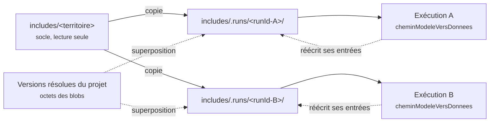

# Pourquoi chaque exécution a sa copie des `includes`

!!! abstract "En bref"
    MAELIA ne se contente pas de lire ses fichiers d'entrée : il en réécrit
    certains pendant l'exécution. Deux exécutions qui partagent un répertoire se
    corrompent mutuellement, sans erreur. Cette page explique la panne et la
    parade.

!!! question "Le problème"
    Le réflexe est de pointer toutes les exécutions sur le même répertoire de
    territoire : les données sont les mêmes, et une copie coûte du disque. Ce
    réflexe produit des résultats faux, et rien dans la console ne le signale.

## Un moteur qui écrit là où il lit

Pendant une exécution, MAELIA réécrit une partie de ses propres entrées — les
fichiers d'assolement par blocs en sont l'exemple qui a été mesuré. La
constatation ne vient pas d'une lecture du GAML mais d'empreintes prises avant
et après une exécution.

À partir de là, deux exécutions concurrentes sur le même répertoire se
retrouvent dans la situation classique de l'écriture croisée : la seconde lit ce
que la première vient d'écrire, la première relit ce que la seconde a modifié.

!!! danger "La corruption est silencieuse"
    Aucune exception, aucun message. Les deux exécutions vont au bout, produisent
    leurs fichiers de sortie, et ces fichiers sont faux. Une panne bruyante coûte
    une heure ; celle-ci coûte la confiance dans tous les résultats produits
    depuis qu'elle a commencé.

## La parade : une copie de travail par exécution

Chaque exécution reçoit un répertoire qui n'appartient qu'à elle, sous
`includes/.runs/<runId>/`, et le paramètre `cheminModeleVersDonnees` y est
pointé. Le socle redevient ce qu'il aurait toujours dû être : une source en
lecture seule. La copie est supprimée à la fin, quelle que soit l'issue —
succès, échec ou annulation — puisque les sorties vivent ailleurs.

Le point d'entrée est `app/contexts/dataset/application/materialize.py`, et le
préfixe pointant du répertoire `.runs` le distingue d'un territoire réel tout en
l'excluant du dépôt.

## Le socle n'est pas toujours copié

La même brique sert deux usages, et la différence est délibérée.

| Usage | Point de départ | Pourquoi |
|---|---|---|
| Banc d'essai | copie du jeu livré | c'est sa raison d'être : exercer GAMA sur les données du modèle |
| Projet | rien, puis les fichiers du projet | un projet tourne sur ses propres données et sur rien d'autre |

!!! warning "Copier un jeu livré sous un projet comblerait ses trous"
    Si les fichiers d'un territoire de démonstration venaient compléter ceux d'un
    projet incomplet, l'exécution irait au bout et ses résultats ne décriraient
    ni le projet ni le jeu de démonstration. Le silence serait plus coûteux que
    l'échec.

## Les octets ne sont jamais régénérés

La superposition est une **copie d'octets**, jamais une reconstruction. Les
octets d'une version publiée sont ceux qui ont été reçus ou sérialisés une seule
fois, à la publication, puis gelés.

C'est ce qui écarte une dérive discrète entre ce qui a été validé et ce que GAMA
lit : un délimiteur, un encodage, un ordre de colonnes ou un terminateur de
ligne inhabituel ne survit pas à un aller-retour par une représentation
intermédiaire. Reconstruire le fichier au moment de la matérialisation
reviendrait à ne plus savoir ce qui a été exécuté.

## Les sorties aussi sont isolées

L'isolation des entrées serait inutile si les exécutions se disputaient leur
dossier de sortie. La plateforme impose donc `idSimulationAPI` avec
l'identifiant de l'exécution ; l'action `majChemins` écrit alors sous
`models/main/log/<runId>` au lieu d'un dossier horodaté qu'il faudrait deviner.

!!! info "Un chemin imposé plutôt qu'un chemin deviné"
    On ne cherche pas où le moteur a écrit : on le lui impose, et on lit à
    l'endroit prévu. Le chemin annoncé par le modèle sur sa console reste un
    repli, jamais la source de vérité.

## Ce que l'isolation ne résout pas

Elle rend les exécutions concurrentes correctes ; elle ne les rend pas
gratuites. Toutes les simulations vivent dans la même JVM : la mémoire est
partagée, le débit est sous-linéaire, et un dépassement mémoire tue toutes les
exécutions en cours à la fois. Le plafond de parallélisme se dimensionne donc
sur la RAM disponible, pas sur le nombre de cœurs — les ordres de grandeur
mesurés sont consignés dans le `README.md` du dépôt.

La compilation, elle, ne se parallélise pas du tout : deux chargements
simultanés du même modèle se disputent le registre de ressources de GAMA. Un
verrou ne couvre que cette étape, les simulations restant concurrentes — voir
[pieges-gama-maelia.md](pieges-gama-maelia.md).

!!! note "Voir aussi"
    - [Pièges connus de GAMA et de MAELIA](pieges-gama-maelia.md)
    - [Le modèle MAELIA en bref](maelia-en-bref.md)
    - [Pourquoi une plateforme entre l'utilisateur et GAMA](pourquoi.md)
