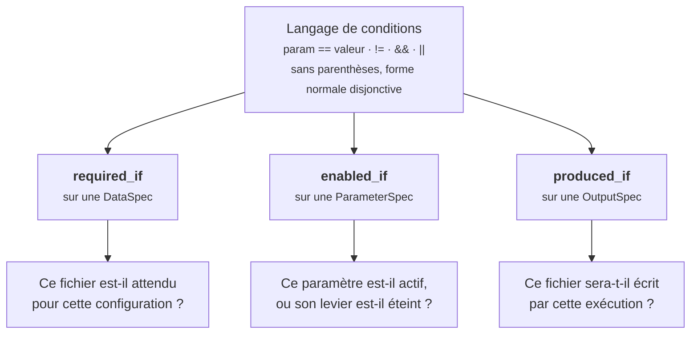

# Le langage de conditions des catalogues

!!! abstract "En bref"
    Les catalogues portent des conditions : ce fichier est-il attendu, ce
    paramètre est-il actif, cette sortie sera-t-elle écrite. Elles sont écrites
    dans un langage minuscule, sans parenthèses, qui tient dans une cellule de
    tableau. Cette page explique pourquoi il est aussi pauvre, et ce que cette
    pauvreté achète.

!!! question "Le problème"
    Les dépendances du modèle sont réelles : un fichier hydrographique n'a de
    sens qu'en mode SWAT, un identifiant d'exploitation n'a de sens que si l'on
    exécute une seule exploitation, une sortie n'est écrite que si toute une
    pile de modules tourne. Les coder en Python revient à les sortir du
    catalogue ; les évaluer avec un interpréteur complet revient à accepter que
    le catalogue exécute du code arbitraire.

## Une grammaire, et rien de plus

Une condition est une suite de comparaisons `param == valeur` ou
`param != valeur`, liées par `&&` et `||`. Il n'y a pas d'autre opérateur, pas
d'appel de fonction, pas de parenthèse.

```
executerModeleHydrographique == true && nomChoixModeleHydrographique == 'SWAT'
```

Les littéraux acceptés sont ceux qu'un launcher GAML manipule : chaîne entre
apostrophes, `true` ou `false`, entier, décimal. L'évaluation vit dans
`app/contexts/catalog/domain/services.py`, en fonctions pures, et n'appelle
jamais l'interpréteur Python.

!!! info "Un paramètre absent vaut « non renseigné »"
    Une égalité sur un paramètre que la configuration ne porte pas est fausse,
    une inégalité est vraie. C'est ce qui permet d'évaluer une condition sur des
    écarts partiels sans avoir à compléter la carte des valeurs au préalable.

## Pourquoi sans parenthèses

`&&` lie plus fort que `||`. Une condition se lit donc comme une somme de
produits : plusieurs alternatives, chacune étant une conjonction. C'est la forme
normale disjonctive, et l'extraction depuis le GAML distribue les gardes dans
cette forme au lieu de les recopier.

```
sorties_eau == true && plante == 'AqYield' || sorties_eau == true && plante == 'AqYieldNC'
```

Deux raisons à ce choix, et aucune n'est esthétique.

**La condition est lue par un administrateur, dans une cellule de tableau.** Une
expression parenthésée demande de compter les niveaux ; une somme de produits se
lit en diagonale.

**La forme normale rend les réponses calculables.** Quand une sortie n'est pas
produite, la plateforme doit dire quoi activer pour l'obtenir. Chaque
alternative est un chemin possible ; la plus courte est le conseil qu'on donne
(`app/contexts/catalog/domain/outputs.py`).

!!! info "Le `||` est arrivé avec les sorties"
    Les gardes des entrées ne l'ont jamais réclamé : une entrée est attendue
    parce qu'un module est actif, et ces conditions se cumulent. Les gardes de
    sortie, elles, offrent des alternatives — deux modèles de croissance qui
    ouvrent le même fichier. Le langage a donc gagné la disjonction à ce
    moment-là, et rien d'autre.

## Une grammaire, trois emplois



Les trois questions sont différentes, la grammaire est la même. C'est ce qui
permet à un administrateur d'apprendre une syntaxe et de la réutiliser partout,
et au code de n'avoir qu'un évaluateur.

| Emploi | Ce qui change si la condition est fausse |
|---|---|
| `required_if` | le fichier n'est pas réclamé au projet |
| `enabled_if` | le champ est grisé, avec la raison de son extinction |
| `produced_if` | la sortie est annoncée absente, avec la route la plus courte pour l'obtenir |

## Ce qu'une condition illisible ne fait jamais

Une condition qu'on ne sait pas lire est un défaut du catalogue, pas une réponse
négative. Le code le traite toujours dans le même sens : **ne rien masquer**.

- Une `required_if` illisible rend le fichier **applicable** : mieux vaut un
  fichier réclamé à tort qu'un fichier silencieusement oublié.
- Une `enabled_if` illisible laisse le paramètre **modifiable**, avec la mention
  du problème : un champ verrouillé sans explication coûte plus qu'un champ
  ouvert à tort.
- Une `produced_if` illisible rend la sortie **incertaine**, jamais absente.

En amont, la validation d'une spec écrite à la main refuse une condition qu'elle
ne sait pas évaluer, un paramètre qui dépendrait de lui-même, et une référence à
un paramètre inconnu du launcher. Le refus a lieu à l'écriture, pas des écrans
plus tard.

## Quand la traduction abandonne un terme

Certaines gardes du modèle portent une expression que ce langage ne sait pas
dire — une longueur de liste, un booléen d'état interne :

```gaml
if(isPrelevementEtRejetSimules and isCanaux and length(listeCanaux) > 0){
```

Le terme est écarté et la condition retenue devient plus permissive que le
modèle. La sortie est alors marquée comme non exacte : la plateforme l'annonce
*possible*, jamais certaine, et conserve le texte GAML d'origine pour qu'on
puisse vérifier. Une traduction qui abandonne un terme doit rester vérifiable.

!!! danger "Le piège serait de présenter l'approximation comme une certitude"
    Annoncer un fichier comme produit alors qu'une condition interne peut
    l'empêcher revient à faire chercher une erreur là où il n'y en a pas. La
    distinction entre *produit*, *absent* et *incertain* existe pour cela.

!!! quote "Sources GAML"
    `models/output/ecritureResultats.gaml` — les gardes traduites, y compris
    celles qui ne le sont pas entièrement.
    `models/main/launcherBase.gaml` — les paramètres que ces conditions citent.

!!! note "Voir aussi"
    - [Rien de MAELIA n'est écrit dans le code](rien-n-est-code-en-dur.md)
    - [Pourquoi MAELIA n'écrit presque rien par défaut](ce-que-maelia-ecrit.md)
    - [Le modèle MAELIA en bref](maelia-en-bref.md)
