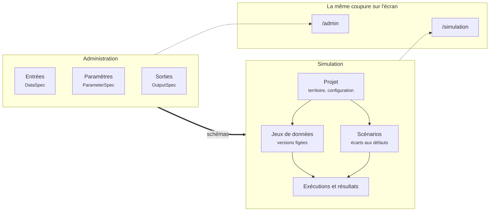

# Administration et Simulation

!!! abstract "En bref"
    La plateforme couvre deux usages, deux publics et deux rythmes. Elle les
    sépare jusque dans les routes du front et dans le découpage du backend.
    Cette page dit pourquoi cette coupure existe et ce qu'elle interdit.

!!! question "Le problème"
    Un modèle se décrit une fois et s'exploite tous les jours. Mélanger les deux
    revient à laisser un projet écrire dans le catalogue : la définition d'un
    type de fichier deviendrait alors dépendante des données qu'un territoire
    lui a fait avaler. Les schémas cesseraient d'être communs, et accueillir un
    second modèle demanderait de réécrire la plateforme.

## Deux publics, deux rythmes

--8<-- "_partials/deux-domaines.md:tableau"

L'administration est rare et structurante : on y décrit les fichiers qu'un
modèle lit, les paramètres que son launcher expose, les sorties qu'il peut
écrire. La simulation est quotidienne et volumineuse : on y charge un
territoire, on compose des scénarios, on lance des exécutions, on lit des
résultats.

## La flèche, et son sens

--8<-- "_partials/deux-domaines.md:regle"

Un jeu de données n'est valide que par rapport à une `DataSpec` ; un scénario
n'est valide que par rapport à une `ParameterSpec`. L'inverse n'existe pas :
`catalog` ignore jusqu'à l'existence de `project`.

!!! info "Le domaine, et le contexte qui exécute"
    Le domaine métier s'appelle **Simulation** ; le contexte qui porte le cycle
    de vie d'une exécution s'appelle **`run`**. Un contexte nommé `simulation`
    à l'intérieur d'un domaine nommé Simulation aurait rendu ambiguë chaque
    phrase de cette documentation.

## Ce que la coupure interdit

**Un projet ne modifie pas un catalogue.** Il le lit, il en déduit ce qu'on
attend de lui, il signale un écart. Corriger un type de fichier reste un geste
d'administration, visible par tous les projets à la fois.

**Un catalogue ne connaît pas les données.** Une `DataSpec` dit quel fichier est
attendu et sous quelle condition ; elle ne sait rien du contenu qu'un territoire
donné a fourni. Le rapprochement se fait dans le domaine Simulation, par une
fonction pure qui reçoit d'un côté les specs applicables, de l'autre un
inventaire.

**Aucun cycle entre contextes.** Un besoin bidirectionnel signale un découpage
raté, jamais une exception à accorder. La règle de dépendance du backend en est
la traduction technique : `api`/`worker` → `application` → `domain` ←
`infrastructure`, et de l'administration vers la simulation, jamais l'inverse.

## Ce que l'administration produit

--8<-- "_partials/chiffres-modele.md:tout"

Ces trois catalogues sont la totalité de ce que la plateforme sait de MAELIA.
Ils ne sont pas saisis à la main : ils sont engendrés depuis le GAML du modèle
— voir [rien-n-est-code-en-dur.md](rien-n-est-code-en-dur.md).

## La coupure sur l'écran

Le front sépare les deux espaces au niveau des routes, chacune avec son cadre et
sa barre latérale : `src/routes/adminRoutes.jsx` et
`src/routes/simulationRoutes.jsx`. Un écran d'administration et un écran de
projet n'ont ni la même navigation, ni le même vocabulaire, ni le même risque —
on n'y fait pas les mêmes gestes.

Côté simulation, la liste des projets occupe toute la largeur ; chaque projet
reçoit ensuite sa propre barre latérale, porteuse de ses rubriques — données,
scénarios, simulations, résultats. La séparation est donc visible avant même
d'avoir lu un libellé.

## Pourquoi cela compte au-delà de MAELIA

Le seul modèle embarqué à ce jour est MAELIA. Rien dans la plateforme ne lui est
propre, et c'est la coupure qui le garantit : si un jour un second modèle
arrive, il apporte ses catalogues et le domaine Simulation continue de
fonctionner sans changer une ligne. L'inverse — un domaine Simulation qui
connaîtrait les noms de fichiers de MAELIA — rendrait cette arrivée impossible.

!!! note "Voir aussi"
    - [Pourquoi une plateforme entre l'utilisateur et GAMA](pourquoi.md)
    - [Rien de MAELIA n'est écrit dans le code](rien-n-est-code-en-dur.md)
    - [Ce que la version Java a enseigné](heritage-java.md)
    - [Sommaire de la documentation](../index.md)
