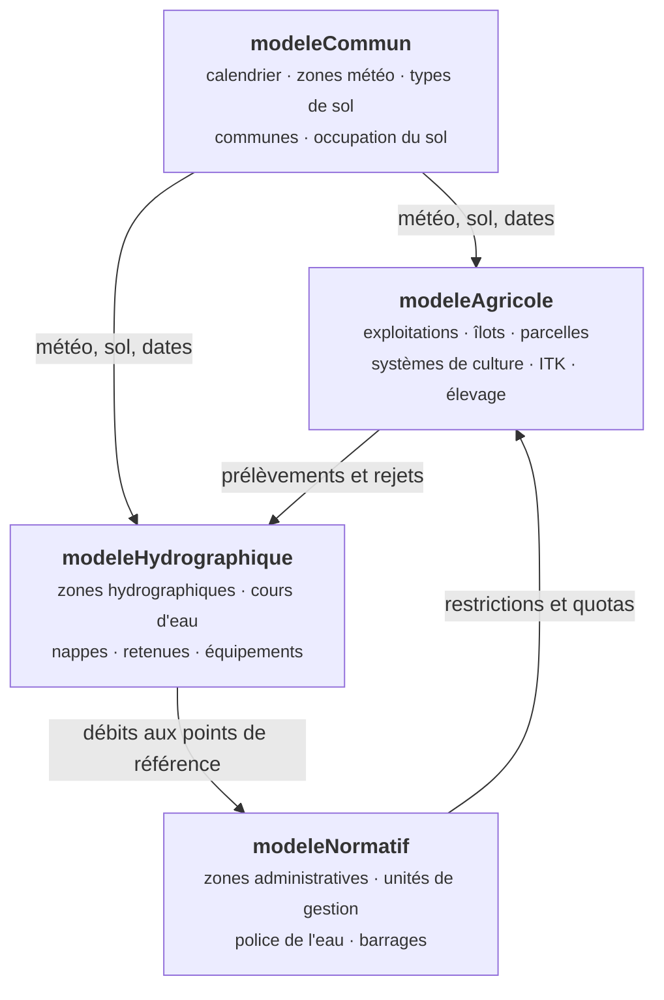

# Le modèle MAELIA en bref

!!! abstract "En bref"
    MAELIA simule les interactions entre l'usage agricole de l'eau, la
    ressource disponible et la réglementation qui l'encadre, sur un territoire
    donné et au pas de temps journalier. Cette page décrit ce que le modèle
    couvre et ce qu'il appelle un territoire — le minimum pour lire les autres
    pages de cette section.

!!! question "Le problème"
    Sans une idée de ce que MAELIA calcule, le vocabulaire de la plateforme
    reste opaque : on ne comprend ni pourquoi un fichier d'entrée devient
    obligatoire quand on active un module, ni pourquoi certaines sorties
    dépendent d'autres modules que le leur. Ces deux comportements viennent du
    modèle, pas de la plateforme.

--8<-- "_partials/avertissement-code-fait-autorite.md:version"

## Ce que le modèle représente

MAELIA est un modèle multi-agents de socio-agrosystème. Il fait coexister des
exploitations agricoles qui décident et travaillent, une ressource en eau qui
s'écoule et se prélève, et des autorités qui arbitrent les usages quand la
ressource manque. Le pas de temps est le jour ; l'horizon se compte en années,
par `anneeDebutSimulation` et `nbAnneesSimulation`
(`models/main/launcherBase.gaml`).

## Quatre modules, et ce qu'ils s'échangent

L'arborescence `models/` porte cette structure telle quelle : un répertoire par
module.

**Le module commun** ne décide rien : il fournit aux autres le temps, le climat
et le sol. Il tourne toujours.

**Le module agricole** est celui qui est actif par défaut
(`executerModeleAgricole`). Il porte les exploitations, leurs îlots et parcelles,
leurs systèmes de culture et leurs itinéraires techniques — donc les semis, les
travaux, la fertilisation, l'irrigation et les récoltes.

**Le module hydrographique** (`executerModeleHydrographique`) simule la
ressource : découpage en zones hydrographiques, écoulements, nappes, retenues,
et les équipements par lesquels on prélève et on rejette.

**Le module normatif** (`executerModeleNormatif`) porte la règle : zones
administratives, unités de gestion, seuils, quotas, barrages. Il lit des débits
et prononce des restrictions.

!!! info "Les échanges ne sont pas symétriques"
    Une sortie du module agricole peut dépendre du module normatif — les fichiers
    de quotas ne sont écrits que si l'agricole, l'hydrographique et le normatif
    tournent ensemble, et si les prélèvements sont simulés
    (`models/output/ecritureResultats.gaml`). C'est la raison pour laquelle une
    condition de production est une conjonction, et non un simple interrupteur.

## Activer un module change ce qu'on doit fournir

Les paramètres d'activation ne changent pas seulement le calcul : ils changent
la liste des fichiers que le modèle va chercher. Activer l'hydrographique rend
nécessaire tout ce qui décrit la ressource ; choisir un mode de calcul plutôt
qu'un autre ajoute ses propres fichiers.

--8<-- "_partials/chiffres-modele.md:entrees"

C'est cette dépendance que le catalogue encode, dans le langage décrit par
[langage-de-conditions.md](langage-de-conditions.md).

## Ce qu'un scénario peut changer

Tout ce qui est réglable au lancement passe par le launcher : c'est lui, et lui
seul, qui dit quelles variables sont surchargeables au `load`.

--8<-- "_partials/chiffres-modele.md:parametres"

Quelques-uns sont imposés par la plateforme et ne sont pas négociables — le
dossier de sortie, la racine partagée, le chemin vers les données du run.

## Un territoire, c'est quoi

Un **territoire** est un jeu complet de données d'entrée, rangé sous une racine
qui porte son nom. Le modèle le choisit par le paramètre
`nomDecoupageZonePourLectureFichiers`, et tout chemin de lecture est relatif à
`<cheminModeleVersDonnees><territoire>/`. Les fichiers y sont rangés par module :
`modeleAgricole/`, `modeleCommun/`, `modeleHydrographique/`, `modeleNormatif/`.

!!! warning "Les jeux livrés ne sont pas des territoires de projet"
    Les jeux présents sous `gama-models/MAELIA_1.4.29_GAMA_2025-06/includes/`
    servent à **exercer GAMA depuis le banc d'essai**. Ce ne sont pas des
    territoires à proposer à la création d'un projet : les données d'un projet
    viennent de ses propres téléversements, et une exécution de projet part de
    ses fichiers et de rien d'autre
    (`app/contexts/dataset/application/materialize.py`).

`terrainTest` est le jeu de référence : c'est le seul dont on ait la preuve
qu'il mène une exécution à terme. C'est lui que prennent le territoire par
défaut du launcher, le générateur de catalogue et les tests sur fichiers réels.

## Ce que le modèle écrit, et quand

--8<-- "_partials/chiffres-modele.md:sorties"

Le point contre-intuitif est que presque rien n'est écrit sans qu'on le demande.
Il a sa page : [ce-que-maelia-ecrit.md](ce-que-maelia-ecrit.md).

## Ce que le modèle dit sur sa propre avancée

MAELIA ne trace pas de numéro de cycle. Il écrit une ligne par jour simulé, qui
porte la date courante — c'est le seul signal d'avancement exploitable pendant
une exécution, et c'est celui que le worker lit
(`app/worker/tasks.py`). La fin est annoncée par un marqueur de console, avant
que l'expérience ne se mette en pause.

!!! quote "Sources GAML"
    `models/main/launcherBase.gaml` — horizon, territoire, activation des
    modules. `models/main/main.gaml` — boucle journalière et fin de simulation.
    `models/output/ecritureResultats.gaml` — dépendances entre modules au moment
    d'écrire. `models/` — un répertoire par module.

!!! note "Voir aussi"
    - [Pourquoi une plateforme entre l'utilisateur et GAMA](pourquoi.md)
    - [Pourquoi MAELIA n'écrit presque rien par défaut](ce-que-maelia-ecrit.md)
    - [Pourquoi chaque exécution a sa copie des includes](isolation-des-executions.md)
    - [Inventaire archivé des entrées et sorties](../archive/donnees-et-parametres.md)
