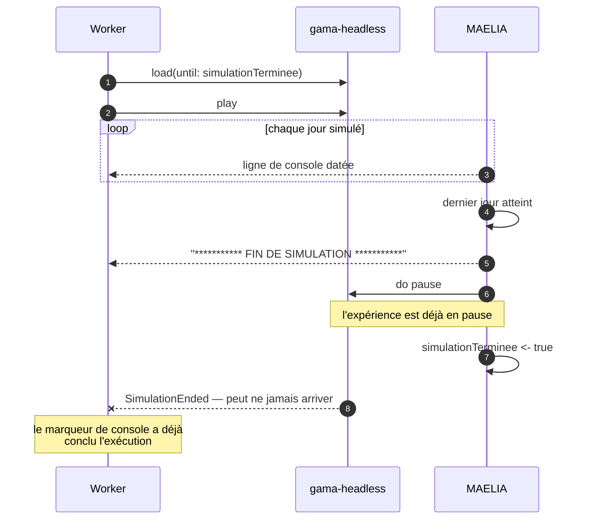

# Pièges connus de GAMA et de MAELIA

!!! abstract "En bref"
    Piloter un moteur de simulation depuis un service suppose de connaître ses
    comportements non documentés. Ceux qui suivent ont tous été rencontrés, et
    chacun a laissé une trace dans le code d'exécution. Cette page les explique
    plutôt que de les lister.

!!! question "Le problème"
    Un moteur qui ne dit pas qu'il a fini, ou qui ne dit pas qu'il a échoué,
    laisse une exécution bloquée en cours jusqu'au délai de garde. Une heure à
    ne rien produire, pour un modèle mort depuis la première minute. Les pièges
    de cette page se paient tous en attente et en résultats manquants.

--8<-- "_partials/avertissement-code-fait-autorite.md:version"

## La fin qui peut ne jamais s'annoncer

L'expérience est chargée avec `until: simulationTerminee`. Mais `main.gaml`
exécute `do pause` **avant** de poser ce booléen : quand la condition d'arrêt
devient vraie, l'expérience est déjà en pause, et GAMA n'émet alors pas toujours
`SimulationEnded`.

Le worker surveille donc en parallèle l'événement et le marqueur de console.
Celui qui arrive le premier conclut. Sans cette seconde voie, une exécution
reste en cours alors que sa console affiche « FIN DE SIMULATION » — c'est
exactement la panne qu'on lit au dépannage du `README.md`.

## L'initialisation ratée qui ne dit rien au protocole

Quand une donnée d'entrée manque ou est illisible, le modèle appelle
`raiseError` : il écrit l'erreur sur la console, puis meurt
(`models/modeleCommun/donneesGlobales.gaml`). Rien ne remonte au protocole. Pire,
l'échec survient **pendant le chargement** : l'identifiant d'expérience est
renvoyé ensuite comme si de rien n'était, et le `play` réussit sur un modèle
déjà mort.

Surveiller la seule attente de fin ne suffirait donc pas. Le marqueur d'erreur
d'initialisation est surveillé dès le chargement
(`app/contexts/run/infrastructure/gama_session.py`).

## Pas de cycle, une date par jour

MAELIA ne trace jamais « cycle N ». Il écrit une ligne par jour simulé, qui
porte la date courante et le quantième — c'est le seul signal d'avancement
exploitable pendant l'exécution, et c'est celui que le worker analyse.

!!! tip "Le cycle final se demande, il ne se lit pas"
    À la fin, le worker interroge GAMA par une expression plutôt que d'analyser
    la console : une réponse du moteur vaut mieux qu'une expression régulière sur
    un texte libre.

## Deux chargements simultanés se disputent le moteur

GAMA ne sait pas compiler deux fois le même modèle en même temps : les deux
chargements se disputent le registre de ressources et l'un échoue en annonçant
qu'une ressource différente est déjà enregistrée sous la même adresse.

La parade n'est pas de sérialiser les exécutions : un verrou couvre le seul
chargement, et les simulations restent concurrentes
(`app/contexts/run/infrastructure/model_lock.py`). Le verrou porte un délai
d'expiration et sa boucle d'attente rend la main périodiquement — aucune attente
non bornée n'est admise dans ce code.

## Le socket qui tient la simulation

Le protocole `gama-server` détruit la simulation si la connexion se ferme. Deux
conséquences directes : la session appartient à une tâche de fond et jamais à une
requête HTTP, et un arrêt demandé doit envoyer son `stop` **tant que le socket
est encore ouvert** — sortir de la session avant revient à tuer la simulation
sans avoir rendu la main proprement.

## Deux exigences d'environnement faciles à casser

**Le descripteur de projet Eclipse.** GAMA est une application Eclipse : sans le
fichier `.project` à la racine du modèle, il refuse de le charger. L'erreur
parle d'un modèle introuvable alors qu'il est bien là.

**Le répertoire courant du conteneur GAMA.** Le script de lancement headless
fabrique un espace de travail jetable dans son répertoire courant. Si ce
répertoire est un volume monté depuis l'hôte, ces espaces de travail
s'accumulent dans l'arborescence des modèles — et comme leur numéro vient d'un
comptage et non d'un maximum, en supprimer un au milieu fait que deux instances
visent le même. D'où la règle de ne pas surcharger le répertoire de travail de
l'image GAMA.

!!! warning "L'invariant de chemins"
    `api`, `worker` et `gama-headless` montent le même volume au même chemin. Un
    chemin calculé en Python est alors un chemin valide côté GAML, sans
    traduction. Le casser produit des erreurs GAMA incompréhensibles ; une sonde
    de santé vérifie l'invariant à chaque appel.

## Deux pièges propres aux jeux de données livrés

**Un scénario climatique non vide bascule la météo.** Laisser
`nomScenarioClimatique` renseigné fait lire la météo **simulée** au lieu de
l'observée. Un jeu qui ne livre que l'observée échoue alors à l'initialisation,
et il faut laisser ce paramètre vide.

**Tous les jeux livrés ne vont pas au bout.** `terrainTest` est le jeu de
référence, le seul dont on ait la preuve qu'il mène une exécution à terme. Un
autre jeu livré s'arrête sans rien dire pendant la création des systèmes de
culture : il ne dépanne que pour un fichier que `terrainTest` ne porterait pas.

!!! quote "Sources GAML"
    `models/main/main.gaml` — le marqueur de fin, `do pause`, puis
    `simulationTerminee`. `models/modeleCommun/donneesGlobales.gaml` —
    `raiseError`, le marqueur d'initialisation ratée, et `majChemins`.
    `models/main/launcherTest.gaml` — l'expérience adaptée au headless.

!!! note "Voir aussi"
    - [Pourquoi chaque exécution a sa copie des includes](isolation-des-executions.md)
    - [Pourquoi une plateforme entre l'utilisateur et GAMA](pourquoi.md)
    - [Le modèle MAELIA en bref](maelia-en-bref.md)
