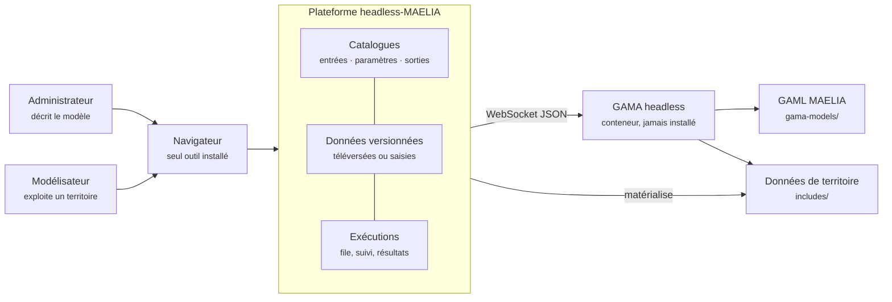

# Pourquoi une plateforme entre l'utilisateur et GAMA

!!! abstract "En bref"
    GAMA exécute MAELIA, et fait cela très bien. Ce qu'il ne fait pas, c'est
    dire à un modélisateur quels fichiers préparer, quelles valeurs sont
    acceptables, ce qu'une exécution produira et pourquoi un résultat manque.
    Cette page explique le travail que la plateforme prend en charge, et ce
    qu'elle laisse au moteur.

!!! question "Le problème"
    Faire tourner MAELIA sans plateforme demande d'installer une plateforme
    Eclipse, de connaître l'arborescence attendue sous `includes/`, de savoir
    quel paramètre du launcher commande quel module, et de deviner, devant un
    dossier de sortie, si un fichier absent n'a pas été demandé ou n'a pas pu
    être écrit. Chacune de ces connaissances vit aujourd'hui dans le code GAML
    ou dans la tête de celui qui l'a écrit.

## Le moteur seul, et ce qu'il suppose connu

GAMA headless est un serveur : on lui envoie un `load`, puis un `play`, et il
répond par un flux de messages. C'est une interface de machine, pas d'usage.
Elle suppose résolu tout ce qui vient avant.

| Ce que le moteur suppose acquis | Qui le sait, sans plateforme |
|---|---|
| Quels fichiers d'entrée déposer, et où | le code GAML, module par module |
| Lesquels sont obligatoires pour cette configuration | le GAML, à travers ses gardes `file_exists` |
| Quelles valeurs un paramètre accepte | `models/main/launcherBase.gaml` |
| Quels fichiers seront écrits | `models/output/ecritureResultats.gaml` |
| Où ils seront écrits | l'action `majChemins` de `models/modeleCommun/donneesGlobales.gaml` |

Un modélisateur qui ne lit pas le GAML n'a aucun de ces éléments. Et un
modélisateur qui les lit y consacre du temps qui ne va pas à la modélisation.

## Ce que la plateforme prend en charge

Personne, sur ce schéma, n'installe GAMA. Le seul prérequis d'un poste est
Docker ; le seul outil d'un utilisateur est son navigateur. Le moteur reste un
service parmi d'autres, joignable au bout d'un socket.

## Quatre services rendus, et pas un de plus

**Décrire avant d'exiger.** Le catalogue dit quels fichiers un modèle attend,
sous quelles conditions et avec quels champs. Un projet sait donc ce qui lui
manque avant de lancer quoi que ce soit, au lieu de le découvrir dans une trace
d'erreur GAML.

**Versionner ce qui a servi.** Un résultat n'a de valeur que si l'on sait de
quelles données il découle. Chaque modification d'un jeu de données produit une
version ; une exécution fige les versions qu'elle a consommées.

**Tenir la session.** Le protocole `gama-server` détruit la simulation si le
socket se ferme : la connexion doit vivre du `load` jusqu'à la fin, donc hors du
cycle de vie d'une requête HTTP. C'est un worker qui la porte
(`app/contexts/run/infrastructure/gama_session.py`).

**Expliquer une absence.** Un fichier de sortie manquant a une cause : un
drapeau non activé, un module éteint, une garde interne au modèle. La
plateforme la nomme — voir [ce-que-maelia-ecrit.md](ce-que-maelia-ecrit.md).

## Ce que la plateforme ne fait pas

!!! info "Le modèle reste le modèle"
    La plateforme ne modifie pas MAELIA, ne corrige pas ses résultats et ne
    compense pas ses limites. Quand une sortie est inatteignable parce que son
    drapeau n'est pas déclaré par le launcher, la réponse est une ligne à
    ajouter au **modèle**, pas une rustine dans le code de la plateforme.

Elle n'enferme pas non plus MAELIA dans son code. Rien de ce qui est propre à ce
modèle — nom de fichier, de paramètre, de colonne — n'est écrit dans le code
Python : tout vient des catalogues engendrés. C'est la condition pour qu'un
second modèle n'impose pas une réécriture
— voir [rien-n-est-code-en-dur.md](rien-n-est-code-en-dur.md).

## Ce que le choix coûte

Mettre un service devant un moteur ajoute des contraintes que le moteur seul
n'aurait pas.

- **Un invariant de chemins.** `api`, `worker` et `gama-headless` montent le
  même volume au même chemin, faute de quoi un chemin calculé en Python devient
  illisible côté GAML. La sonde `shared-volume` le vérifie à chaque appel.
- **Une concurrence bornée.** Toutes les simulations vivent dans la même JVM :
  le nombre d'exécutions menées de front se dimensionne sur la mémoire, pas sur
  les cœurs.
- **Une isolation par exécution.** MAELIA réécrit certaines de ses entrées
  pendant le run — voir
  [isolation-des-executions.md](isolation-des-executions.md).

Ces trois points ne sont pas des détails d'installation : ce sont les raisons
d'être de la moitié du code d'exécution.

## Les services, pour situer les pièces

--8<-- "_partials/services.md:urls"

!!! quote "Sources GAML"
    `models/main/launcherBase.gaml` — les paramètres surchargeables au `load`.
    `models/output/ecritureResultats.gaml` — l'aiguillage des sorties.
    `models/modeleCommun/donneesGlobales.gaml` — l'action `majChemins`, qui fixe
    le dossier de sortie.

!!! note "Voir aussi"
    - [Administration et Simulation](les-deux-domaines.md)
    - [Le modèle MAELIA en bref](maelia-en-bref.md)
    - [Pièges connus de GAMA et de MAELIA](pieges-gama-maelia.md)
    - [Sommaire de la documentation](../index.md)
