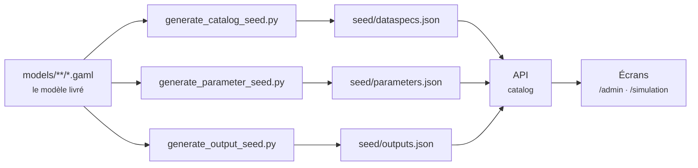

# Rien de MAELIA n'est écrit dans le code

!!! abstract "En bref"
    Aucun nom de fichier, de paramètre ou de colonne du modèle n'apparaît dans
    le code de la plateforme. Tout vient de trois catalogues engendrés depuis le
    GAML. Cette page explique pourquoi cette règle est une condition de survie
    du projet, et ce qu'elle impose en retour.

!!! question "Le problème"
    La tentation, devant un modèle qu'on découvre, est d'écrire le code du
    premier fichier, puis celui du deuxième. Au rythme d'une fonction par type
    d'entrée, la plateforme devient une transcription de MAELIA : chaque montée
    de version du modèle demande une version de la plateforme, et l'arrivée d'un
    second modèle demande une seconde plateforme.

## L'ordre de grandeur qui tranche la question

--8<-- "_partials/chiffres-modele.md:tout"

Le code par fichier n'est pas seulement long à écrire : il est faux dès la
montée de version suivante, et il est invérifiable. Personne ne relit cette
quantité de branches pour s'assurer qu'elles disent encore ce que le GAML dit.

## Le GAML est la seule source

Une seule flèche entre, et rien ne revient : la plateforme ne réécrit jamais le
modèle, et un écran ne corrige jamais le GAML. Les trois scripts vivent dans
`headless-maelia-server/scripts/` et déposent leur résultat sous
`app/contexts/catalog/infrastructure/seed/`.

**Ce que chaque générateur lit**

| Catalogue | Ce qui fait autorité |
|---|---|
| Entrées | le code GAML pour les chemins lus, les fichiers réellement livrés pour les champs |
| Paramètres | `models/main/launcherBase.gaml`, la liste exacte des variables surchargeables au `load` |
| Sorties | `models/output/selectionOutput.gaml` pour les drapeaux, `ecritureResultats.gaml` pour les gardes, le module d'écriture pour le nom de fichier |

!!! warning "Le tableur livré n'est pas une source"
    Le schéma de données fourni avec le modèle (`MAELIA_Schema_Donnees.xlsx`)
    n'est pas utilisé : l'analyse a montré qu'il contient des erreurs de collecte
    et décrit une partie de ses feuilles positionnellement. Le générateur d'entrées
    le dit dans son propre en-tête
    (`headless-maelia-server/scripts/generate_catalog_seed.py`).

--8<-- "_partials/avertissement-code-fait-autorite.md:autorite"

## Ce que le seed préserve, et ce qu'il retire

Le chargement du seed est **idempotent et non destructif**. Les specs modifiées
à la main par un administrateur sont marquées comme telles et survivent à une
régénération ; celles qui venaient du seed et ont disparu du modèle sont
retirées.

Ce second point n'est pas une commodité. Une spec orpheline ferait réclamer à un
projet un fichier que GAMA ne lit plus : le projet resterait incomplet sans
raison, et personne ne saurait dire laquelle.

## Le test de la règle

La règle se vérifie par un geste, pas par une intention :

!!! tip "Ajouter un type de fichier ne doit toucher aucun code"
    Si ajouter une entrée, un paramètre ou une sortie demande d'écrire une ligne
    de Python, la logique a fui du catalogue vers le code. C'est le signal, et il
    est sans appel.

Le même test se décline à la lecture des résultats. Le catalogue dit **si** un
fichier de sortie sera écrit et sous quelle condition ; c'est en l'ouvrant qu'on
apprend **ce qu'il contient**. Déclarer à la main les colonnes de tous les
fichiers de sortie serait faux dès la montée de version suivante ; déduire la
condition de production en lisant le fichier est impossible, puisqu'il n'est
justement pas là.

## Les cas où le GAML ne dit pas tout

Un générateur ne devine pas ce que le modèle ne déclare pas. Trois situations
demandent une déclaration explicite au catalogue, et elles sont assumées comme
telles.

- **Un paramètre qui désigne une entité d'un fichier.** Le launcher n'indique
  nulle part qu'un identifiant d'exploitation doit exister dans les données du
  projet ; le lien est porté par le catalogue, qui propose alors les valeurs
  réellement présentes.
- **Un paramètre commandé par un autre.** Le launcher documente ses propres
  dépendances par un commentaire, que le générateur lit plutôt que de le
  recopier ; quelques-unes, qu'il ne commente pas, sont déclarées à la main.
- **Une garde que le langage de conditions ne sait pas dire.** Le terme est
  écarté et la sortie devient *possible* au lieu de certaine — voir
  [langage-de-conditions.md](langage-de-conditions.md).

Dans les trois cas, la déclaration reste une **donnée** du catalogue. Rien n'est
retourné dans le code.

## Ce que la règle protège

Elle protège la possibilité d'accueillir un second modèle sans réécrire la
plateforme, et c'est la raison invoquée dès la page d'accueil. Elle protège
aussi une propriété plus immédiate : la plateforme ne peut pas mentir sur le
modèle plus longtemps qu'une régénération du catalogue. Ce qu'elle affiche vient
du GAML qui s'exécute.

!!! quote "Sources GAML"
    `models/main/launcherBase.gaml` — le référentiel des paramètres.
    `models/output/selectionOutput.gaml` — la déclaration des drapeaux de sortie.
    `models/output/ecritureResultats.gaml` — l'aiguillage et ses gardes.

!!! note "Voir aussi"
    - [Administration et Simulation](les-deux-domaines.md)
    - [Le langage de conditions des catalogues](langage-de-conditions.md)
    - [Pourquoi MAELIA n'écrit presque rien par défaut](ce-que-maelia-ecrit.md)
    - [Ce que la version Java a enseigné](heritage-java.md)
