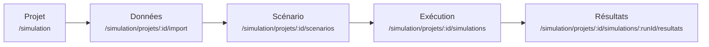

# Votre première simulation, de bout en bout

!!! abstract "En bref"
    Un dépôt cloné d'un côté, un graphique de l'autre. Ce tutoriel se rejoue
    littéralement : chaque étape dit ce que vous devez voir pour savoir qu'elle
    a réussi, et combien de temps elle prend. Comptez une trentaine de minutes,
    dont l'essentiel en attente.

## Le chemin



Cinq objets, dans cet ordre, et l'ordre ne s'inverse pas : un scénario n'a de
sens que sur des données, une exécution que sur un scénario, un graphique que
sur une exécution terminée.

## Étape 1 — la plateforme répond

Suivez [Installer et démarrer](installation.md) jusqu'à la sonde verte. En
résumé :

```bash
docker compose up -d
docker compose exec api alembic upgrade head
docker compose restart api
curl http://localhost:8000/api/v1/health/dependencies
```

**Ce que vous devez voir** : `"status": "ok"` et cinq sondes `up`.
**Durée** : quelques minutes au premier lancement, une minute ensuite.

N'allez pas plus loin tant que cette réponse n'est pas verte. Toutes les étapes
suivantes en dépendent, et elles échoueraient de façon moins lisible.

## Étape 2 — créer le projet

Ouvrez <http://localhost:5173/simulation> et créez un projet. Un **nom** suffit,
la description est facultative ; rien d'autre ne vous est demandé.

**Ce que vous devez voir** : la page d'initialisation du projet,
`/simulation/projets/<id>/initialisation`. Notez cet identifiant, il revient
dans toutes les routes suivantes.
**Durée** : quelques secondes.

!!! info "Le territoire n'est pas un choix de création"
    Un projet neuf démarre sur le jeu de référence livré avec le modèle, et vos
    fichiers viendront s'y superposer. Le demander à la création reviendrait à
    exiger une décision avant d'avoir de quoi la prendre.

## Étape 3 — lire la configuration de modélisation

Restez sur l'écran d'initialisation. La section **Configuration de
modélisation** porte des interrupteurs : modèle agricole, hydrographique,
normatif, élevage, barrages, îlots hors zone. Seul le modèle agricole est actif
par défaut.

Sous le formulaire, une phrase annonce combien de fichiers d'entrée cette
configuration attend. Actionnez un interrupteur : le nombre change. **Ne
l'enregistrez pas** — laissez la configuration par défaut pour ce tutoriel,
c'est la plus courte à alimenter.

**Ce que vous devez voir** : le nombre de fichiers attendus se recalcule quand
vous touchez un interrupteur.
**Durée** : une minute.

## Étape 4 — fabriquer une archive de données

Un projet neuf ne contient aucune donnée. Pour ce tutoriel, nous prenons comme
échantillon le jeu de référence livré avec le modèle — le seul dont on sache
qu'il mène une exécution à terme.

```bash
cd gama-models/MAELIA_1.4.29_GAMA_2025-06/includes/terrainTest
zip -r ../../../../terrainTest.zip .
```

Sous Windows, sans `zip` :

```powershell
Compress-Archive -Path gama-models\MAELIA_1.4.29_GAMA_2025-06\includes\terrainTest\* -DestinationPath terrainTest.zip
```

**Ce que vous devez voir** : une archive de quelques méga-octets à la racine du
dépôt.
**Durée** : quelques secondes.

!!! warning "Ce jeu est un échantillon, pas un patrimoine"
    Les données livrées sous `includes/` servent à exercer le moteur. Un vrai
    projet téléverse **ses** fichiers : ce sont eux qui décrivent son territoire.
    Voir [Importer et versionner des données](../guides/importer-des-donnees.md).

## Étape 5 — importer l'archive

Depuis l'écran d'initialisation, allez sur
`/simulation/projets/<id>/import` et déposez l'archive. Chaque fichier est
apparié au catalogue **par son nom**, importé, puis validé. L'arborescence de
l'archive ne vous contraint pas — elle sert seulement à départager deux fichiers
homonymes.

**Ce que vous devez voir** : un compte rendu ligne par ligne, avec **zéro
invalide et zéro erreur**. Quelques fichiers ignorés sont normaux : le catalogue
ne décrit pas tout ce qu'un territoire transporte.
**Durée** : une à deux minutes. L'archive part en un seul envoi, chaque fichier
est validé puis stocké — ne rechargez pas la page pendant ce temps.

## Étape 6 — vérifier la complétude

Allez sur `/simulation/projets/<id>/donnees`.

**Ce que vous devez voir** : la barre d'avancement des entrées obligatoires à
**100 %**, et chaque module au complet. Un fichier facultatif manquant ne
compte pas : le modèle continue sans lui.
**Durée** : quelques secondes.

Si la barre n'est pas pleine, le lancement sera refusé à l'étape 8 — inutile de
continuer. L'écran nomme les fichiers qui manquent.

## Étape 7 — composer un scénario d'un an

Allez sur `/simulation/projets/<id>/scenarios` et créez un scénario. Dans la
section **Général** de l'éditeur, posez `nbAnneesSimulation` à **1**, puis
enregistrez.

**Ce que vous devez voir** : le scénario apparaît dans la liste avec **un seul
écart**. C'est le principe : un scénario n'enregistre que les différences aux
valeurs par défaut, jamais l'ensemble des paramètres.
**Durée** : deux minutes.

!!! tip "Pourquoi une seule année"
    La durée de simulation est le paramètre qui pèse le plus sur le temps
    d'exécution. Une année suffit largement à produire des sorties lisibles, et
    vous n'attendrez que quelques minutes au lieu de plusieurs dizaines.

## Étape 8 — lancer l'exécution

Allez sur `/simulation/projets/<id>/simulations` et lancez une simulation en
choisissant votre scénario. Rien d'autre ne vous est demandé : les paramètres
et les versions de données sont déjà portés par le scénario.

**Ce que vous devez voir** : l'écran de suivi
`/simulation/projets/<id>/simulations/<runId>`, avec un état `PENDING` qui passe
à `RUNNING`.
**Durée** : immédiat.

Deux choses sont **figées à cet instant précis**, et seulement ici : les
paramètres résolus depuis le scénario, et la version exacte de **chaque** jeu de
données du projet. Publier une version plus récente ensuite ne changera rien à
ce qu'a consommé cette exécution.

## Étape 9 — suivre la simulation

Restez sur l'écran de suivi. La console GAMA défile en direct, relayée par
WebSocket.

**Ce que vous devez voir** : une **date simulée** qui avance jour après jour.
C'est le seul indicateur de progression fiable — le modèle ne trace pas de
numéro de cycle exploitable. Quand la console affiche
`*********** FIN DE SIMULATION ***********`, l'état passe à `FINISHED` et la
section **Sorties** se remplit.
**Durée** : deux à trois minutes pour une année sur le jeu de référence.

Rien ne s'écrit avant la fin : le modèle produit ses fichiers en fin de période
simulée. Une console muette pendant l'initialisation est normale ; une console
muette après plusieurs minutes ne l'est pas.

## Étape 10 — lire un résultat

Depuis l'écran de suivi d'un run terminé, ouvrez les résultats —
`/simulation/projets/<id>/simulations/<runId>/resultats`.

**Ce que vous devez voir** : la liste des fichiers produits, et pour le premier
fichier tabulaire un graphique déjà tracé, accompagné de lectures proposées. Le
profil des colonnes — quelle colonne est un axe de temps, laquelle est une
mesure, laquelle sert à filtrer — est déduit du fichier lui-même, pas déclaré à
l'avance.
**Durée** : quelques secondes.

Changez d'axe, d'agrégat ou de mesure : le tracé se redessine. Vous pouvez
enregistrer cette lecture sous un nom ; elle appartiendra au **projet** et se
rejouera sur vos prochaines exécutions.

## Ce que vous avez vérifié

Un graphique à l'écran prouve toute la chaîne d'un coup : la base et le
stockage objet fonctionnent, le catalogue décrit correctement les entrées, le
worker a matérialisé les fichiers, GAMA a compilé puis exécuté le modèle, les
sorties ont été inventoriées et relues.

C'est le seul test qui atteste que la plateforme fonctionne. Les autres
attestent qu'elle n'est pas cassée — ce n'est pas la même affirmation.

!!! note "Voir aussi"
    - [Créer un projet et le configurer](../guides/creer-un-projet.md) — la
      configuration de modélisation en détail.
    - [Composer un scénario](../guides/composer-un-scenario.md) — au-delà d'un
      seul écart.
    - [Lire et comparer les résultats](../guides/lire-les-resultats.md) — les
      lectures enregistrées et la comparaison d'exécutions.
    - [Dépannage](../guides/depannage.md) — si une étape a échoué.
