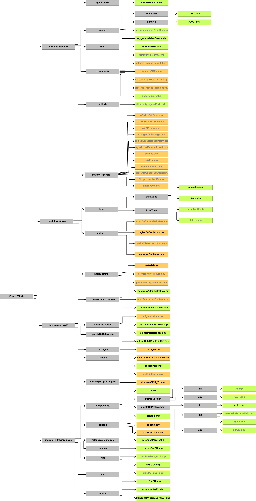
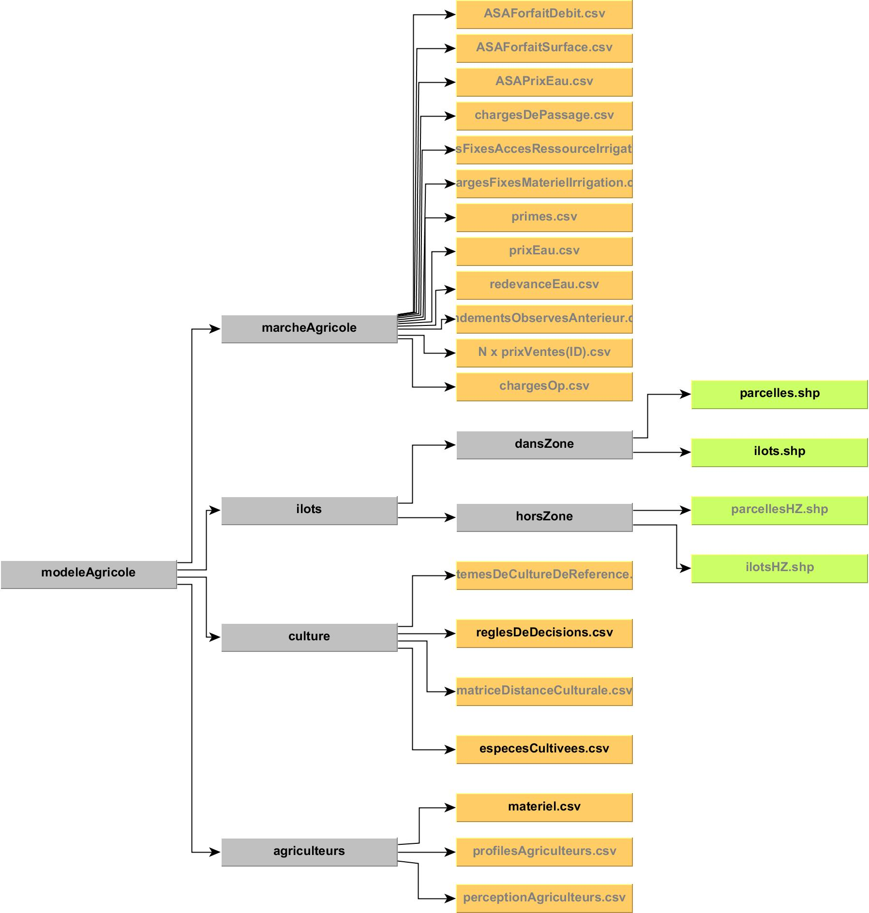
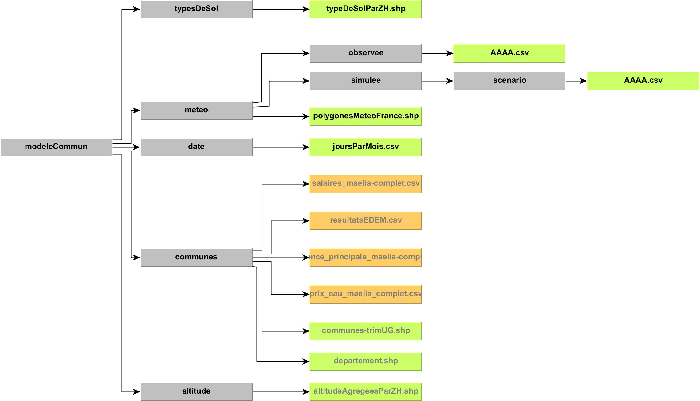
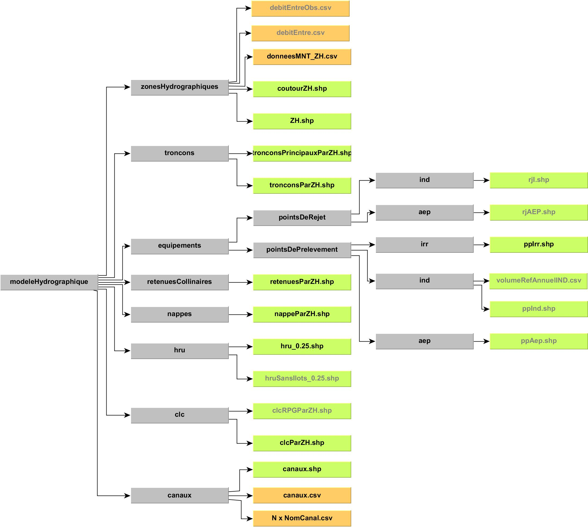
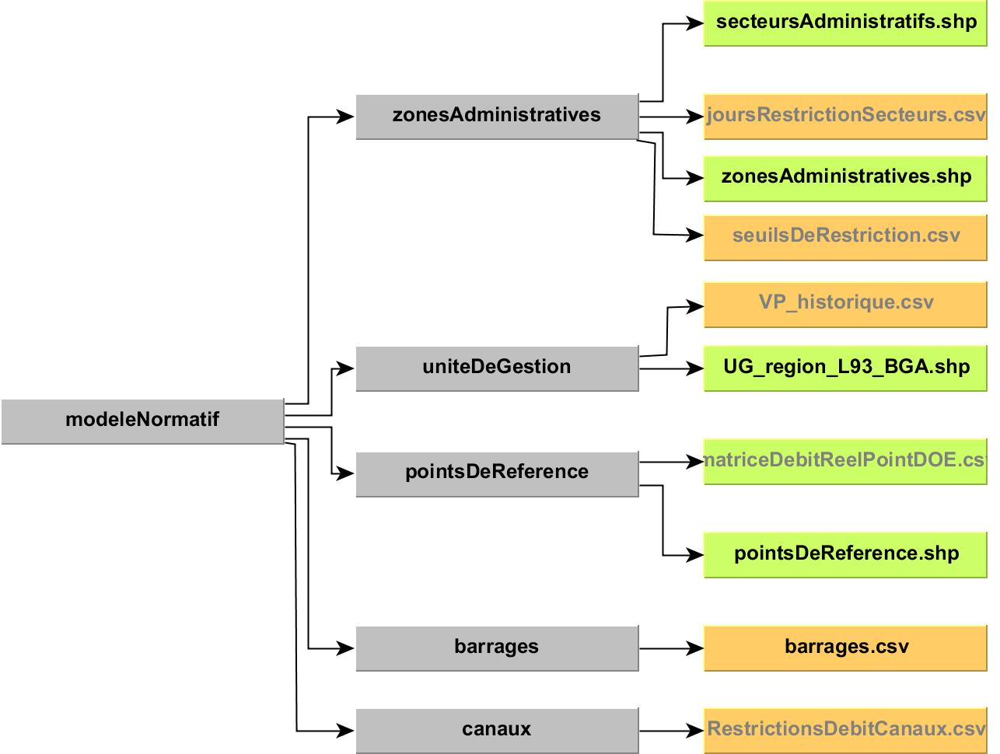

# Les fichiers d'entrée

!!! abstract "En bref"
    Inventaire de tout ce que le modèle MAELIA lit : chemin relatif,
    identifiant au catalogue, caractère obligatoire, condition d'applicabilité
    et fichier GAML qui commande la lecture. À consulter pour savoir quel
    fichier fournir, et sous quelle configuration il devient nécessaire.

**Source** : extraction de `headless-maelia-server/app/contexts/catalog/infrastructure/seed/dataspecs.json` — vérifié le 2026-09-15 contre MAELIA 1.4.29.

--8<-- "_partials/chiffres-modele.md:entrees"

--8<-- "_partials/avertissement-code-fait-autorite.md:autorite"

## Où le modèle cherche ses fichiers

Tout chemin d'entrée est relatif à `<cheminModeleVersDonnees><territoire>/`,
où le territoire est la valeur du paramètre
`nomDecoupageZonePourLectureFichiers`. La colonne **Chemin relatif** des
tableaux ci-dessous part de cette racine.

```text
<cheminModeleVersDonnees>/<nomDecoupageZonePourLectureFichiers>/<chemin relatif>
```

!!! danger "Un run travaille sur une copie"
    MAELIA réécrit certains de ses fichiers d'entrée pendant l'exécution. La
    plateforme recopie donc les includes d'un run dans un répertoire qui lui
    est propre : deux runs partageant un même répertoire se corrompraient
    silencieusement.

??? example "Organigramme INRAE d'ensemble"

    

## Comment lire les tableaux

| Colonne | Contenu |
|---|---|
| **Chemin relatif** | chemin sous la racine du territoire ; une expression régulière quand le nom du fichier n'est pas fixe |
| **Identifiant** | clé du catalogue (`DataSpec.id`) — celle qu'attendent les routes d'API et les `options_from` des paramètres |
| **Type** | `CSV`, `SHAPEFILE` ou `IMAGE` |
| **Obligatoire** | `oui` = la lecture n'est pas gardée, ou le modèle lève une erreur en l'absence du fichier ; `non` = il prévient et poursuit |
| **Attendu si** | condition d'applicabilité (`required_if`) ; vide = attendu dans toute configuration |
| **Déclaré dans** | fichier GAML qui commande la lecture (`gaml_source`) |

!!! info "Obligatoire ne veut pas dire attendu"
    L'applicabilité se calcule d'abord. **Attendu si** dit si le fichier entre
    dans la configuration ; **Obligatoire** dit si, y étant, le modèle peut
    démarrer sans lui. Un fichier obligatoire hors configuration ne bloque rien.

## Module agricole

??? example "Organigramme INRAE du module"

    

| Chemin relatif | Identifiant | Type | Obligatoire | Attendu si | Déclaré dans |
|---|---|---|---|---|---|
| `modeleAgricole/agriculteurs/batiments.shp` | `agri.agriculteurs.batiments` | SHAPEFILE | non | `executerModeleElevage == true` | `modeleAgricole/Elevage/gestionElevage/batiment.gaml` |
| `modeleAgricole/agriculteurs/contratsLivraison.csv` | `agri.agriculteurs.contratsLivraison` | CSV | non | — | `modeleAgricole/exploitation.gaml` |
| `modeleAgricole/agriculteurs/exploitations.csv` | `agri.agriculteurs.exploitations` | CSV | non | — | `modeleAgricole/exploitation.gaml` |
| `modeleAgricole/agriculteurs/explSurf.csv` | `agri.agriculteurs.explSurf` | CSV | non | — | `modeleAgricole/exploitation.gaml` |
| `modeleAgricole/agriculteurs/lotsAnimaux.csv` | `agri.agriculteurs.lotsAnimaux` | CSV | oui | `executerModeleElevage == true` | `modeleAgricole/Elevage/gestionElevage/atelierElevage.gaml` |
| `modeleAgricole/agriculteurs/materiel.csv` | `agri.agriculteurs.materiel` | CSV | non | — | `modeleAgricole/materielIrrigation.gaml` |
| `modeleAgricole/agriculteurs/perceptionAgriculteurs.csv` | `agri.agriculteurs.perceptionAgriculteurs` | CSV | non | — | `modeleAgricole/Agriculteurs/agriculteur.gaml` |
| `modeleAgricole/agriculteurs/profilesAgriculteurs.csv` | `agri.agriculteurs.profilesAgriculteurs` | CSV | oui | `nomChoixAssolement == 'FonctionsDeCroyances'` | `modeleAgricole/Agriculteurs/agriculteurFonctionsDeCroyances.gaml` |
| `modeleAgricole/blocs(?!.*_cor).+\.csv` | `agri.blocs` | CSV | non | — | — |
| `modeleAgricole/blocs.+_cor\.csv` | `agri.blocsCorriges` | CSV | non | — | — |
| `modeleAgricole/culture/correspondance_especesMAELIA_especesIBIO.csv` | `agri.culture.correspondance_especesMAELIA_especesIBIO` | CSV | non | — | `output/resultats_iBIO.gaml` |
| `modeleAgricole/culture/especesCultivees.csv` | `agri.culture.especesCultivees` | CSV | oui | — | `modeleAgricole/especeCultivee.gaml` |
| `modeleAgricole/culture/especesHerbSim.csv` | `agri.culture.especesHerbSim` | CSV | oui | `nomChoixModeleCroissancePrairie == 'HerbSim'` | `modeleAgricole/Cultures/especeHerbSim.gaml` |
| `modeleAgricole/culture/matriceDistanceCulturale.csv` | `agri.culture.matriceDistanceCulturale` | CSV | non | — | `modeleAgricole/SystemesDeCultures/systemeDeCultureDeReference.gaml` |
| `modeleAgricole/culture/reglesDeDecisions.csv` | `agri.culture.reglesDeDecisions` | CSV | oui | — | `modeleAgricole/SystemesDeCultures/systemeDeCultureDeReference.gaml` |
| `modeleAgricole/culture/reglesDeDecisions_fertilisation.csv` | `agri.culture.reglesDeDecisions_fertilisation` | CSV | oui | — | `modeleAgricole/SystemesDeCultures/systemeDeCultureDeReference.gaml` |
| `modeleAgricole/culture/systemesDeCultureDeReference.csv` | `agri.culture.systemesDeCultureDeReference` | CSV | non | — | `modeleAgricole/SystemesDeCultures/systemeDeCultureDeReference.gaml` |
| `modeleAgricole/Engrais/Engrais.csv` | `agri.Engrais.Engrais` | CSV | oui | — | `modeleAgricole/Engrais/Engrais.gaml` |
| `modeleAgricole/engrais/stocskEngraisParExploitation.csv` | `agri.engrais.stocskEngraisParExploitation` | CSV | non | — | `modeleAgricole/exploitation.gaml` |
| `modeleAgricole/ilots/dansZone/ilots.shp` | `agri.ilots.dansZone.ilots` | SHAPEFILE | oui | — | `modeleAgricole/Ilots/ilot.gaml` |
| `modeleAgricole/ilots/dansZone/parcelles.shp` | `agri.ilots.dansZone.parcelles` | SHAPEFILE | oui | — | `modeleAgricole/Parcelles/parcelle.gaml` |
| `modeleAgricole/ilots/horsZone/ilots_HZ.shp` | `agri.ilots.horsZone.ilots_HZ` | SHAPEFILE | oui | `avecIlotsHorsZone == true` | `modeleAgricole/Ilots/ilotHorsZone.gaml` |
| `modeleAgricole/ilots/horsZone/parcelles_HZ.shp` | `agri.ilots.horsZone.parcelles_HZ` | SHAPEFILE | oui | `avecIlotsHorsZone == true` | `modeleAgricole/Parcelles/parcelleHorsZone.gaml` |
| `modeleAgricole/marcheAgricole/ASAForfaitDebit.csv` | `agri.marcheAgricole.ASAForfaitDebit` | CSV | non | — | `modeleAgricole/marcheAgricole.gaml` |
| `modeleAgricole/marcheAgricole/ASAForfaitSurface.csv` | `agri.marcheAgricole.ASAForfaitSurface` | CSV | non | — | `modeleAgricole/marcheAgricole.gaml` |
| `modeleAgricole/marcheAgricole/ASAPrixEau.csv` | `agri.marcheAgricole.ASAPrixEau` | CSV | non | — | `modeleAgricole/marcheAgricole.gaml` |
| `modeleAgricole/marcheAgricole/chargesDePassage.csv` | `agri.marcheAgricole.chargesDePassage` | CSV | non | — | `modeleAgricole/marcheAgricole.gaml` |
| `modeleAgricole/marcheAgricole/chargesFixesAccesRessourceIrrigation.csv` | `agri.marcheAgricole.chargesFixesAccesRessourceIrrigation` | CSV | non | — | `modeleAgricole/marcheAgricole.gaml` |
| `modeleAgricole/marcheAgricole/chargesFixesMaterielIrrigation.csv` | `agri.marcheAgricole.chargesFixesMaterielIrrigation` | CSV | non | — | `modeleAgricole/marcheAgricole.gaml` |
| `modeleAgricole/marcheAgricole/chargesOp.csv` | `agri.marcheAgricole.chargesOp` | CSV | non | — | `modeleAgricole/marcheAgricole.gaml` |
| `modeleAgricole/marcheAgricole/primes.csv` | `agri.marcheAgricole.primes` | CSV | non | — | `modeleAgricole/marcheAgricole.gaml` |
| `modeleAgricole/marcheAgricole/prixEau.csv` | `agri.marcheAgricole.prixEau` | CSV | non | — | `modeleAgricole/marcheAgricole.gaml` |
| `modeleAgricole/marcheAgricole/prixVentes.+\.csv` | `agri.marcheAgricole.prixVentes` | CSV | non | — | — |
| `modeleAgricole/marcheAgricole/redevanceEau.csv` | `agri.marcheAgricole.redevanceEau` | CSV | non | — | `modeleAgricole/marcheAgricole.gaml` |
| `modeleAgricole/marcheAgricole/rendementsObservesAnterieur.csv` | `agri.marcheAgricole.rendementsObservesAnterieur` | CSV | non | — | `modeleAgricole/Agriculteurs/memoire.gaml` |

## Module commun

??? example "Organigramme INRAE du module"

    

| Chemin relatif | Identifiant | Type | Obligatoire | Attendu si | Déclaré dans |
|---|---|---|---|---|---|
| `modeleCommun/altitude/altitudeAgregeesParZH.shp` | `commun.altitude.altitudeAgregeesParZH` | SHAPEFILE | non | — | `modeleCommun/bandeAltitude.gaml` |
| `modeleCommun/communes/communes-trimUG.shp` | `commun.communes.communes-trimUG` | SHAPEFILE | non | — | `modeleCommun/commune.gaml` |
| `modeleCommun/communes/departement.shp` | `commun.communes.departement` | SHAPEFILE | non | — | `modeleAgricole/exploitation.gaml` |
| `modeleCommun/communes/prix_eau_maelia_complet.csv` | `commun.communes.prix_eau_maelia_complet` | CSV | non | — | `modeleCommun/commune.gaml` |
| `modeleCommun/communes/residence_principale_maelia-complet.csv` | `commun.communes.residence_principale_maelia-complet` | CSV | non | — | `modeleCommun/commune.gaml` |
| `modeleCommun/communes/resultatsEDEM.csv` | `commun.communes.resultatsEDEM` | CSV | non | — | `modeleCommun/commune.gaml` |
| `modeleCommun/communes/salaires_maelia-complet.csv` | `commun.communes.salaires_maelia-complet` | CSV | non | — | `modeleCommun/commune.gaml` |
| `modeleCommun/date/joursParMois.csv` | `commun.date.joursParMois` | CSV | oui | — | `modeleCommun/dateCourante.gaml` |
| `modeleCommun/meteo/observee/\d{4}\.csv` | `commun.meteo.observee` | CSV | oui | — | — |
| `modeleCommun/meteo/polygonesMeteoFrance.shp` | `commun.meteo.polygonesMeteoFrance` | SHAPEFILE | oui | — | `modeleCommun/zoneMeteo.gaml` |
| `modeleCommun/meteo/simulee/\d{4}\.csv` | `commun.meteo.simulee` | CSV | non | `nomScenarioClimatique != ''` | — |
| `modeleCommun/typesDeSol/typeDeSolParZH.shp` | `commun.typesDeSol.typeDeSolParZH` | SHAPEFILE | oui | — | `modeleCommun/typeDeSol.gaml` |

## Module hydrographique

??? example "Organigramme INRAE du module"

    

| Chemin relatif | Identifiant | Type | Obligatoire | Attendu si | Déclaré dans |
|---|---|---|---|---|---|
| `modeleHydrographique/canaux/(?!canaux\.csv).+\.csv` | `hydro.canaux.donneesDetaillees` | CSV | non | `executerModeleHydrographique == true` | — |
| `modeleHydrographique/canaux/canaux.csv` | `hydro.canaux.canaux_csv` | CSV | oui | `executerModeleHydrographique == true` | `modeleHydrographique/equipementDeCaptageCanaux.gaml` |
| `modeleHydrographique/canaux/canaux.shp` | `hydro.canaux.canaux_shp` | SHAPEFILE | non | `executerModeleHydrographique == true` | `modeleHydrographique/canaux.gaml` |
| `modeleHydrographique/clc/clcParZH.shp` | `hydro.clc.clcParZH` | SHAPEFILE | oui | `executerModeleHydrographique == true` | `modeleCommun/clc.gaml` |
| `modeleHydrographique/clc/clcRPGParZH.shp` | `hydro.clc.clcRPGParZH` | SHAPEFILE | oui | `executerModeleHydrographique == true` | `modeleAgricole/clcRPG.gaml` |
| `modeleHydrographique/clc/disparitionIlots.csv` | `hydro.clc.disparitionIlots` | CSV | oui | `executerModeleHydrographique == true` | `processus/disparitionIlots.gaml` |
| `modeleHydrographique/equipements/pointsDePrelevement/aep/ppAep.shp` | `hydro.equipements.pointsDePrelevement.aep.ppAep` | SHAPEFILE | non | `executerModeleHydrographique == true` | `modeleHydrographique/equipementDeCaptageAEP.gaml` |
| `modeleHydrographique/equipements/pointsDePrelevement/ind/ppInd.shp` | `hydro.equipements.pointsDePrelevement.ind.ppInd` | SHAPEFILE | non | `executerModeleHydrographique == true` | `modeleHydrographique/equipementDeCaptageIND.gaml` |
| `modeleHydrographique/equipements/pointsDePrelevement/ind/volumeRefAnnuelIND.csv` | `hydro.equipements.pointsDePrelevement.ind.volumeRefAnnuelIND` | CSV | non | `executerModeleHydrographique == true` | `modeleHydrographique/equipementDeCaptageIND.gaml` |
| `modeleHydrographique/equipements/pointsDePrelevement/irr/ppIrr.shp` | `hydro.equipements.pointsDePrelevement.irr.ppIrr` | SHAPEFILE | non | `executerModeleHydrographique == true` | `modeleHydrographique/equipementDeCaptageIRR.gaml` |
| `modeleHydrographique/equipements/pointsDeRejet/aep/rjAEP.shp` | `hydro.equipements.pointsDeRejet.aep.rjAEP` | SHAPEFILE | non | `executerModeleHydrographique == true` | `modeleHydrographique/equipementDeRejetAEP.gaml` |
| `modeleHydrographique/equipements/pointsDeRejet/ind/rjI.shp` | `hydro.equipements.pointsDeRejet.ind.rjI` | SHAPEFILE | non | `executerModeleHydrographique == true` | `modeleHydrographique/equipementDeRejetIND.gaml` |
| `modeleHydrographique/hru/hru_0.25.shp` | `hydro.hru.hru_0.25` | SHAPEFILE | oui | `executerModeleHydrographique == true` | `modeleHydrographique/hru.gaml` |
| `modeleHydrographique/hru/hruSansIlots_0.25.shp` | `hydro.hru.hruSansIlots_0.25` | SHAPEFILE | oui | `executerModeleHydrographique == true` | `modeleHydrographique/hru.gaml` |
| `modeleHydrographique/mnt/BGA_PNG.png` | `hydro.mnt.BGA_PNG` | IMAGE | oui | `executerModeleHydrographique == true` | `modeleHydrographique/mnt.gaml` |
| `modeleHydrographique/mnt/majortribdskratie.shp` | `hydro.mnt.majortribdskratie` | SHAPEFILE | non | `executerModeleHydrographique == true` | `modeleHydrographique/mnt.gaml` |
| `modeleHydrographique/nappes/nappeParZH.shp` | `hydro.nappes.nappeParZH` | SHAPEFILE | oui | `executerModeleHydrographique == true` | `modeleHydrographique/nappePhreatique.gaml` |
| `modeleHydrographique/retenuesCollinaires/retenuesParZH.shp` | `hydro.retenuesCollinaires.retenuesParZH` | SHAPEFILE | non | `executerModeleHydrographique == true` | `modeleHydrographique/retenueCollinaire.gaml` |
| `modeleHydrographique/troncons/noeudsExutoireZH.shp` | `hydro.troncons.noeudsExutoireZH` | SHAPEFILE | non | `executerModeleHydrographique == true` | `modeleHydrographique/noeudHydrographique.gaml` |
| `modeleHydrographique/troncons/tronconsPrincipauxParZH.shp` | `hydro.troncons.tronconsPrincipauxParZH` | SHAPEFILE | oui | `executerModeleHydrographique == true` | `modeleHydrographique/coursDeau.gaml` |
| `modeleHydrographique/zonesHydrographiques/contourZH.shp` | `hydro.zonesHydrographiques.contourZH` | SHAPEFILE | oui | `executerModeleHydrographique == true` | `modeleCommun/contourZoneMaelia.gaml` |
| `modeleHydrographique/zonesHydrographiques/debitEntre.csv` | `hydro.zonesHydrographiques.debitEntre` | CSV | oui | `executerModeleHydrographique == true` | `modeleHydrographique/zoneHydrographique.gaml` |
| `modeleHydrographique/zonesHydrographiques/debitEntreObs.csv` | `hydro.zonesHydrographiques.debitEntreObs` | CSV | non | `executerModeleHydrographique == true` | `modeleHydrographique/zoneHydrographique.gaml` |
| `modeleHydrographique/zonesHydrographiques/donneesMNT_ZH.csv` | `hydro.zonesHydrographiques.donneesMNT_ZH` | CSV | oui | `executerModeleHydrographique == true && nomChoixModeleHydrographique == 'SWAT'` | `modeleHydrographique/zoneHydrographiqueSWAT.gaml` |
| `modeleHydrographique/zonesHydrographiques/ZH.shp` | `hydro.zonesHydrographiques.ZH` | SHAPEFILE | oui | `executerModeleHydrographique == true` | `modeleHydrographique/zoneHydrographique.gaml` |

## Module normatif

??? example "Organigramme INRAE du module"

    

| Chemin relatif | Identifiant | Type | Obligatoire | Attendu si | Déclaré dans |
|---|---|---|---|---|---|
| `modeleNormatif/barrages/barrages.csv` | `normatif.barrages.barrages` | CSV | oui | `executerModeleNormatif == true && executerBarrage == true` | `modeleNormatif/barrage.gaml` |
| `modeleNormatif/canaux/RestrictionsDebitCanaux.csv` | `normatif.canaux.RestrictionsDebitCanaux` | CSV | oui | `executerModeleNormatif == true` | `modeleNormatif/secteurAdministratif.gaml` |
| `modeleNormatif/pointsDeReference/matriceDebitReelPointDOE.csv` | `normatif.pointsDeReference.matriceDebitReelPointDOE` | CSV | non | `executerModeleNormatif == true` | `modeleNormatif/pointDeReferenceCalibration.gaml` |
| `modeleNormatif/pointsDeReference/pointsDeReference.shp` | `normatif.pointsDeReference.pointsDeReference` | SHAPEFILE | non | `executerModeleNormatif == true` | `modeleNormatif/pointDeReference.gaml` |
| `modeleNormatif/uniteDeGestion/UG_region_L93_BGA.shp` | `normatif.uniteDeGestion.UG_region_L93_BGA` | SHAPEFILE | non | `executerModeleNormatif == true` | `modeleNormatif/uniteDeGestion.gaml` |
| `modeleNormatif/uniteDeGestion/VP_historique.csv` | `normatif.uniteDeGestion.VP_historique` | CSV | oui | `executerModeleNormatif == true` | `modeleNormatif/uniteDeDefinitionDuVP.gaml` |
| `modeleNormatif/zonesAdministratives/joursRestrictionSecteurs.csv` | `normatif.zonesAdministratives.joursRestrictionSecteurs` | CSV | oui | `executerModeleNormatif == true` | `modeleNormatif/secteurAdministratif.gaml` |
| `modeleNormatif/zonesAdministratives/secteursAdministratifs.shp` | `normatif.zonesAdministratives.secteursAdministratifs` | SHAPEFILE | oui | `executerModeleNormatif == true` | `modeleNormatif/secteurAdministratif.gaml` |
| `modeleNormatif/zonesAdministratives/seuilsDeRestriction.csv` | `normatif.zonesAdministratives.seuilsDeRestriction` | CSV | oui | `executerModeleNormatif == true` | `modeleNormatif/zoneAdministrativeSimple.gaml` |
| `modeleNormatif/zonesAdministratives/zonesAdministratives.shp` | `normatif.zonesAdministratives.zonesAdministratives` | SHAPEFILE | oui | `executerModeleNormatif == true` | `modeleNormatif/zoneAdministrative.gaml` |

## Fichiers désignés par un motif

Ces entrées ne portent pas un nom fixe : le modèle compose le nom à
l'exécution, à partir d'un paramètre ou d'une énumération du répertoire. Le
catalogue retient donc une expression régulière, et non un nom de fichier.

| Identifiant | Répertoire | Motif | Ce qui compose le nom |
|---|---|---|---|
| `agri.blocs` | `modeleAgricole` | `blocs(?!.*_cor).+\.csv` | le paramètre `nomChoixAssolement` |
| `agri.blocsCorriges` | `modeleAgricole` | `blocs.+_cor\.csv` | le paramètre `nomChoixAssolement` |
| `agri.marcheAgricole.prixVentes` | `modeleAgricole/marcheAgricole` | `prixVentes.+\.csv` | les paramètres `listScenarioPrix` et `scenarioDePrixPrincipal` |
| `commun.meteo.observee` | `modeleCommun/meteo/observee` | `\d{4}\.csv` | l'année simulée |
| `commun.meteo.simulee` | `modeleCommun/meteo/simulee` | `\d{4}\.csv` | l'année simulée, sous le répertoire du scénario climatique |
| `hydro.canaux.donneesDetaillees` | `modeleHydrographique/canaux` | `(?!canaux\.csv).+\.csv` | un nom de canal, énuméré à l'exécution |

## Le langage des conditions

Une condition d'applicabilité s'écrit `param == valeur` ou `param != valeur`,
les comparaisons étant liées par `&&` et `||`. **`&&` lie plus fort que `||`**
et il n'y a **pas de parenthèses** : l'expression est en forme normale
disjonctive, elle tient sur une ligne et se lit dans une cellule de tableau.
Le même langage sert aux conditions d'activation d'un paramètre
(`enabled_if`) et aux gardes de production d'une sortie (`produced_if`).

Les conditions effectivement portées par le catalogue d'entrées :

| Condition | Entrées concernées |
|---|---|
| `executerModeleHydrographique == true` | `hydro.canaux.canaux_csv`, `hydro.canaux.canaux_shp`, `hydro.canaux.donneesDetaillees`, `hydro.clc.clcParZH`, `hydro.clc.clcRPGParZH`, `hydro.clc.disparitionIlots`, `hydro.equipements.pointsDePrelevement.aep.ppAep`, `hydro.equipements.pointsDePrelevement.ind.ppInd`, `hydro.equipements.pointsDePrelevement.ind.volumeRefAnnuelIND`, `hydro.equipements.pointsDePrelevement.irr.ppIrr`, `hydro.equipements.pointsDeRejet.aep.rjAEP`, `hydro.equipements.pointsDeRejet.ind.rjI`, `hydro.hru.hruSansIlots_0.25`, `hydro.hru.hru_0.25`, `hydro.mnt.BGA_PNG`, `hydro.mnt.majortribdskratie`, `hydro.nappes.nappeParZH`, `hydro.retenuesCollinaires.retenuesParZH`, `hydro.troncons.noeudsExutoireZH`, `hydro.troncons.tronconsPrincipauxParZH`, `hydro.zonesHydrographiques.ZH`, `hydro.zonesHydrographiques.contourZH`, `hydro.zonesHydrographiques.debitEntre`, `hydro.zonesHydrographiques.debitEntreObs` |
| `executerModeleNormatif == true` | `normatif.canaux.RestrictionsDebitCanaux`, `normatif.pointsDeReference.matriceDebitReelPointDOE`, `normatif.pointsDeReference.pointsDeReference`, `normatif.uniteDeGestion.UG_region_L93_BGA`, `normatif.uniteDeGestion.VP_historique`, `normatif.zonesAdministratives.joursRestrictionSecteurs`, `normatif.zonesAdministratives.secteursAdministratifs`, `normatif.zonesAdministratives.seuilsDeRestriction`, `normatif.zonesAdministratives.zonesAdministratives` |
| `avecIlotsHorsZone == true` | `agri.ilots.horsZone.ilots_HZ`, `agri.ilots.horsZone.parcelles_HZ` |
| `executerModeleElevage == true` | `agri.agriculteurs.batiments`, `agri.agriculteurs.lotsAnimaux` |
| `executerModeleHydrographique == true && nomChoixModeleHydrographique == 'SWAT'` | `hydro.zonesHydrographiques.donneesMNT_ZH` |
| `executerModeleNormatif == true && executerBarrage == true` | `normatif.barrages.barrages` |
| `nomChoixAssolement == 'FonctionsDeCroyances'` | `agri.agriculteurs.profilesAgriculteurs` |
| `nomChoixModeleCroissancePrairie == 'HerbSim'` | `agri.culture.especesHerbSim` |
| `nomScenarioClimatique != ''` | `commun.meteo.simulee` |

## Dépendances entre fichiers

Un fichier se référence par clé : la lecture de l'un suppose que l'autre ait
déjà été chargé. Ces arêtes forment le graphe que renvoie
`GET /api/v1/dataspecs/graph`, et qui ordonne le prétraitement.

| Fichier | Dépend de |
|---|---|
| `agri.culture.reglesDeDecisions` | `agri.culture.especesCultivees` |
| `agri.culture.reglesDeDecisions_fertilisation` | `agri.culture.especesCultivees` |
| `agri.ilots.dansZone.ilots` | `hydro.zonesHydrographiques.ZH`, `commun.typesDeSol.typeDeSolParZH`, `agri.agriculteurs.exploitations` |
| `agri.ilots.dansZone.parcelles` | `agri.ilots.dansZone.ilots` |
| `agri.marcheAgricole.prixVentes` | `agri.culture.especesCultivees` |
| `commun.altitude.altitudeAgregeesParZH` | `hydro.zonesHydrographiques.ZH` |
| `commun.meteo.observee` | `commun.meteo.polygonesMeteoFrance` |
| `commun.typesDeSol.typeDeSolParZH` | `hydro.zonesHydrographiques.ZH` |
| `hydro.clc.clcParZH` | `hydro.zonesHydrographiques.ZH` |
| `hydro.clc.clcRPGParZH` | `hydro.zonesHydrographiques.ZH` |
| `hydro.nappes.nappeParZH` | `hydro.zonesHydrographiques.ZH` |
| `hydro.retenuesCollinaires.retenuesParZH` | `hydro.zonesHydrographiques.ZH` |
| `hydro.troncons.tronconsPrincipauxParZH` | `hydro.zonesHydrographiques.ZH` |
| `hydro.zonesHydrographiques.contourZH` | `hydro.zonesHydrographiques.ZH` |
| `hydro.zonesHydrographiques.debitEntre` | `hydro.zonesHydrographiques.ZH` |
| `hydro.zonesHydrographiques.debitEntreObs` | `hydro.zonesHydrographiques.ZH` |
| `hydro.zonesHydrographiques.donneesMNT_ZH` | `hydro.zonesHydrographiques.ZH` |

## Sens de lecture des fichiers tabulaires

Tous les CSV du modèle sont délimités par `;` et portent un en-tête.
`FIELDS_AS_COLUMNS` est la disposition ordinaire : un champ par colonne, une
entité par ligne. `FIELDS_AS_ROWS` est transposé : les noms de champs
occupent la première colonne et chaque colonne suivante décrit une entité.
`matrix_value_start_index` donne l'indice à partir duquel commencent les
valeurs, quand les premières colonnes servent de libellés.

| Identifiant | Chemin relatif | Orientation | Début des valeurs |
|---|---|---|---|
| `agri.agriculteurs.exploitations` | `modeleAgricole/agriculteurs/exploitations.csv` | `FIELDS_AS_COLUMNS` | — |
| `agri.agriculteurs.lotsAnimaux` | `modeleAgricole/agriculteurs/lotsAnimaux.csv` | `FIELDS_AS_COLUMNS` | — |
| `agri.agriculteurs.materiel` | `modeleAgricole/agriculteurs/materiel.csv` | `FIELDS_AS_COLUMNS` | — |
| `agri.blocs` | `modeleAgricole/blocs(?!.*_cor).+\.csv` | `FIELDS_AS_COLUMNS` | — |
| `agri.blocsCorriges` | `modeleAgricole/blocs.+_cor\.csv` | `FIELDS_AS_COLUMNS` | — |
| `agri.marcheAgricole.prixVentes` | `modeleAgricole/marcheAgricole/prixVentes.+\.csv` | `FIELDS_AS_COLUMNS` | — |
| `commun.date.joursParMois` | `modeleCommun/date/joursParMois.csv` | `FIELDS_AS_COLUMNS` | — |
| `commun.meteo.observee` | `modeleCommun/meteo/observee/\d{4}\.csv` | `FIELDS_AS_COLUMNS` | — |
| `commun.meteo.simulee` | `modeleCommun/meteo/simulee/\d{4}\.csv` | `FIELDS_AS_COLUMNS` | — |
| `hydro.canaux.donneesDetaillees` | `modeleHydrographique/canaux/(?!canaux\.csv).+\.csv` | `FIELDS_AS_COLUMNS` | — |
| `hydro.zonesHydrographiques.donneesMNT_ZH` | `modeleHydrographique/zonesHydrographiques/donneesMNT_ZH.csv` | `FIELDS_AS_COLUMNS` | — |
| `agri.Engrais.Engrais` | `modeleAgricole/Engrais/Engrais.csv` | `FIELDS_AS_ROWS` | `1` |
| `agri.culture.especesCultivees` | `modeleAgricole/culture/especesCultivees.csv` | `FIELDS_AS_ROWS` | `1` |
| `agri.culture.especesHerbSim` | `modeleAgricole/culture/especesHerbSim.csv` | `FIELDS_AS_ROWS` | `1` |
| `agri.culture.reglesDeDecisions` | `modeleAgricole/culture/reglesDeDecisions.csv` | `FIELDS_AS_ROWS` | `2` |
| `agri.culture.reglesDeDecisions_fertilisation` | `modeleAgricole/culture/reglesDeDecisions_fertilisation.csv` | `FIELDS_AS_ROWS` | `2` |

Les entrées absentes de ce tableau sont lues sans transposition déclarée :
shapefiles, image, et CSV dont le sens de lecture n'a pas eu à être précisé.

## Champs relevés

Les champs ci-dessous sont ceux **réellement présents** dans les en-têtes des
jeux livrés, pas ceux que décrit le schéma de données fourni par l'INRAE —
voir [Écarts entre le code et la documentation source](ecarts-code-documentation.md).
Les entrées qui n'apparaissent pas ici n'ont pas encore de champs décrits au
catalogue ; leur structure se lit dans le fichier livré.

??? info "agri.Engrais.Engrais — `modeleAgricole/Engrais/Engrais.csv`"

    ```text
    nom, C, N, Norg, Nmin, CNorg, hum, K1, C2, kres1, kres2, kbio, CNbio, aCN1, Y, H, ETM_Cd, ETM_Cu, ETM_Ni, ETM_Pb, ETM_Zn, ETM_Hg, ETM_Cr, Fertilizer_type, EF_normal_pH, EF_high_pH, EF, Fertilizer_form, eqCO2_MinN, eqCO2_MinP, eqCO2_MinK, eqCO2_PRO, CoutT, QuantiteDispoAnnuelleT, plan_epandage
    ```

??? info "agri.agriculteurs.batiments — `modeleAgricole/agriculteurs/batiments.shp`"

    ```text
    ID_BATIMEN, ID_EXPL
    ```

??? info "agri.agriculteurs.exploitations — `modeleAgricole/agriculteurs/exploitations.csv`"

    ```text
    ID_EXPL, TYPE_EXPL
    ```

??? info "agri.agriculteurs.lotsAnimaux — `modeleAgricole/agriculteurs/lotsAnimaux.csv`"

    ```text
    ID_EXPL, ID_LOT, TYPE_ANIMAUX, NB_UGB, DUREE_PATURAGE, CST_ALIM, STOCK_FOIN, FECES, RESTITUTION_BATIMENT, ELOIGNEMENT_MIN, ELOIGNEMENT_MAX
    ```

??? info "agri.agriculteurs.materiel — `modeleAgricole/agriculteurs/materiel.csv`"

    ```text
    SIJ (ha/jr), travail (h/jr)
    ```

??? info "agri.culture.especesCultivees — `modeleAgricole/culture/especesCultivees.csv`"

    ```text
    ESPECE, RENDEMENT_MOYEN, RENDEMENT_MIN, RENDEMENT_OPTIMAL, COULEUR_R, COULEUR_V, COULEUR_B, Tbase, Tmax, DEGRES_J_LevTbase, DEGRES_J_Flor, DEGRES_J_matPhyTbase, FREIN, CRACINE, CVIG, KMAX, CSTO, coeff_Fonction_Prod, NA_col19, NA_col20, NA_col21, NA_col22, NA_col23, NA_col24, NA_col25, NA_col26, NA_col27, NA_col28, NA_col29, NA_col30, NA_col31, NA_col32, NA_col33, NA_col34, NA_col35, NA_col36, NA_col37, NA_col38, NA_col39, NA_col40, NA_col41, NA_col42, NA_col43, NA_col44, ZonesClimatiques, BESOIN_N, DEBUT_BESOIN_N, FREIN_BESOIN_N, PRE_FLO_BESOIN_N, PRE_MAT_BESOIN_N, Tms, NA_col52, NA_col53, NA_col54, NA_col55, C_aer, C_rac, NA_col58, NA_col59, isLEG, ABSCISSION, isCouvert, HI, Pse, beta, SR_ratio, RootC_fixed, CN_ratio, adil, bdil, Type_Nacq, a_Ndemand_ci, b_Ndemand_ci, coef_500Mat, Dde, N_grain, especeRepousse, BESOIN_Ntot, PROF_MAX_RACINE, date_maj
    ```

??? info "agri.culture.especesHerbSim — `modeleAgricole/culture/especesHerbSim.csv`"

    ```text
    Espece, nomSequenceEspeceHerbSim, couleur_r, couleur_g, couleur_b, biomass_above_ground_reinit_winter_species, LeafAngle, LeafAreaIndexRate, LeafLifeSpanMin, LeafLifeSpanMax, RegrowthKSward, hauteurPourKc1, croissanceRacineCult, VegetativePotentialRadiationUseEfficiencyRate, ThermalTimeAtFlowering, ThermalTimeAtStemElongation, PotentialOrganicMatterDigestibility, YieldCorrectionCoefficient, casCroissanceSenescence, isLEG, C_aer, C_rac, coeffRacBM, coeffRacN, paramDilMaxA, Grass (STICS) = adil = 4,8, adilmax = ??: bdil = bdil max = 0,32, paramDilMaxB, paramDilMinA, paramDilMinB, CN_LostLeafHarvest, profMaxRacines, BM_rac_max, v95_croissance_rac, CN_rac, cn_senescent_root, cn_sheath, cn_senescent_leaf, thermal_time_at_germination_species
    ```

??? info "agri.culture.reglesDeDecisions — `modeleAgricole/culture/reglesDeDecisions.csv`"

    ```text
    NOM_ITK_AFFICHAGE, ID_ITK, IDS_SDCS, IDS_SDCS_CLASS, ID_ESPECE, MATERIEL, ID_PREC, ZONE_PEDO, ZONE_PEDO_CLASS, TYPE_EXPL, TYPE_GESTION_PRAIRIE, CLIMAT, IS_CULTURE_HIVER, IS_PREPA, PREPA_PASSAGES, PREPA_OUTIL, PREPA_AGRIW, PREPA_NB_SOUS_PERIODES, PREPA_TEMPS, PREPA_DEBUT, PREPA_FIN, PREPA_JOURS_P-ETP_MIN, PREPA_P-ETP_MIN, PREPA_JOURS_PLUIE, PREPA_HAUTEURS_PLUIE_MAX, PREPA_HUMIDITE_SOL_MAX, PREPA_EFFET_RUs, PREPA_TEMPERATURE_MIN, PREPA_JOURS_TEMP_MIN, PREPA_TEMPERATURE_MAX, PREPA_JOURS_TEMP_MAX, PREPA_TEMPERATURE_MAX_INF, PREPA_JOURS_TEMP_MAX_INF, IS_REPRISE, REPRISE_PASSAGES, REPRISE_OUTIL, REPRISE_AGRIW, REPRISE_NB_SOUS_PERIODES, REPRISE_TEMPS, REPRISE_DEBUT, REPRISE_FIN, REPRISE_JOURS_P-ETP_MIN, REPRISE_P-ETP_MIN, REPRISE_JOURS_PLUIE, REPRISE_HAUTEURS_PLUIE_MAX, REPRISE_HUMIDITE_SOL_MAX, REPRISE_EFFET_RUs, REPRISE_TEMPERATURE_MIN, REPRISE_JOURS_TEMP_MIN, REPRISE_TEMPERATURE_MAX, REPRISE_JOURS_TEMP_MAX, REPRISE_TEMPERATURE_MAX_INF, REPRISE_JOURS_TEMP_MAX_INF, REPRISE_TEMPERATURE_MIN, REPRISE_JOURS_TEMP_MIN, REPRISE_TEMPERATURE_MAX, REPRISE_JOURS_TEMP_MAX, REPRISE_TEMPERATURE_MAX_INF, REPRISE_JOURS_TEMP_MAX_INF, IS_SEMIS, SEMIS_PASSAGES, SEMIS_OUTIL, SEMIS_AGRIW, SEMIS_TEMPS, SEMIS_NB_SOUS_PERIODES, SEMIS_DEBUT, SEMIS_FIN, SEMIS_JOURS_PLUIE, SEMIS_HAUTEURS_PLUIE_MAX, SEMIS_HUMIDITE_SOL_MAX, SEMIS_EFFET_RUs, SEMIS_OPERATEUR, SEMIS_TEMPERATURE_MIN, SEMIS_JOURS_TEMP_MIN, SEMIS_TEMPERATURE_MAX, SEMIS_JOURS_TEMP_MAX, SEMIS_TEMPERATURE_MAX_INF, SEMIS_JOURS_TEMP_MAX_INF, SEMIS_AU_MOINS_TEMP_MOY, SEMIS_NJ_AU_MOINS_TEMP_MOY, SEMIS_AU_MOINS_TEMP_MIN, SEMIS_NJ_AU_MOINS_TEMP_MIN, SEMIS_AU_MOINS_TEMP_MAX, SEMIS_NJ_AU_MOINS_TEMP_MAX, SEMIS_HAUTEUR_AU_MOINS_CUMUL_PLUIES_PREVUES, SEMIS_NJ_AU_MOINS_CUMUL_PLUIES_PREVUES, IS_BINAGE, BINAGE_PASSAGES, BINAGE_OUTIL, BINAGE_AGRIW, BINAGE_TEMPS, BINAGE_NB_SOUS_PERIODES, BINAGE_DEBUT, BINAGE_FIN, BINAGE_ECHV_MIN, BINAGE_HUMIDITE_SOL_MAX, BINAGE_EFFET_RUs, BINAGE_TEMPERATURE_MIN, BINAGE_JOURS_TEMP_MIN, BINAGE_TEMPERATURE_MAX, BINAGE_JOURS_TEMP_MAX, BINAGE_TEMPERATURE_MAX_INF, BINAGE_JOURS_TEMP_MAX_INF, IS_RECOLTE, RECOLTE_PASSAGES, RECOLTE_OUTIL, RECOLTE_AGRIW, RECOLTE_TEMPS, RECOLTE_TEMPS_INTERNE, RECOLTE_NB_SOUS_PERIODES, RECOLTE_DEBUT, RECOLTE_FIN, RECOLTE_ECHV_MIN, RECOLTE_JOURS_PLUIE, RECOLTE_HAUTEURS_PLUIE_MAX, RECOLTE_HUMIDITE_SOL_MAX, RECOLTE_EFFET_RUs, RECOLTE_OPERATEUR, RECOLTE_TEMPERATURE_MIN, RECOLTE_JOURS_TEMP_MIN, RECOLTE_TEMPERATURE_MAX, RECOLTE_JOURS_TEMP_MAX, RECOLTE_TEMPERATURE_MAX_INF, RECOLTE_JOURS_TEMP_MAX_INF, RECOLTE_HAUTEUR_AU_PLUS_CUMUL_PLUIES_PREVUES, RECOLTE_NJ_AU_PLUS_CUMUL_PLUIES_PREVUES, IS_IRRIGATION, IRRIGATION_PASSAGES, IRRIGATION_OUTIL, IRRIGATION_AGRIW, IRRIGATION_TD, IRRIGATION_DOSE, IRRIGATION_NB_SOUS_PERIODES, IRRIGATION_DEBUT, IRRIGATION_FIN, IRRIGATION_ECHV_DEBUT, IRRIGATION_ECHV_FIN, IRRIGATION_JOURS_PLUIE_CUMUL, IRRIGATION_HAUTEUR_PLUIE_CUMUL_ANNULATION, IRRIGATION_JOURS_PLUIE_SIGNIF, IRRIGATION_HAUTEUR_PLUIE_SIGNIF_REPORT, IRRIGATION_JOURS_PLUIE_PREVUES, IRRIGATION_HAUTEURS_PLUIE_PREVUES_MIN, IRRIGATION_JOURS_P-ETP, IRRIGATION_P-ETP_MAX, IRRIGATION_HUMIDITE_SOL_MAX, IRRIGATION_IS_THEORIQUE, IRRIGATION_SIRR1, IRRIGATION_SIRR2, IRRIGATION_SIRR3, IRRIGATION_OPERATEUR, IRRIGATION_REPORT_MAX, IRRIGATION_GROUPE, IRRIGATION_TEMPERATURE_MIN, IRRIGATION_JOURS_TEMP_MIN, IRRIGATION_TEMPERATURE_MAX, IRRIGATION_JOURS_TEMP_MAX, IRRIGATION_TEMPERATURE_MAX_INF, IRRIGATION_JOURS_TEMP_MAX_INF, IRRIGATION_HAUTEUR_AU_PLUS_CUMUL_PLUIES_PREVUES, IRRIGATION_NJ_AU_PLUS_CUMUL_PLUIES_PREVUES, IS_FERTI, FERTI_PASSAGES, FERTI_OUTIL, FERTI_AGRIW, FERTI_NB_SOUS_PERIODES, FERTI_TEMPS, FERTI_DEBUT, FERTI_FIN, FERTI_DOSE/Ha, FERTI_JOURS_PLUIE_OBS_MIN, FERTI_HAUTEURS_PLUIE_OBS_MIN, FERTI_ECHV_DEBUT, FERTI_ECHV_FIN, FERTI_TEMPERATURE_MIN, FERTI_JOURS_TEMP_MIN, FERTI_TEMPERATURE_MAX, FERTI_JOURS_TEMP_MAX, FERTI_TEMPERATURE_MAX_INF, FERTI_JOURS_TEMP_MAX_INF, FERTI_HAUTEUR_AU_MOINS_CUMUL_PLUIE_PREVUE, FERTI_NJ_AU_MOINS_CUMUL_PLUIE_PREVUE, IS_PHYTO, PHYTO_PASSAGES, PHYTO_OUTIL, PHYTO_AGRIW, PHYTO_TEMPS, PHYTO_TYPE, PHYTO_DOSE/Ha, PHYTO_NB_SOUS_PERIODES, PHYTO_DEBUT, PHYTO_FIN, PHYTO_HUMIDITE_SOL_MAX, PHYTO_JOURS_PLUIE_OBS, PHYTO_HAUTEURS_PLUIE_OBS_MIN, PHYTO_JOURS_PLUIE_PREVUES, PHYTO_HAUTEURS_PLUIE_PREVUES_MIN, PHYTO_TEMPERATURE_MIN, PHYTO_JOURS_TEMP_MIN, PHYTO_TEMPERATURE_MAX, PHYTO_JOURS_TEMP_MAX, PHYTO_TEMPERATURE_MAX_INF, PHYTO_JOURS_TEMP_MAX_INF, PHYTO_JOURS_HYGROMETERIE, PHYTO_HYGROMETERIE, IS_FAUCHE, FAUCHE_OUTIL, FAUCHE_AGRIW, FAUCHE_TEMPS, FAUCHE_NB_SOUS_PERIODES, FAUCHE_DEBUT, FAUCHE_FIN, FAUCHE_DELAI_COUPE, FAUCHE_HAUTEUR_COUPE, FAUCHE_VOLUME, FAUCHE_HAUTEUR_MIN, FAUCHE_QUANTITE_BIOMASSE_MIN, FAUCHE_DIGESTABILITE_MIN, FAUCHE_JOURS_PLUIE, FAUCHE_HAUTEURS_PLUIE_MAX, FAUCHE_JOURS_PLUIE_PREVUES, FAUCHE_HAUTEURS_PLUIE_PREVUES, FAUCHE_JOURS_TEMP_MIN, FAUCHE_TEMPERATURE_MIN, IS_PHYTO_2, PHYTO_PASSAGES_2, PHYTO_OUTIL_2, PHYTO_AGRIW_2, PHYTO_TEMPS_2, PHYTO_TYPE_2, PHYTO_DOSE/Ha_2, PHYTO_NB_SOUS_PERIODES_2, PHYTO_DEBUT_2, PHYTO_FIN_2, PHYTO_HUMIDITE_SOL_MAX_2, PHYTO_JOURS_PLUIE_OBS_2, PHYTO_HAUTEURS_PLUIE_OBS_MIN_2, PHYTO_JOURS_PLUIE_PREVUES_2, PHYTO_HAUTEURS_PLUIE_PREVUES_MIN_2, PHYTO_TEMPERATURE_MIN_2, PHYTO_JOURS_TEMP_MIN_2, PHYTO_TEMPERATURE_MAX_2, PHYTO_JOURS_TEMP_MAX_2, PHYTO_TEMPERATURE_MAX_INF_2, PHYTO_JOURS_TEMP_MAX_INF_2, PHYTO_JOURS_HYGROMETERIE_2, PHYTO_HYGROMETERIE_2, IS_PREPA_2, PREPA_PASSAGES_2, PREPA_OUTIL_2, PREPA_AGRIW_2, PREPA_NB_SOUS_PERIODES_2, PREPA_TEMPS_2, PREPA_DEBUT_2, PREPA_FIN_2, PREPA_JOURS_P-ETP_MIN_2, PREPA_P-ETP_MIN_2, PREPA_JOURS_PLUIE_2, PREPA_HAUTEURS_PLUIE_MAX_2, PREPA_HUMIDITE_SOL_MAX_2, PREPA_EFFET_RUs_2, PREPA_TEMPERATURE_MIN_2, PREPA_JOURS_TEMP_MIN_2, PREPA_TEMPERATURE_MAX_2, PREPA_JOURS_TEMP_MAX_2, PREPA_TEMPERATURE_MAX_INF_2, PREPA_JOURS_TEMP_MAX_INF_2, IS_PREPA_3, PREPA_PASSAGES_3, PREPA_OUTIL_3, PREPA_AGRIW_3, PREPA_NB_SOUS_PERIODES_3, PREPA_TEMPS_3, PREPA_DEBUT_3, PREPA_FIN_3, PREPA_JOURS_P-ETP_MIN_3, PREPA_P-ETP_MIN_3, PREPA_JOURS_PLUIE_3, PREPA_HAUTEURS_PLUIE_MAX_3, PREPA_HUMIDITE_SOL_MAX_3, PREPA_EFFET_RUs_3, PREPA_TEMPERATURE_MIN_3, PREPA_JOURS_TEMP_MIN_3, PREPA_TEMPERATURE_MAX_3, PREPA_JOURS_TEMP_MAX_3, PREPA_TEMPERATURE_MAX_INF_3, PREPA_JOURS_TEMP_MAX_INF_3, IS_PHYTO_3, PHYTO_PASSAGES_3, PHYTO_OUTIL_3, PHYTO_AGRIW_3, PHYTO_TEMPS_3, PHYTO_TYPE_3, PHYTO_DOSE/Ha_3, PHYTO_NB_SOUS_PERIODES_3, PHYTO_DEBUT_3, PHYTO_FIN_3, PHYTO_HUMIDITE_SOL_MAX_3, PHYTO_JOURS_PLUIE_OBS_3, PHYTO_HAUTEURS_PLUIE_OBS_MIN_3, PHYTO_JOURS_PLUIE_PREVUES_3, PHYTO_HAUTEURS_PLUIE_PREVUES_MIN_3, PHYTO_TEMPERATURE_MIN_3, PHYTO_JOURS_TEMP_MIN_3, PHYTO_TEMPERATURE_MAX_3, PHYTO_JOURS_TEMP_MAX_3, PHYTO_TEMPERATURE_MAX_INF_3, PHYTO_JOURS_TEMP_MAX_INF_3, PHYTO_JOURS_HYGROMETERIE_3, PHYTO_HYGROMETERIE_3, IS_PHYTO_4, PHYTO_PASSAGES_4, PHYTO_OUTIL_4, PHYTO_AGRIW_4, PHYTO_TEMPS_4, PHYTO_TYPE_4, PHYTO_DOSE/Ha_4, PHYTO_NB_SOUS_PERIODES_4, PHYTO_DEBUT_4, PHYTO_FIN_4, PHYTO_HUMIDITE_SOL_MAX_4, PHYTO_JOURS_PLUIE_OBS_4, PHYTO_HAUTEURS_PLUIE_OBS_MIN_4, PHYTO_JOURS_PLUIE_PREVUES_4, PHYTO_HAUTEURS_PLUIE_PREVUES_MIN_4, PHYTO_TEMPERATURE_MIN_4, PHYTO_JOURS_TEMP_MIN_4, PHYTO_TEMPERATURE_MAX_4, PHYTO_JOURS_TEMP_MAX_4, PHYTO_TEMPERATURE_MAX_INF_4, PHYTO_JOURS_TEMP_MAX_INF_4, PHYTO_JOURS_HYGROMETERIE_4, PHYTO_HYGROMETERIE_4, IS_PATURE, PATURE_NB_SOUS_PERIODES, PATURE_TEMPS, PATURE_TEMPS_PATURE, PATURE_TEMPS_REPOS, PATURE_COEF_HERBE_ACCESSIBLE, PATURE_DEBUT, PATURE_FIN, PATURE_HAUTEUR_HERBE_ENTREE, PATURE_HAUTEUR_HERBE_SORTIE, PATURE_VOLUME_MIN, PATURE_DIGESTABILITE_MIN, PATURE_HUMIDITE_SOL_MAX, PATURE_SOMME_DEGRESJ, IS_PATURE_2, PATURE_NB_SOUS_PERIODES_2, PATURE_TEMPS_2, PATURE_TEMPS_PATURE_2, PATURE_TEMPS_REPOS_2, PATURE_COEF_HERBE_ACCESSIBLE_2, PATURE_DEBUT_2, PATURE_FIN_2, PATURE_HAUTEUR_HERBE_ENTREE_2, PATURE_HAUTEUR_HERBE_SORTIE_2, PATURE_VOLUME_MIN_2, PATURE_DIGESTABILITE_MIN_2, PATURE_HUMIDITE_SOL_MAX_2, PATURE_SOMME_DEGRESJ_2, IS_FAUCHE_2, FAUCHE_OUTIL_2, FAUCHE_AGRIW_2, FAUCHE_TEMPS_2, FAUCHE_NB_SOUS_PERIODES_2, FAUCHE_DEBUT_2, FAUCHE_FIN_2, FAUCHE_HAUTEUR_COUPE_2, FAUCHE_VOLUME_2, FAUCHE_HAUTEUR_MIN_2, FAUCHE_QUANTITE_BIOMASSE_MIN_2, FAUCHE_DIGESTABILITE_MIN_2, FAUCHE_JOURS_PLUIE_2, FAUCHE_HAUTEURS_PLUIE_MAX_2, FAUCHE_JOURS_PLUIE_PREVUES_2, FAUCHE_HAUTEURS_PLUIE_PREVUES_2, FAUCHE_JOURS_TEMP_MIN_2, FAUCHE_TEMPERATURE_MIN_2, IS_PHYTO_5, PHYTO_PASSAGES_5, PHYTO_OUTIL_5, PHYTO_AGRIW_5, PHYTO_TEMPS_5, PHYTO_TYPE_5, PHYTO_DOSE/Ha_5, PHYTO_NB_SOUS_PERIODES_5, PHYTO_DEBUT_5, PHYTO_FIN_5, PHYTO_HUMIDITE_SOL_MAX_5, PHYTO_JOURS_PLUIE_OBS_5, PHYTO_HAUTEURS_PLUIE_OBS_MIN_5, PHYTO_JOURS_PLUIE_PREVUES_5, PHYTO_HAUTEURS_PLUIE_PREVUES_MIN_5, PHYTO_TEMPERATURE_MIN_5, PHYTO_JOURS_TEMP_MIN_5, PHYTO_TEMPERATURE_MAX_5, PHYTO_JOURS_TEMP_MAX_5, PHYTO_TEMPERATURE_MAX_INF_5, PHYTO_JOURS_TEMP_MAX_INF_5, PHYTO_JOURS_HYGROMETERIE_5, PHYTO_HYGROMETERIE_5
    ```

??? info "agri.culture.reglesDeDecisions_fertilisation — `modeleAgricole/culture/reglesDeDecisions_fertilisation.csv`"

    ```text
    FERTIALT_NOM_ITK, FERTIALT_NOM_ALTERNATIVE, FERTIALT_ORDRE_ALTERNATIVE, FERTIALT_ORDRE_APPORT, FERTIALT_NOM_PRODUIT, FERTIALT_DOSE, FERTIALT_DOSE_P, FERTIALT_DOSE_K, FERTIALT_PROF_WSOL, FERTIALT_AGRIW, FERTIALT_OUTIL, FERTIALT_TPS_TRAVAIL, FERTIALT_N_PASSAGES, FERTIALT_OT_SIMULTANEE, FERTIALT_N_SOUS_PERIODES, FERTIALT_DEBUT, FERTIALT_FIN, FERTIALT_HUM_MAX_SOL, FERTIALT_N_J_CUMUL_PLUIE, FERTIALT_CUMUL_PLUIE, FERTIALT_N_J_CUMUL_PLUIE_EVA, FERTIALT_CUMUL_PLUIE_EVA, FERTIALT_N_J_CUMUL_TEMP_MIN, FERTIALT_TEMP_MIN, FERTIALT_N_J_CUMUL_TEMP_MAX, FERTIALT_TEMP_MAX, FERTIALT_N_J_CUMUL_TEMP_MAX_INF, FERTIALT_TEMP_MAX_INF, FERTIALT_SEUIL_VEGE, FERTIALT_SEUIL_VEGE_PRE, FERTIALT_SEUIL_VEGE_POST, FERTIALT_N_J_CUMUL_PLUIE_PREVUE, FERTIALT_CUMUL_PLUIE_PREVUE, FERTIALT_N_J_CUMUL_HYGROMETRIE_MIN, FERTIALT_HYGROMETRIE_MIN, FERTIALT_HAUTEUR_AU_MOINS_CUMUL_PLUIES_PREVUES, FERTIALT_NJ_AU_MOINS_CUMUL_PLUIES_PREVUES
    ```

??? info "agri.ilots.dansZone.ilots — `modeleAgricole/ilots/dansZone/ilots.shp`"

    ```text
    ID_ILOT, ID_EXPL, PENTE_MOY, PENTE_SWAT, LISTE_EQUS, CARACT_IRR, MATERIEL, EQU_0, EQU_1, EQU_2, EQU_3, ID_SOL, ID_ZH, area_ha, cas, prairie
    ```

??? info "agri.ilots.dansZone.parcelles — `modeleAgricole/ilots/dansZone/parcelles.shp`"

    ```text
    ID_ILOT, ID_PARCELL, SEQUENCE, POURCENTAG, INDEX_DEP, CULT_REF, SURFACE, ID_SDC, EXPREST, IS_FAUCHE, IS_PATURAG
    ```

??? info "commun.date.joursParMois — `modeleCommun/date/joursParMois.csv`"

    ```text
    numeroMois, anneeBessextile, anneeNonBissextile
    ```

??? info "commun.meteo.polygonesMeteoFrance — `modeleCommun/meteo/polygonesMeteoFrance.shp`"

    ```text
    ID_PDG, POSX, POSY, ALTI_MOY
    ```

??? info "commun.typesDeSol.typeDeSolParZH — `modeleCommun/typesDeSol/typeDeSolParZH.shp`"

    ```text
    ID_SOL, ID_ZH, STU_DOM, ZONE_PEDO, PIRM, PRO, P1, P2, P3, ARG1, ARG2, ARG3, EG1, EG2, EG3, DAH1, DAH2, DAH3, RUPRH1, RUPRH2, RUPRH3, KSAT1, KSAT2, KSAT3, CSTRU, PH1, PH2, PH3, CN1, CN2, CN3, CAL1, CAL2, CAL3, MO1, MO2, MO3, HCC1, HCC2, HCC3, HPFP1, HPFP2, HPFP3, SAB1, SAB2, SAB3, ID_UTS, ID_UCS, PCT_UTS, RANG_UTS, LIM1, LIM2, LIM3, INFO_SOL, DAH_OC, PRO_OC, name, srid, P4, ARG4, EG4, DAH4, RUPRH4, KSAT4, PH4, CN4, CAL4, MO4, HCC4, HPFP4, SAB4, LIM4
    ```

??? info "hydro.zonesHydrographiques.ZH — `modeleHydrographique/zonesHydrographiques/ZH.shp`"

    ```text
    ID_ZH, EU_CD, EU_CD_EXUT, PERCENTAGE, ID_ND_EXUT
    ```

??? info "hydro.zonesHydrographiques.contourZH — `modeleHydrographique/zonesHydrographiques/contourZH.shp`"

    ```text
    ID_PDG, POSX, POSY, ALTI_MOY
    ```

??? info "hydro.zonesHydrographiques.donneesMNT_ZH — `modeleHydrographique/zonesHydrographiques/donneesMNT_ZH.csv`"

    ```text
    No. Subbasin SWAT, No. ZH MAELIA, W_bnkful (CH_W2), depth_bnkful (CH_D), slp_ch (CH_S2), L_Ch (CH_L2), L_slp.zh (SLSUBBSN), CH_S1, CH_W1
    ```

!!! note "Voir aussi"

    - [Les paramètres de scénario](parametres.md) — ce qui décide quels fichiers sont lus
    - [Les chiffres du modèle](chiffres.md) — combien, et comment les recompter
    - [Écarts entre le code et la documentation source](ecarts-code-documentation.md)
    - [Glossaire](glossaire.md)
